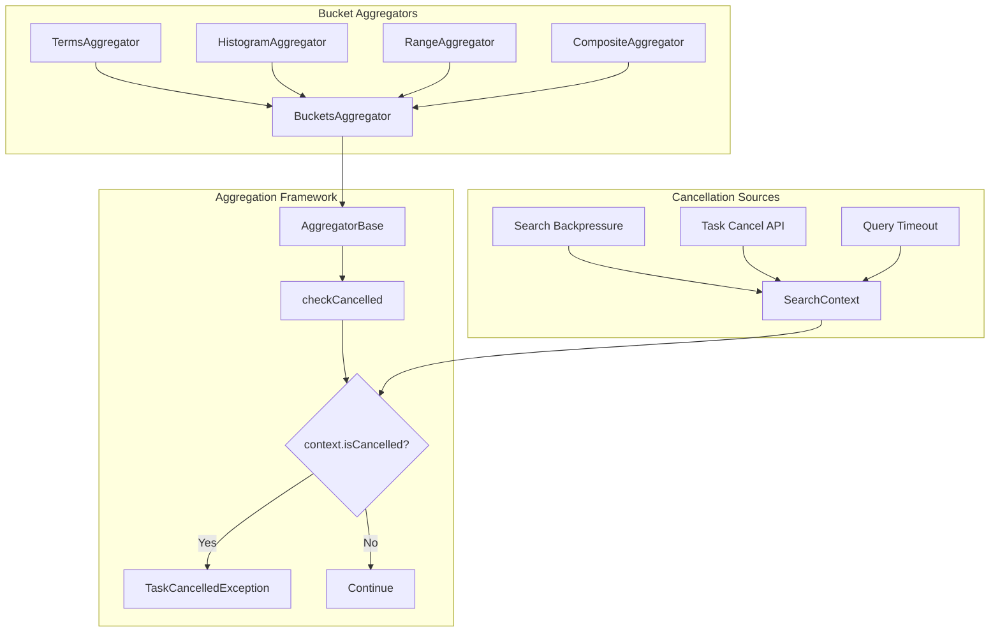
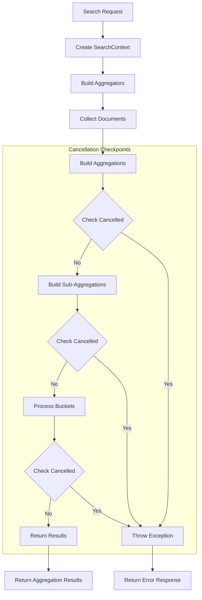

# Aggregation Task Cancellation

## Summary

Aggregation Task Cancellation enables OpenSearch to properly terminate long-running aggregation queries when they exceed resource thresholds or are manually cancelled. This feature addresses a critical gap where deeply nested aggregations could run indefinitely, consuming excessive memory and potentially causing Out of Memory errors on data nodes.

## Details

### Architecture



### Data Flow



### Components

| Component | Description |
|-----------|-------------|
| `AggregatorBase.checkCancelled()` | Protected method that checks `SearchContext.isCancelled()` and throws `TaskCancelledException` |
| `BucketsAggregator` | Base class for bucket aggregations with cancellation checks in `buildSubAggsForBuckets()` |
| `SearchContext` | Holds the cancellation state for the search request |
| `TaskCancelledException` | Exception thrown when a cancelled task attempts to continue |

### Configuration

Aggregation task cancellation works with existing search backpressure settings:

| Setting | Description | Default |
|---------|-------------|---------|
| `search_backpressure.mode` | Backpressure mode: `monitor_only`, `enforced`, `disabled` | `monitor_only` |
| `search_backpressure.search_task.elapsed_time_millis_threshold` | Max elapsed time before cancellation | 45,000 |
| `search_backpressure.search_task.cpu_time_millis_threshold` | Max CPU time before cancellation | 30,000 |
| `search_backpressure.search_shard_task.elapsed_time_millis_threshold` | Max elapsed time for shard tasks | 30,000 |

### Usage Example

Enable enforced search backpressure to automatically cancel long-running aggregations:

```json
PUT /_cluster/settings
{
  "persistent": {
    "search_backpressure": {
      "mode": "enforced"
    }
  }
}
```

Example of a problematic query that will now be properly cancelled:

```json
POST /my-index/_search
{
  "size": 0,
  "aggs": {
    "level1": {
      "terms": {
        "field": "category",
        "size": 500000
      },
      "aggs": {
        "level2": {
          "terms": {
            "field": "subcategory",
            "size": 500000
          },
          "aggs": {
            "level3": {
              "date_histogram": {
                "field": "timestamp",
                "interval": "1m"
              }
            }
          }
        }
      }
    }
  }
}
```

When cancelled, the response will include:

```json
{
  "error": {
    "type": "task_cancelled_exception",
    "reason": "The query has been cancelled"
  }
}
```

## Limitations

- Cancellation checks are implemented in the **query phase** only
- The fetch phase (result transformation) does not yet support cancellation
- Very fast aggregations may complete before cancellation can take effect
- Cancellation is checked at bucket boundaries, not during individual document collection

## Related PRs

| Version | PR | Description |
|---------|-----|-------------|
| v3.2.0 | [#18426](https://github.com/opensearch-project/OpenSearch/pull/18426) | Add task cancellation check in aggregation code paths |

## References

- [Issue #15413](https://github.com/opensearch-project/OpenSearch/issues/15413): Original bug report describing the problem with non-terminable nested aggregations
- [Search Backpressure Documentation](https://docs.opensearch.org/3.0/tuning-your-cluster/availability-and-recovery/search-backpressure/): Official documentation on configuring search backpressure

## Change History

- **v3.2.0** (2025-06-11): Initial implementation - Added cancellation checks in aggregation code paths during query phase
