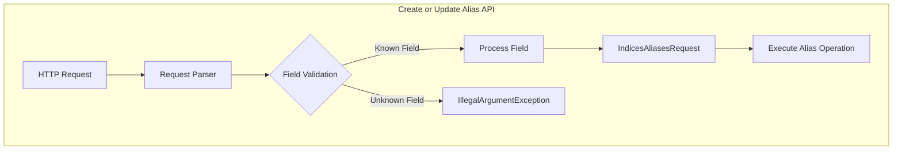

---
tags:
  - opensearch
---
# Alias API Validation

## Summary

The Create or Update Alias API provides strict validation of request body parameters, ensuring that only recognized fields are accepted and throwing exceptions for unknown parameters.

## Details

### Architecture



### Supported Parameters

| Parameter | Type | Description |
|-----------|------|-------------|
| `index` | String | Index name (can override URL path parameter) |
| `alias` | String | Alias name (can override URL path parameter) |
| `filter` | Object | Query filter for the alias |
| `routing` | String | Custom routing value for both index and search |
| `index_routing` | String | Custom routing for index operations only |
| `search_routing` | String | Custom routing for search operations only |
| `is_write_index` | Boolean | Designates this index as the write index for the alias |
| `is_hidden` | Boolean | Makes the alias hidden from most APIs |

### API Endpoints

The Create or Update Alias API supports multiple URL patterns:

```
PUT /{index}/_alias/{name}
POST /{index}/_alias/{name}
PUT /{index}/_aliases/{name}
PUT /_alias/{name}
POST /_alias/{name}
PUT /_aliases/{name}
PUT /{index}/_alias
PUT /{index}/_aliases
PUT /_alias
```

### Usage Example

```json
PUT /my-index/_alias/my-alias
{
  "filter": {
    "term": {
      "status": "published"
    }
  },
  "routing": "1",
  "is_write_index": true,
  "is_hidden": false
}
```

### Error Handling

When an unknown field is provided, the API returns an error:

```json
PUT /my-index/_alias/my-alias
{
  "unknown_field": "value"
}
```

Response:
```json
{
  "error": {
    "type": "illegal_argument_exception",
    "reason": "unknown field [unknown_field]"
  },
  "status": 400
}
```

## Limitations

- The `is_hidden` parameter behavior may vary between versions
- Request body parameters override URL path parameters when both are specified

## Change History

- **v2.16.0** (2024-07-15): Added validation for unknown fields, added `is_hidden` parameter support

## References

### Documentation
- [Create or Update Alias API](https://docs.opensearch.org/latest/api-reference/index-apis/update-alias/)
- [Index Aliases](https://docs.opensearch.org/latest/im-plugin/index-alias/)

### Pull Requests
| Version | PR | Description |
|---------|-----|-------------|
| v2.16.0 | [#14719](https://github.com/opensearch-project/OpenSearch/pull/14719) | Fix create or update alias API doesn't throw exception for unsupported parameters |

### Related Issues
- [#14384](https://github.com/opensearch-project/OpenSearch/issues/14384) - Validation issue while adding/removing backing indices in aliases
