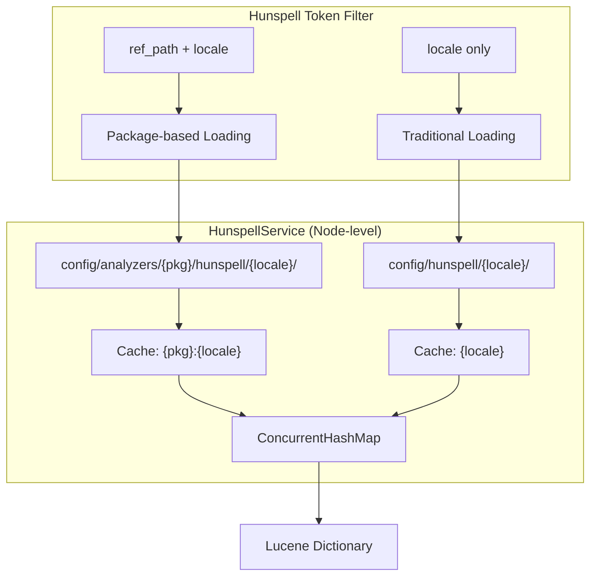

---
tags:
  - opensearch
---
# Analysis & Text Processing

## Summary

OpenSearch provides a Hunspell token filter for spell-checking and stemming during text analysis. The Hunspell token filter loads dictionary files (`.aff` and `.dic`) and applies morphological rules to reduce words to their base forms. Starting in v3.6.0, the Hunspell token filter supports package-based dictionary loading via the `ref_path` parameter, enabling multi-tenant dictionary isolation where different packages can maintain independent dictionaries for the same locale.

## Details

### Architecture



### Components

| Component | Description |
|-----------|-------------|
| `HunspellTokenFilterFactory` | Token filter factory that reads `ref_path`, `locale`, `dedup`, and `longest_only` settings. Routes to appropriate loading method. |
| `HunspellService` | Node-level singleton that manages dictionary loading, caching, and resolution from both traditional and package-based paths. |
| `validatePackageIdentifier()` | Allowlist-based input validator that permits only `[a-zA-Z0-9_-]` characters to prevent path traversal and injection. |

### Configuration

| Setting | Description | Default |
|---------|-------------|---------|
| `ref_path` | Package ID for package-based dictionary loading (optional) | None |
| `locale` / `language` / `lang` | Dictionary locale (e.g., `en_US`). Required when using `ref_path`. | None |
| `dedup` | Remove duplicate stems from output | `true` |
| `longest_only` | Return only the longest stem | `false` |
| `indices.analysis.hunspell.dictionary.ignore_case` | Case-insensitive dictionary matching (node-level) | `false` |
| `indices.analysis.hunspell.dictionary.lazy_init` | Lazy-load dictionaries on first use | `false` |

### Usage Example

**Package-based dictionary (multi-tenant):**
```json
PUT /my_index
{
  "settings": {
    "analysis": {
      "analyzer": {
        "my_analyzer": {
          "type": "custom",
          "tokenizer": "standard",
          "filter": ["lowercase", "my_hunspell"]
        }
      },
      "filter": {
        "my_hunspell": {
          "type": "hunspell",
          "ref_path": "pkg-1234",
          "locale": "en_US",
          "dedup": true
        }
      }
    }
  }
}
```

**Traditional locale-based dictionary:**
```json
PUT /my_index
{
  "settings": {
    "analysis": {
      "filter": {
        "my_hunspell": {
          "type": "hunspell",
          "locale": "en_US"
        }
      }
    }
  }
}
```

**Directory structure:**
```
config/
├── hunspell/                          # Traditional dictionaries
│   └── en_US/
│       ├── en_US.aff
│       └── en_US.dic
└── analyzers/                         # Package-based dictionaries
    ├── pkg-1234/
    │   └── hunspell/
    │       └── en_US/
    │           ├── en_US.aff
    │           └── en_US.dic
    └── pkg-5678/
        └── hunspell/
            └── en_US/
                ├── en_US.aff
                └── en_US.dic
```

## Limitations

- Package-based dictionaries are cached at the node level; no hot-reload support yet (planned for Phase 2).
- Cache invalidation requires node restart until the REST API for cache management is implemented.
- The `ref_path` parameter only accepts alphanumeric characters, hyphens, and underscores.

## Change History

- **v3.6.0**: Added `ref_path` parameter for package-based Hunspell dictionary loading with multi-tenant isolation. Refactored `HunspellService.loadDictionary()` to support configurable base directory. Added security validation for package identifiers.

## References

### Documentation
- OpenSearch Hunspell token filter documentation: https://opensearch.org/docs/latest/analyzers/token-filters/hunspell/

### Pull Requests
| Version | PR | Description |
|---------|-----|-------------|
| v3.6.0 | `https://github.com/opensearch-project/OpenSearch/pull/20840` | Add ref_path support for package-based Hunspell dictionary loading |

### Related Issues
- `https://github.com/opensearch-project/OpenSearch/issues/20712` — RFC: Add ref_path support for Hunspell token filter
