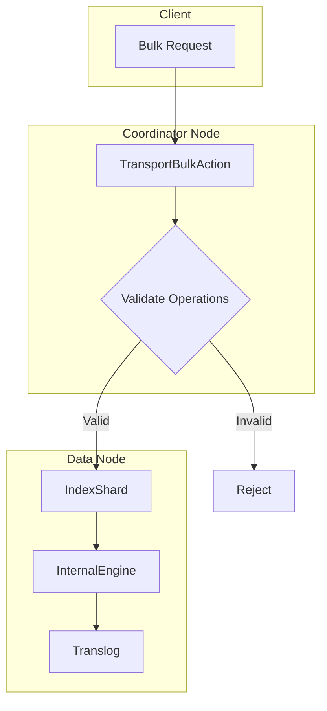

---
tags:
  - opensearch
---
# Append Only Indices

## Summary

Append-only indices are a specialized index mode in OpenSearch that enforces document immutability by disabling all update and delete operations. This feature is optimized for time-series workloads such as logs, metrics, observability data, and security events where documents should never be modified after ingestion.

## Details

### Architecture



### Components

| Component | Description |
|-----------|-------------|
| `INDEX_APPEND_ONLY_ENABLED_SETTING` | Index-scoped boolean setting to enable append-only mode |
| `TransportBulkAction` | Validates operations at the transport layer before shard routing |
| `InternalEngine` | Handles retry detection and prevents duplicate translog entries |
| `AppendOnlyIndexOperationRetryException` | Exception for retry scenarios in append-only indices |

### Configuration

| Setting | Type | Default | Scope | Description |
|---------|------|---------|-------|-------------|
| `index.append_only.enabled` | Boolean | `false` | Index | Enables append-only mode. Final setting (cannot be changed after creation). |

### Usage Example

Create an append-only index:

```json
PUT /logs-2024
{
  "settings": {
    "index.append_only.enabled": true,
    "index.number_of_shards": 3,
    "index.number_of_replicas": 1
  }
}
```

Index documents (auto-generated IDs only):

```json
POST /logs-2024/_bulk
{"index": {}}
{"timestamp": "2024-01-15T10:00:00Z", "message": "Application started", "level": "INFO"}
{"index": {}}
{"timestamp": "2024-01-15T10:00:01Z", "message": "Connection established", "level": "DEBUG"}
```

Rejected operations:

```json
# This will fail - custom document ID not allowed
POST /logs-2024/_doc/custom-id
{"message": "test"}

# This will fail - updates not allowed
POST /logs-2024/_update/abc123
{"doc": {"message": "updated"}}

# This will fail - deletes not allowed
DELETE /logs-2024/_doc/abc123
```

### Use Cases

1. **Log Analytics**: Immutable audit logs, application logs, security logs
2. **Metrics and Observability**: Time-series metrics that should never be modified
3. **Compliance**: Regulatory requirements for immutable records (audit trails, transactions)
4. **Pre-computed Data Structures**: Foundation for features like Star Tree index where updates would be expensive

### Benefits

- **Data Integrity**: Guarantees documents cannot be altered after ingestion
- **Performance Potential**: Enables future optimizations by eliminating update/delete overhead
- **Reduced Memory Footprint**: Potential for version map optimizations (planned)
- **Merge Optimization**: Allows for more aggressive merge policies (planned)

## Limitations

- Setting is final and cannot be changed after index creation
- Custom document IDs are not supported
- No current integration with data streams (may be added in future)
- `_split` and `_shrink` API restrictions planned but not yet enforced

## Change History

- **v2.19.0** (2025-01-28): Initial implementation with basic append-only enforcement

## References

### Documentation

- Official documentation pending

### Pull Requests

| Version | PR | Description |
|---------|-----|-------------|
| v2.19.0 | [#17039](https://github.com/opensearch-project/OpenSearch/pull/17039) | Add support for append only indices |

### Related Issues

- [#12886](https://github.com/opensearch-project/OpenSearch/issues/12886) - RFC: Append-only Indices
