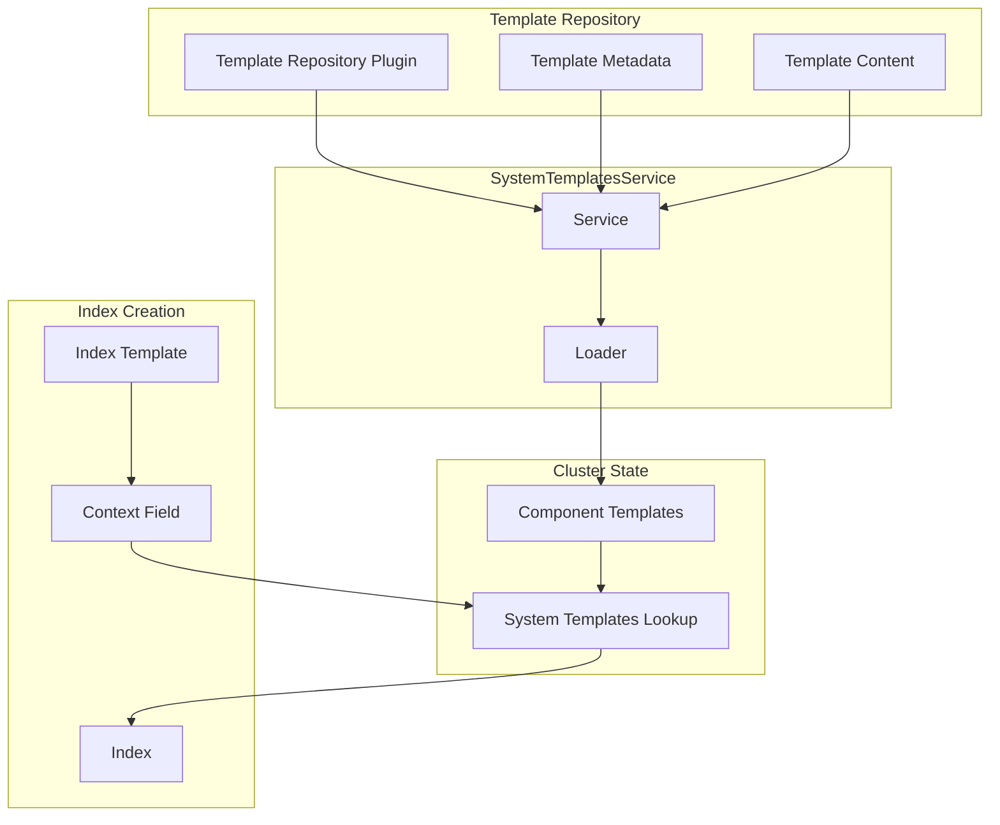

---
tags:
  - opensearch
---
# Application-Based Configuration (ABC) Templates

## Summary

Application-Based Configuration (ABC) templates are predefined system templates in OpenSearch that simplify index configuration by providing optimized settings and mappings for specific use cases. Instead of manually configuring numerous settings, users can specify a `context` when creating an index or index template, and OpenSearch automatically applies the appropriate configuration for that use case.

## Details

### Architecture



### Components

| Component | Description |
|-----------|-------------|
| `SystemTemplatesPlugin` | Plugin interface for providing template repositories |
| `SystemTemplateRepository` | Repository interface for listing and fetching templates |
| `SystemTemplatesService` | Service that orchestrates template loading on cluster manager election |
| `SystemTemplateLoader` | Interface for loading templates into the cluster |
| `ClusterStateSystemTemplateLoader` | Default loader that stores templates as component templates |
| `SystemTemplateMetadata` | Metadata about a template (name, version, type) |
| `SystemTemplate` | Container for template content and metadata |
| `TemplateRepositoryMetadata` | Metadata about a template repository |
| `Context` | Field in `ComposableIndexTemplate` for referencing ABC templates |

### Configuration

| Setting | Description | Default |
|---------|-------------|---------|
| `cluster.application_templates.enabled` | Enable/disable ABC templates at cluster level | `false` |
| `opensearch.experimental.feature.application_templates.enabled` | Feature flag (node-level) | `false` |

### Context Field Structure

The `context` field in index templates supports the following properties:

| Property | Type | Description |
|----------|------|-------------|
| `name` | String | Name of the ABC template to use |
| `version` | String | Template version (`_latest` for latest, or specific version number) |
| `params` | Object | Optional parameters for template customization |

### Usage Example

```json
PUT _index_template/my-logs
{
  "index_patterns": ["my-logs-*"],
  "template": {
    "settings": {
      "number_of_shards": 1
    }
  },
  "context": {
    "name": "logs",
    "version": "_latest",
    "params": {}
  }
}
```

### Template Naming Convention

System templates follow a specific naming pattern:
- Format: `@abc_template@{name}@{version}`
- Example: `@abc_template@logs@1`

### Precedence Order

When resolving settings, mappings, and aliases for an index:
1. Component templates from `composed_of` (lowest priority)
2. Index template's declared settings/mappings/aliases
3. Context-referenced ABC template (highest priority)

### Plugin Interface

Plugins can provide ABC templates by implementing `SystemTemplatesPlugin`:

```java
public interface SystemTemplatesPlugin {
    SystemTemplateRepository loadRepository() throws IOException;
    SystemTemplateLoader loaderFor(SystemTemplateMetadata templateInfo);
}
```

### Available Templates (as of v2.17)

| Template Name | Use Case |
|---------------|----------|
| `logs` | General log data |
| `metrics` | Time-series metrics |
| `nginx-logs` | NGINX access/error logs |
| `amazon-cloudtrail-logs` | AWS CloudTrail logs |
| `amazon-elb-logs` | AWS ELB access logs |
| `amazon-s3-logs` | AWS S3 access logs |
| `apache-web-logs` | Apache HTTP server logs |
| `k8s-logs` | Kubernetes logs |

### Performance Benefits

Using ABC templates provides:
- ~20% storage improvement (with `zstd_no_dict` compression)
- ~6% improvement in indexing p99 latency
- Optimized merge policy (`log_byte_size`) for time-range queries

## Limitations

- Experimental feature requiring feature flag enablement
- System templates can only be managed through repository plugins, not APIs
- Context cannot be removed once configured for an index
- Settings from ABC templates cannot be overridden during index creation
- Template updates apply only to newly created indexes

## Change History

- **v2.16.0** (2024-08-06): Initial implementation with plugin SPI and context field support

## References

### Documentation
- [Index Context Documentation](https://opensearch.org/docs/latest/im-plugin/index-context/)
- [ABC Templates Blog Post](https://opensearch.org/blog/opensearch-simplified-the-power-of-application-based-templates/)

### Pull Requests
| Version | PR | Description |
|---------|-----|-------------|
| v2.16.0 | [#14659](https://github.com/opensearch-project/OpenSearch/pull/14659) | Add Plugin interface for loading ABC templates |
| v2.16.0 | [#14811](https://github.com/opensearch-project/OpenSearch/pull/14811) | Add logic to create index templates using context field |

### Related Issues
- [RFC: Application Based Configuration Templates](https://github.com/opensearch-project/OpenSearch/issues/12683)
- [ABC Templates Implementation Details](https://github.com/opensearch-project/OpenSearch/issues/14649)
