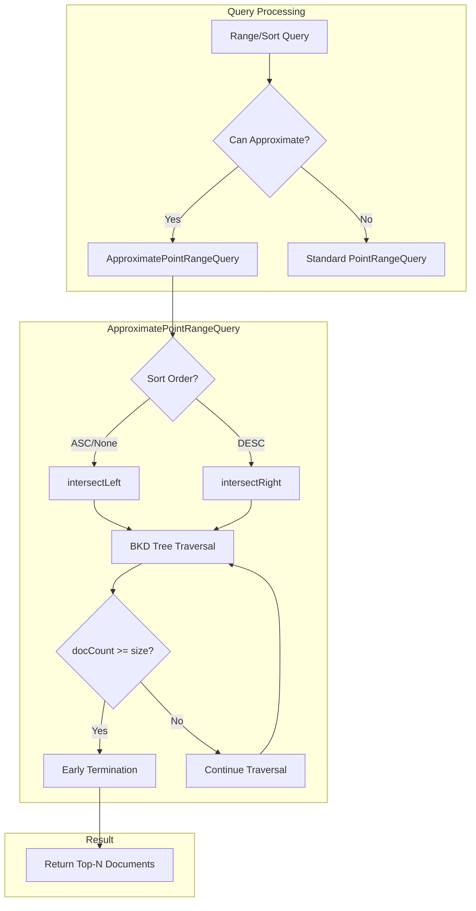
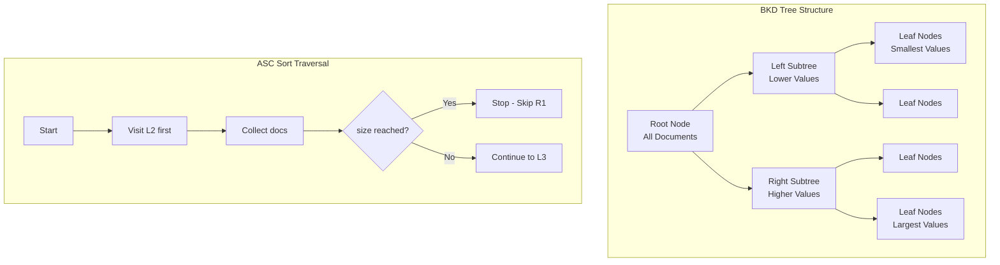

---
tags:
  - dashboards
  - performance
  - search
---

# Approximation Framework

## Summary

The OpenSearch Approximation Framework is a query optimization technique that implements custom BKD tree traversal with early termination for range queries. It significantly improves query latency for time-series and event-based workloads by stopping document collection once the requested number of hits is reached, rather than scanning all matching documents.

The framework is particularly effective for:
- Fetching the latest N logs or events
- Dashboard visualizations with sorted results
- Range queries on numeric fields with size limits

## Details

### Architecture



### Data Flow



### Components

| Component | Description |
|-----------|-------------|
| `ApproximatePointRangeQuery` | Custom query that wraps `PointRangeQuery` with early termination logic |
| `ApproximateQuery` | Base class for approximate queries |
| `intersectLeft()` | DFS traversal from smallest to largest values (ASC sort) |
| `intersectRight()` | DFS traversal from largest to smallest values (DESC sort) |
| `IntersectVisitor` | Custom visitor that tracks document count and triggers early termination |

### Configuration

| Setting | Description | Default |
|---------|-------------|---------|
| `size` | Number of documents to collect before early termination | `track_total_hits_up_to` or `from + size` |
| `sortOrder` | Sort direction (ASC/DESC) determining traversal order | `ASC` |

### Supported Query Types

| Query Type | Example | Optimization | Since |
|------------|---------|--------------|-------|
| Range Query (long/date) | `{"range": {"@timestamp": {"gte": "now-1d"}}}` | Early termination on BKD traversal | v3.0.0 |
| Range Query (int) | `{"range": {"status_code": {"gte": 400}}}` | Early termination on BKD traversal | v3.2.0 |
| Range Query (float/double) | `{"range": {"temperature": {"gte": 20.0}}}` | Early termination on BKD traversal | v3.2.0 |
| Range Query (half_float) | `{"range": {"score": {"gte": 0.5}}}` | Early termination on BKD traversal | v3.2.0 |
| Range Query (unsigned_long) | `{"range": {"counter": {"gte": 1000}}}` | Early termination on BKD traversal | v3.2.0 |
| Match All + Sort | `{"match_all": {}, "sort": [{"@timestamp": "desc"}]}` | Rewritten to bounded range with early termination | v3.0.0 |
| Range + Sort | `{"range": {...}, "sort": [...]}` | Optimized left/right traversal based on sort order | v3.0.0 |
| Range with `now` | `{"range": {"@timestamp": {"gte": "now-1h"}}}` | Approximation applied to `DateRangeIncludingNowQuery` | v3.2.0 |
| `search_after` + Sort | `{"sort": [...], "search_after": [...]}` | Dynamic bound adjustment based on `search_after` value | v3.2.0 |

### Eligibility Criteria

The framework applies when:
- Query has no aggregations
- `track_total_hits` is not set to `true`
- Sort field matches the range query field (if sorting)
- No `terminate_after` is specified
- Only single sort field is used (v3.2.0+)

### Usage Example

```json
// Fetch latest 100 error logs - automatically optimized
GET logs/_search
{
  "query": {
    "range": {
      "@timestamp": {
        "gte": "now-24h",
        "lt": "now"
      }
    }
  },
  "sort": [{ "@timestamp": "desc" }],
  "size": 100
}
```

```json
// Range query on numeric field
GET metrics/_search
{
  "query": {
    "range": {
      "response_time": {
        "gte": 100,
        "lte": 500
      }
    }
  },
  "sort": [{ "response_time": "asc" }],
  "size": 50
}
```

```json
// search_after pagination with approximation (v3.2.0+)
GET logs/_search
{
  "query": {
    "range": {
      "@timestamp": {
        "gte": "now-7d",
        "lt": "now"
      }
    }
  },
  "sort": [{ "@timestamp": "desc" }],
  "size": 100,
  "search_after": ["2026-01-10T00:00:00.000Z"]
}
```

## Limitations

- Does not apply when `track_total_hits: true` is set
- Does not apply when aggregations are present
- Sort field must match the range query field for optimal performance
- Performance gains vary based on data distribution (most effective on skewed datasets)
- Queries with `terminate_after` are not optimized
- Multiple sort fields disable approximation (v3.2.0+)
- `search_after` with multiple tie-breaker values is not optimized (v3.2.0+)

## Change History

- **v3.4.0**: Adopted Lucene's native `pack` method for `half_float` and `unsigned_long` types, replacing custom encoding methods; requires Lucene 10.3.0
- **v3.2.0**: Extended Approximation Framework to all numeric types (int, float, double, half_float, unsigned_long); added `search_after` support for numeric queries; approximation for range queries with `now`; automatic disabling for multiple sort fields
- **v3.1.0** (2025-06-10): Enhanced BKD traversal with DFS strategy for skewed datasets, smart subtree skipping
- **v3.0.0**: Initial GA release with basic early termination support; added logic to skip approximation when `track_total_hits: true` is set

## References

### Documentation
- [Nightly Benchmarks](https://benchmarks.opensearch.org/): Performance metrics dashboard

### Blog Posts
- [OpenSearch Approximation Framework Blog](https://opensearch.org/blog/opensearch-approximation-framework/): Comprehensive overview

### Pull Requests
| Version | PR | Description | Related Issue |
|---------|-----|-------------|---------------|
| v3.4.0 | [#19553](https://github.com/opensearch-project/OpenSearch/pull/19553) | Use Lucene `pack` method for `half_float` and `unsigned_long` | [#14406](https://github.com/opensearch-project/OpenSearch/issues/14406) |
| v3.2.0 | [#18530](https://github.com/opensearch-project/OpenSearch/pull/18530) | Extend Approximation Framework to other numeric types (int, float, double, half_float, unsigned_long) | [#18334](https://github.com/opensearch-project/OpenSearch/issues/18334) |
| v3.2.0 | [#18896](https://github.com/opensearch-project/OpenSearch/pull/18896) | Support `search_after` numeric queries with Approximation Framework | [#18546](https://github.com/opensearch-project/OpenSearch/issues/18546) |
| v3.2.0 | [#18511](https://github.com/opensearch-project/OpenSearch/pull/18511) | Added approximation support for range queries with `now` in date field | [#18503](https://github.com/opensearch-project/OpenSearch/issues/18503) |
| v3.2.0 | [#18763](https://github.com/opensearch-project/OpenSearch/pull/18763) | Disable approximation framework when dealing with multiple sorts | [#18619](https://github.com/opensearch-project/OpenSearch/issues/18619) |
| v3.1.0 | [#18439](https://github.com/opensearch-project/OpenSearch/pull/18439) | BKD traversal optimization for skewed datasets | [#18341](https://github.com/opensearch-project/OpenSearch/issues/18341) |
| v3.0.0 | [#18017](https://github.com/opensearch-project/OpenSearch/pull/18017) | Skip approximation when `track_total_hits` is set to `true` | [#14406](https://github.com/opensearch-project/OpenSearch/issues/14406) |
| v3.0.0 | - | Initial GA release of Approximation Framework |   |

### Issues (Design / RFC)
- [Issue #14406](https://github.com/opensearch-project/OpenSearch/issues/14406): Feature request to expand ApproximatePointRangeQuery to other numeric types
- [Issue #18341](https://github.com/opensearch-project/OpenSearch/issues/18341): Feature request for DFS traversal strategy
- [Issue #18546](https://github.com/opensearch-project/OpenSearch/issues/18546): Feature request for `search_after` support
- [Issue #18503](https://github.com/opensearch-project/OpenSearch/issues/18503): Bug report for `now` range queries skipping approximation
- [META Issue #18619](https://github.com/opensearch-project/OpenSearch/issues/18619): Future enhancements tracking
