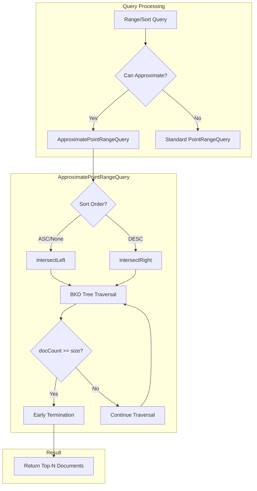
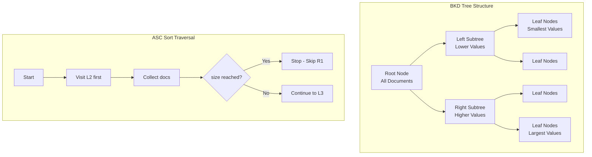

# Approximation Framework

## Summary

The OpenSearch Approximation Framework is a query optimization technique that implements custom BKD tree traversal with early termination for range queries. It significantly improves query latency for time-series and event-based workloads by stopping document collection once the requested number of hits is reached, rather than scanning all matching documents.

The framework is particularly effective for:
- Fetching the latest N logs or events
- Dashboard visualizations with sorted results
- Range queries on numeric fields with size limits

## Details

### Architecture



### Data Flow



### Components

| Component | Description |
|-----------|-------------|
| `ApproximatePointRangeQuery` | Custom query that wraps `PointRangeQuery` with early termination logic |
| `ApproximateQuery` | Base class for approximate queries |
| `intersectLeft()` | DFS traversal from smallest to largest values (ASC sort) |
| `intersectRight()` | DFS traversal from largest to smallest values (DESC sort) |
| `IntersectVisitor` | Custom visitor that tracks document count and triggers early termination |

### Configuration

| Setting | Description | Default |
|---------|-------------|---------|
| `size` | Number of documents to collect before early termination | `track_total_hits_up_to` or `from + size` |
| `sortOrder` | Sort direction (ASC/DESC) determining traversal order | `ASC` |

### Supported Query Types

| Query Type | Example | Optimization |
|------------|---------|--------------|
| Range Query | `{"range": {"@timestamp": {"gte": "now-1d"}}}` | Early termination on BKD traversal |
| Match All + Sort | `{"match_all": {}, "sort": [{"@timestamp": "desc"}]}` | Rewritten to bounded range with early termination |
| Range + Sort | `{"range": {...}, "sort": [...]}` | Optimized left/right traversal based on sort order |

### Eligibility Criteria

The framework applies when:
- Query has no aggregations
- `track_total_hits` is not set to `true`
- Sort field matches the range query field (if sorting)
- No `terminate_after` is specified

### Usage Example

```json
// Fetch latest 100 error logs - automatically optimized
GET logs/_search
{
  "query": {
    "range": {
      "@timestamp": {
        "gte": "now-24h",
        "lt": "now"
      }
    }
  },
  "sort": [{ "@timestamp": "desc" }],
  "size": 100
}
```

```json
// Range query on numeric field
GET metrics/_search
{
  "query": {
    "range": {
      "response_time": {
        "gte": 100,
        "lte": 500
      }
    }
  },
  "sort": [{ "response_time": "asc" }],
  "size": 50
}
```

## Limitations

- Does not apply when `track_total_hits: true` is set
- Does not apply when aggregations are present
- Sort field must match the range query field for optimal performance
- Performance gains vary based on data distribution (most effective on skewed datasets)
- Queries with `terminate_after` are not optimized

## Related PRs

| Version | PR | Description |
|---------|-----|-------------|
| v3.1.0 | [#18439](https://github.com/opensearch-project/OpenSearch/pull/18439) | BKD traversal optimization for skewed datasets |
| v3.0.0 | - | Initial GA release of Approximation Framework |

## References

- [Issue #18341](https://github.com/opensearch-project/OpenSearch/issues/18341): Feature request for DFS traversal strategy
- [OpenSearch Approximation Framework Blog](https://opensearch.org/blog/opensearch-approximation-framework/): Comprehensive overview
- [META Issue #18619](https://github.com/opensearch-project/OpenSearch/issues/18619): Future enhancements tracking
- [Nightly Benchmarks](https://benchmarks.opensearch.org/): Performance metrics dashboard

## Change History

- **v3.1.0** (2025-06-10): Enhanced BKD traversal with DFS strategy for skewed datasets, smart subtree skipping
- **v3.0.0**: Initial GA release with basic early termination support
