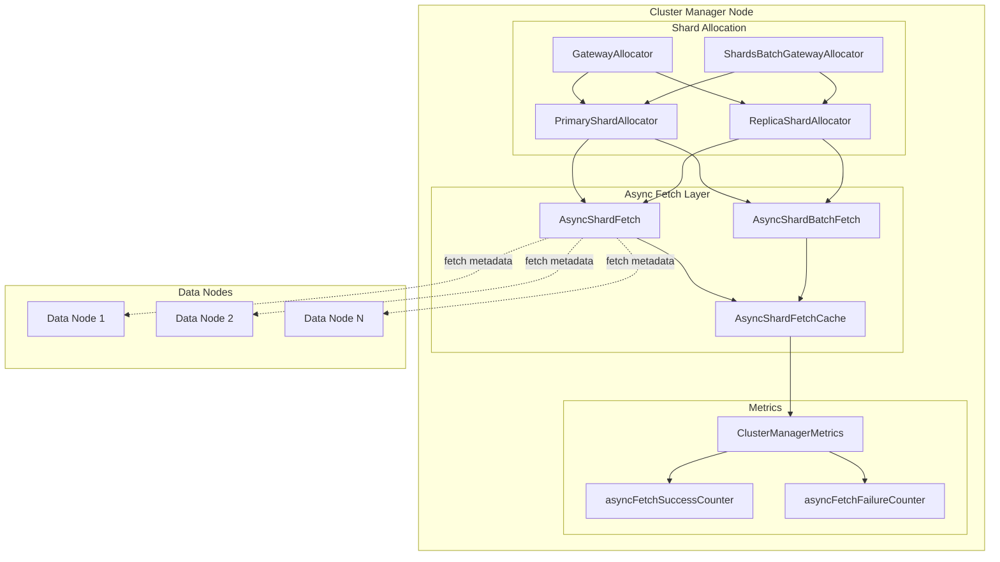
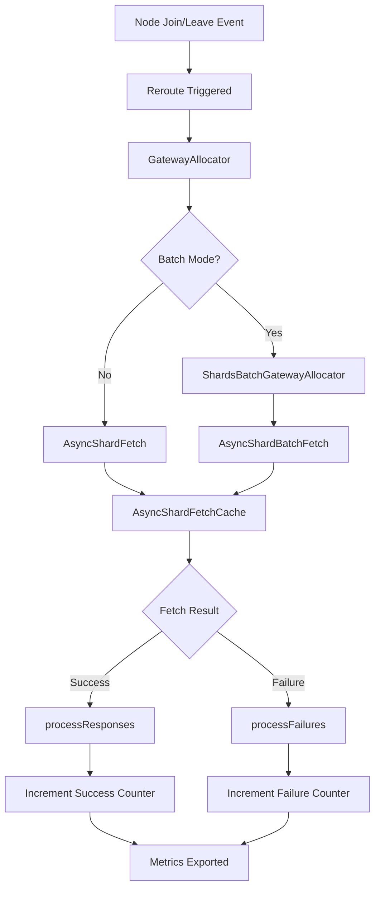

---
tags:
  - indexing
  - observability
---

# Async Shard Fetch Metrics

## Summary

Async Shard Fetch Metrics provide OpenTelemetry-based observability into the cluster manager's shard allocation process. When nodes join or leave a cluster, the cluster manager performs async shard fetch operations to retrieve shard metadata from data nodes. These metrics track the success and failure rates of these operations, helping operators identify issues with shard allocation and cluster recovery.

## Details

### Architecture



### Data Flow



### Components

| Component | Description |
|-----------|-------------|
| `ClusterManagerMetrics` | Central class holding all cluster manager metrics including async fetch counters |
| `AsyncShardFetchCache` | Cache layer that processes fetch responses and increments metrics |
| `asyncFetchSuccessCounter` | OTel counter for successful async fetch operations |
| `asyncFetchFailureCounter` | OTel counter for failed async fetch operations |

### Configuration

| Setting | Description | Default |
|---------|-------------|---------|
| `opensearch.experimental.feature.telemetry.enabled` | Enable telemetry feature flag | `false` |
| `telemetry.feature.metrics.enabled` | Enable metrics collection | `false` |
| `telemetry.otel.metrics.publish.interval` | Metrics publish interval | `60s` |
| `telemetry.otel.metrics.exporter.class` | Metrics exporter class | `LoggingMetricExporter` |

### Metrics Reference

| Metric Name | Type | Description |
|-------------|------|-------------|
| `async.fetch.success.count` | Counter | Number of successful async shard fetch responses processed |
| `async.fetch.failure.count` | Counter | Number of failed async shard fetch responses processed |

### Usage Example

Enable the metrics framework in `opensearch.yml`:

```yaml
# Enable experimental telemetry feature
opensearch.experimental.feature.telemetry.enabled: true

# Enable metrics
telemetry.feature.metrics.enabled: true

# Optional: Configure exporter (default logs to file)
telemetry.otel.metrics.exporter.class: io.opentelemetry.exporter.logging.LoggingMetricExporter
```

Metrics will be written to `logs/_otel_metrics.log` by default, or exported via gRPC if using `OtlpGrpcMetricExporter`.

## Limitations

- Requires experimental telemetry feature to be enabled
- Metrics are aggregate counts without per-shard or per-node dimensions
- No latency/histogram metrics for fetch duration
- Counter values reset on node restart

## Change History

- **v2.18.0** (2024-10-22): Initial implementation - Added success and failure counter metrics for async shard fetch operations

## References

### Documentation
- [Metrics Framework Documentation](https://docs.opensearch.org/2.18/monitoring-your-cluster/metrics/getting-started/): Official OpenSearch metrics framework docs

### Pull Requests
| Version | PR | Description | Related Issue |
|---------|-----|-------------|---------------|
| v2.18.0 | [#15976](https://github.com/opensearch-project/OpenSearch/pull/15976) | Add success and failure count OTel metrics for async shard fetch |   |

### Issues (Design / RFC)
- [Issue #8098](https://github.com/opensearch-project/OpenSearch/issues/8098): META - Cluster Manager Async Shard Fetch Revamp
- [Issue #5098](https://github.com/opensearch-project/OpenSearch/issues/5098): Async shard fetches taking up GBs of memory causing ClusterManager JVM to spike
