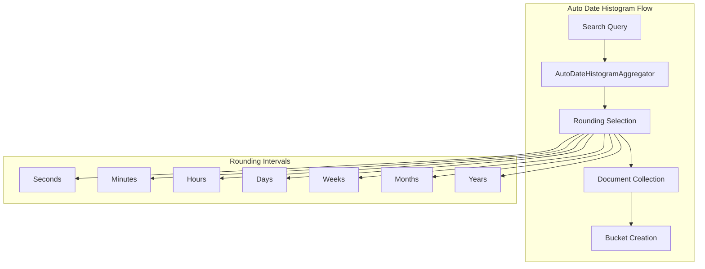

---
tags:
  - opensearch
---
# Auto Date Histogram Aggregation

## Summary

The `auto_date_histogram` aggregation automatically creates date histogram buckets based on a target number of buckets and the time range of the data. Unlike the standard `date_histogram` aggregation where you specify a fixed interval, `auto_date_histogram` dynamically selects the most appropriate interval to achieve the desired bucket count.

## Details

### Architecture



### Configuration

| Parameter | Description | Default |
|-----------|-------------|---------|
| `field` | Date field to aggregate on | Required |
| `buckets` | Target number of buckets | 10 |
| `time_zone` | Timezone for bucket boundaries | UTC |
| `format` | Date format for bucket keys | Date field format |
| `minimum_interval` | Minimum interval to use | `second` |

### Usage Example

```json
GET /logs/_search
{
  "size": 0,
  "aggs": {
    "logs_over_time": {
      "auto_date_histogram": {
        "field": "timestamp",
        "buckets": 10,
        "time_zone": "America/New_York"
      }
    }
  }
}
```

### Rounding Intervals

The aggregation automatically selects from these intervals (in order of granularity):

1. Seconds (1, 5, 10, 30)
2. Minutes (1, 5, 10, 30)
3. Hours (1, 3, 12)
4. Days (1, 7)
5. Months (1, 3)
6. Years (1, 5, 10, 20, 50, 100)

### Filter Rewrite Optimization

The aggregation includes a filter rewrite optimization that examines pre-aggregated document counts in BKD tree structures instead of collecting documents individually. This optimization:

- Improves performance for large datasets
- Only applies when certain conditions are met (no scripts, no missing values, date field type)
- Is disabled for non-UTC timezones (as of v2.19.0) to ensure correctness

## Limitations

- The filter rewrite optimization is disabled for non-UTC timezones
- The actual number of buckets may differ from the target based on data distribution
- Timezone-aware queries may have slightly reduced performance compared to UTC queries

## Change History

- **v2.19.0** (2025-01-28): Fixed assertion failure when using `time_zone` parameter with filter rewrite optimization ([#17023](https://github.com/opensearch-project/OpenSearch/pull/17023))

## References

### Documentation
- [Auto-interval date histogram](https://docs.opensearch.org/latest/aggregations/bucket/auto-interval-date-histogram/)

### Pull Requests
| Version | PR | Description |
|---------|-----|-------------|
| v2.19.0 | [#17023](https://github.com/opensearch-project/OpenSearch/pull/17023) | Fix auto date histogram rounding assertion bug |
