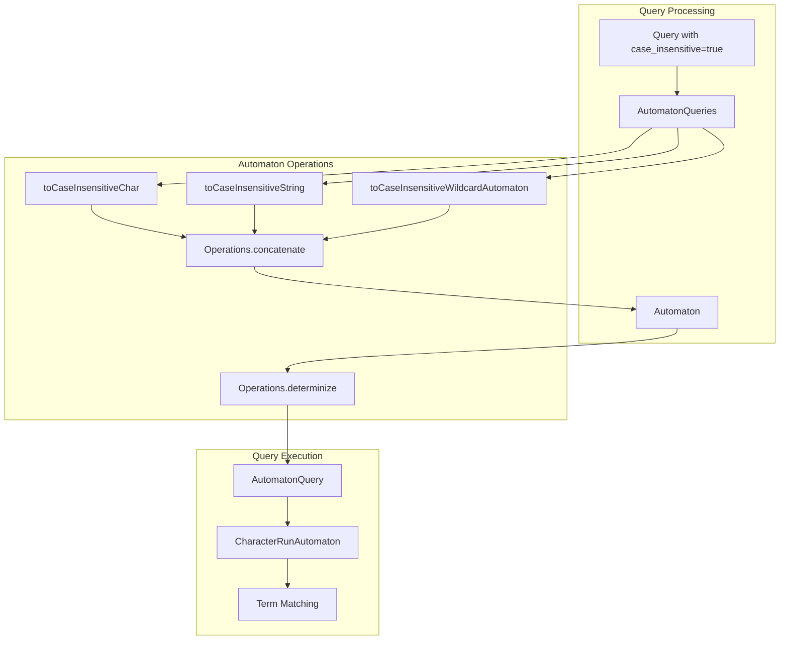
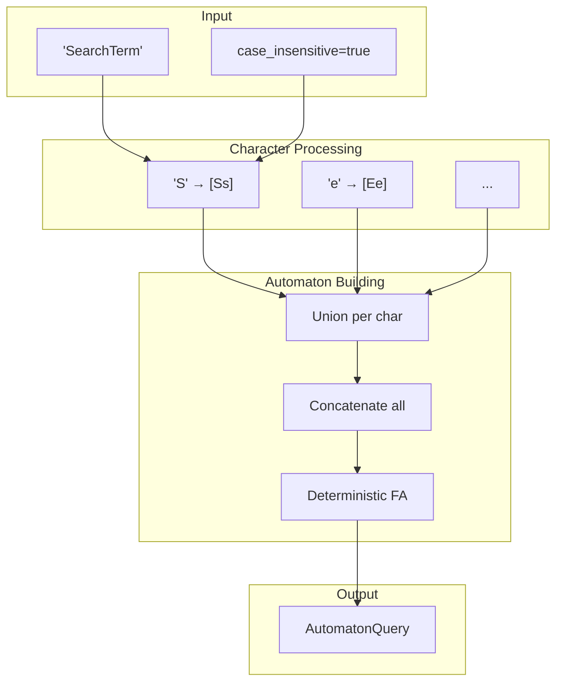

# Automata & Regex Optimization

## Summary

OpenSearch uses finite automata internally to process case-insensitive queries, wildcard queries, and regular expression queries. This feature tracks optimizations to automaton processing that improve memory efficiency and prevent out-of-memory errors when handling complex pattern matching queries.

## Details

### Architecture



### Data Flow



### Components

| Component | Description |
|-----------|-------------|
| `AutomatonQueries` | Helper class for building case-insensitive automaton queries |
| `Operations.determinize()` | Lucene method to convert NFA to DFA |
| `Operations.concatenate()` | Lucene method to concatenate automata |
| `CharacterRunAutomaton` | Compiled automaton for efficient string matching |

### Configuration

| Setting | Description | Default |
|---------|-------------|---------|
| `max_determinized_states` | Maximum automaton states for regexp queries | 10,000 |

### Usage Example

Case-insensitive term query:

```json
GET /my-index/_search
{
  "query": {
    "term": {
      "status": {
        "value": "Active",
        "case_insensitive": true
      }
    }
  }
}
```

Case-insensitive wildcard query:

```json
GET /my-index/_search
{
  "query": {
    "wildcard": {
      "user.name": {
        "value": "john*",
        "case_insensitive": true
      }
    }
  }
}
```

Case-insensitive prefix query:

```json
GET /my-index/_search
{
  "query": {
    "prefix": {
      "product.name": {
        "value": "open",
        "case_insensitive": true
      }
    }
  }
}
```

## Limitations

- Case-insensitive matching only works with ASCII characters (codepoints ≤ 128)
- Complex regular expressions may still hit the `max_determinized_states` limit
- The `case_insensitive` parameter is not available for all query types

## Change History

- **v3.0.0** (2025-05-06): Removed `MinimizationOperations` class; stopped minimizing automata for case-insensitive matches to prevent memory exhaustion

## References

### Documentation
- [Regexp Query Documentation](https://docs.opensearch.org/3.0/query-dsl/term/regexp/): Official docs on regexp queries
- [Term Query Documentation](https://docs.opensearch.org/3.0/query-dsl/term/term/): Official docs on term queries with `case_insensitive`
- [Wildcard Query Documentation](https://docs.opensearch.org/3.0/query-dsl/term/wildcard/): Official docs on wildcard queries
- [Prefix Query Documentation](https://docs.opensearch.org/3.0/query-dsl/term/prefix/): Official docs on prefix queries

### Pull Requests
| Version | PR | Description | Related Issue |
|---------|-----|-------------|---------------|
| v3.0.0 | [#17268](https://github.com/opensearch-project/OpenSearch/pull/17268) | Remove MinimizationOperations to fix memory exhaustion | [#16975](https://github.com/opensearch-project/OpenSearch/issues/16975) |

### Issues (Design / RFC)
- [Issue #16975](https://github.com/opensearch-project/OpenSearch/issues/16975): Bug report - Memory exhaustion with case-insensitive term queries
