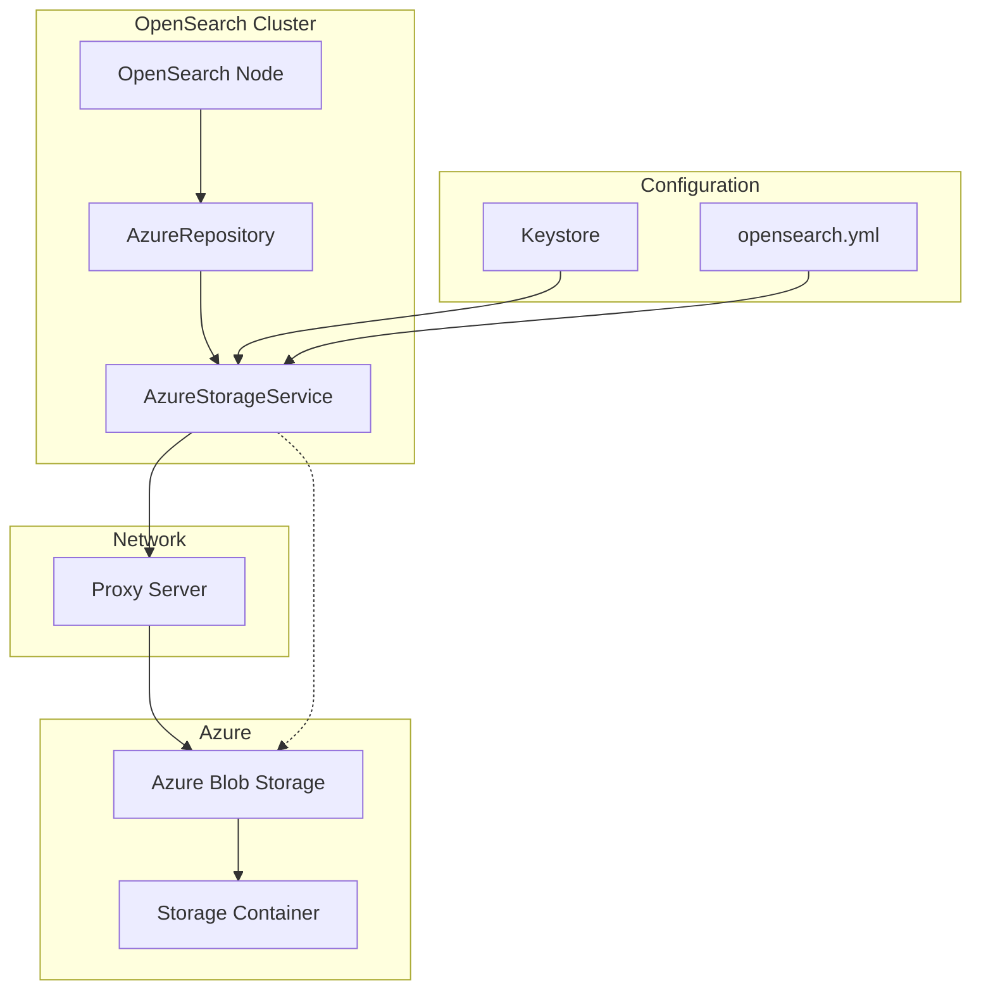

---
tags:
  - indexing
  - security
---

# Azure Repository Plugin

## Summary

The Azure Repository plugin (`repository-azure`) enables OpenSearch to use Microsoft Azure Blob Storage as a backend for snapshot and restore operations. It supports various authentication methods including storage account keys, shared access signatures (SAS), and managed identity token credentials. The plugin also supports proxy configurations including HTTP and SOCKS5 proxies with authentication.

## Details

### Architecture



### Components

| Component | Description |
|-----------|-------------|
| `AzureStorageService` | Core service managing Azure Blob Storage client connections |
| `AzureRepository` | Repository implementation for snapshot/restore operations |
| `ProxySettings` | Configuration for HTTP/SOCKS5 proxy connections |
| `AzureStorageSettings` | Storage account and authentication settings |

### Configuration

#### Authentication Settings

| Setting | Description | Required |
|---------|-------------|----------|
| `azure.client.{client}.account` | Azure Storage account name | Yes |
| `azure.client.{client}.key` | Storage account key | One of key/sas_token/token_credential |
| `azure.client.{client}.sas_token` | Shared access signature token | One of key/sas_token/token_credential |
| `azure.client.{client}.token_credential_type` | Token credential type (e.g., `managed_identity`) | One of key/sas_token/token_credential |

#### Proxy Settings

| Setting | Description | Default |
|---------|-------------|---------|
| `azure.client.{client}.proxy.type` | Proxy type: `http`, `https`, `socks4`, `socks5` | - |
| `azure.client.{client}.proxy.host` | Proxy server hostname | - |
| `azure.client.{client}.proxy.port` | Proxy server port | - |
| `azure.client.{client}.proxy.username` | Proxy authentication username (keystore) | - |
| `azure.client.{client}.proxy.password` | Proxy authentication password (keystore) | - |

#### Timeout Settings

| Setting | Description | Default |
|---------|-------------|---------|
| `azure.client.{client}.connect_timeout` | Connection timeout | - |
| `azure.client.{client}.read_timeout` | Read timeout | - |
| `azure.client.{client}.write_timeout` | Write timeout | - |
| `azure.client.{client}.response_timeout` | Response timeout | - |

### Usage Example

#### Installation

```bash
./bin/opensearch-plugin install repository-azure
```

#### Configure Authentication

```bash
# Add storage account name
./bin/opensearch-keystore add azure.client.default.account

# Add storage account key
./bin/opensearch-keystore add azure.client.default.key
```

#### Register Repository

```json
PUT /_snapshot/my-azure-repository
{
  "type": "azure",
  "settings": {
    "client": "default",
    "container": "my-snapshot-container",
    "base_path": "snapshots"
  }
}
```

#### Configure SOCKS5 Proxy with Authentication

```yaml
# opensearch.yml
azure.client.default.proxy.type: socks5
azure.client.default.proxy.host: proxy.example.com
azure.client.default.proxy.port: 1080
```

```bash
# Add proxy credentials to keystore
./bin/opensearch-keystore add azure.client.default.proxy.username
./bin/opensearch-keystore add azure.client.default.proxy.password
```

## Limitations

- Token credential authentication only supports managed identity (as of v2.15+)
- When using token credentials, they take precedence over storage account keys or SAS tokens
- SOCKS5 proxy authentication requires credentials to be stored in the OpenSearch keystore

## Change History

- **v3.2.0** (2025-08-05): Fixed SOCKS5 proxy authentication - credentials now properly set via ProxyOptions.setCredentials() instead of JDK Authenticator

## Related Features
- [OpenSearch Dashboards](../opensearch-dashboards/ai-chat.md)

## References

### Documentation
- [OpenSearch Snapshot and Restore Documentation](https://docs.opensearch.org/3.0/tuning-your-cluster/availability-and-recovery/snapshots/snapshot-restore/)
- [Azure Blob Storage Introduction](https://learn.microsoft.com/en-us/azure/storage/common/storage-introduction)
- [Azure SDK ProxyOptions](https://learn.microsoft.com/en-us/java/api/com.azure.core.http.proxyoptions)

### Pull Requests
| Version | PR | Description | Related Issue |
|---------|-----|-------------|---------------|
| v3.2.0 | [#18904](https://github.com/opensearch-project/OpenSearch/pull/18904) | Fix socks5 user password settings for Azure repo |   |
