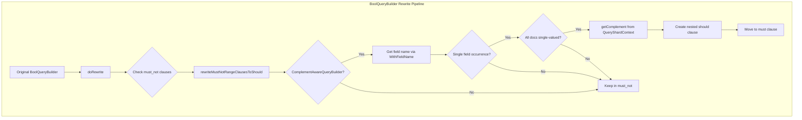
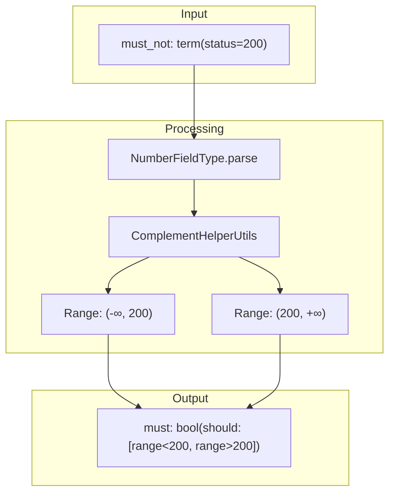

# BooleanQuery Rewrite Optimizations

## Summary

BooleanQuery rewrite optimizations automatically transform slow query patterns into faster equivalents during query execution. OpenSearch analyzes boolean queries and applies mathematical transformations to improve performance without changing query semantics. These optimizations target common patterns like `must_not` clauses on numeric fields, delivering up to 54x performance improvements for exclusion queries.

## Details

### Architecture



### Data Flow



### Components

| Component | Description |
|-----------|-------------|
| `BoolQueryBuilder` | Main query builder that orchestrates the rewrite process |
| `ComplementAwareQueryBuilder` | Interface for queries that can provide complement range queries |
| `ComplementHelperUtils` | Utility class for constructing complement ranges from numeric values |
| `WithFieldName` | Interface to identify the target field of a query |
| `RangeQueryBuilder` | Implements `ComplementAwareQueryBuilder` for range queries |
| `MatchQueryBuilder` | Implements `ComplementAwareQueryBuilder` for numeric match queries |
| `TermQueryBuilder` | Implements `ComplementAwareQueryBuilder` for numeric term queries |
| `TermsQueryBuilder` | Implements `ComplementAwareQueryBuilder` for numeric terms queries |

### Supported Query Types

| Query Type | Numeric Fields | Text/Keyword Fields |
|------------|----------------|---------------------|
| Range | ✅ Rewritten | ❌ Not applicable |
| Match | ✅ Rewritten | ❌ Not rewritten |
| Term | ✅ Rewritten | ❌ Not rewritten |
| Terms | ✅ Rewritten | ❌ Not rewritten |

### Configuration

This optimization is enabled by default and requires no configuration. It applies automatically during query rewrite when conditions are met.

### Usage Example

**Excluding a single value:**
```json
// Original query
{
  "query": {
    "bool": {
      "must_not": {
        "term": { "http_status": 200 }
      }
    }
  }
}

// Internally rewritten to
{
  "query": {
    "bool": {
      "must": {
        "bool": {
          "should": [
            { "range": { "http_status": { "lt": 200 } } },
            { "range": { "http_status": { "gt": 200 } } }
          ],
          "minimum_should_match": 1
        }
      }
    }
  }
}
```

**Excluding multiple values:**
```json
// Original query
{
  "query": {
    "bool": {
      "must_not": {
        "terms": { "http_status": [200, 500] }
      }
    }
  }
}

// Internally rewritten to
{
  "query": {
    "bool": {
      "must": {
        "bool": {
          "should": [
            { "range": { "http_status": { "lt": 200 } } },
            { "range": { "http_status": { "gt": 200, "lt": 500 } } },
            { "range": { "http_status": { "gt": 500 } } }
          ],
          "minimum_should_match": 1
        }
      }
    }
  }
}
```

### Performance Characteristics

The optimization provides significant speedups because:

1. **Avoids full index scan**: `must_not` requires gathering all documents then filtering
2. **Leverages BKD trees**: Range queries use efficient point-based data structures
3. **Early termination**: Can stop processing once enough matches are found

Benchmark results on `http_logs` dataset:

| Scenario | Before (ms) | After (ms) | Improvement |
|----------|-------------|------------|-------------|
| Exclude common value (84% of docs) | 1021 | 20.72 | 49x |
| Exclude rare value (0.5% of docs) | 515.6 | 12.03 | 43x |
| Exclude very rare value (0.00025%) | 481.6 | 9.49 | 44x |
| Exclude multiple values | 958.6 | 17.76 | 54x |

## Limitations

- **Numeric fields only**: Text and keyword fields cannot be rewritten
- **Single-valued fields**: Multi-valued fields are not optimized
- **Single field per must_not**: Multiple queries on the same field prevent rewrite
- **No BITMAP support**: Terms queries with BITMAP value type are not rewritten
- **No termsLookup support**: Terms queries using termsLookup are not rewritten
- **QueryShardContext required**: Match/term/terms rewrites need shard context (range queries don't)

## Related PRs

| Version | PR | Description |
|---------|-----|-------------|
| v3.2.0 | [#18498](https://github.com/opensearch-project/OpenSearch/pull/18498) | Extend must_not rewrite to numeric match, term, and terms queries |
| v3.0.0 | [#17655](https://github.com/opensearch-project/OpenSearch/pull/17655) | Initial must_not rewrite for range queries |
| v3.0.0 | [#18541](https://github.com/opensearch-project/OpenSearch/pull/18541) | Boolean must → filter rewrite for constant-scoring queries |

## References

- [Issue #17586](https://github.com/opensearch-project/OpenSearch/issues/17586): Original feature request with detailed benchmarks
- [Boolean Query Documentation](https://docs.opensearch.org/3.0/query-dsl/compound/bool/): Official boolean query docs
- [Issue #18784](https://github.com/opensearch-project/OpenSearch/issues/18784): RFC for multi-clause boolean query approximation

## Change History

- **v3.2.0** (2025-07-22): Extended must_not rewrite to numeric match, term, and terms queries
- **v3.0.0**: Initial implementation of must_not rewrite for range queries; must → filter rewrite for constant-scoring queries
