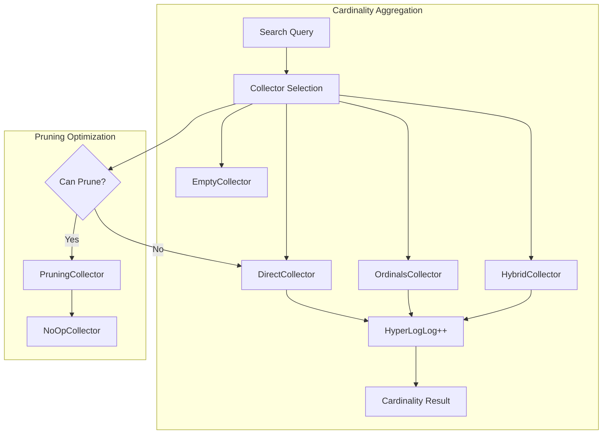

---
tags:
  - observability
  - performance
  - search
---

# Cardinality Aggregation

## Summary

The cardinality aggregation is a single-value metric aggregation that estimates the count of unique (distinct) values for a field. It uses the HyperLogLog++ (HLL++) algorithm to provide approximate counts with configurable precision, making it memory-efficient for high-cardinality fields.

## Details

### Architecture



### Components

| Component | Description |
|-----------|-------------|
| `CardinalityAggregator` | Main aggregator class that orchestrates cardinality computation |
| `HyperLogLogPlusPlus` | HLL++ implementation for approximate distinct counting |
| `EmptyCollector` | No-op collector for empty value sources |
| `DirectCollector` | Collects hash values directly into HLL++ |
| `OrdinalsCollector` | Uses ordinals for efficient collection on keyword fields |
| `HybridCollector` | Starts with ordinals, switches to direct if memory threshold exceeded |
| `PruningCollector` | Enables dynamic pruning optimization for term fields |

### Configuration

| Setting | Description | Default |
|---------|-------------|---------|
| `precision_threshold` | Threshold below which counts are expected to be accurate | 3000 |
| `execution_hint` | How to run aggregation: `ordinals` or `direct` | Auto |
| `search.aggregations.cardinality.pruning_threshold` | Max terms for pruning optimization | Configurable |
| `search.aggregations.cardinality.hybrid_collector.enabled` | Enable hybrid collector | `true` |
| `search.aggregations.cardinality.hybrid_collector.memory_threshold` | Memory threshold for hybrid collector | `1%` |

### Usage Example

```json
GET /my-index/_search
{
  "size": 0,
  "aggs": {
    "unique_users": {
      "cardinality": {
        "field": "user_id",
        "precision_threshold": 10000
      }
    }
  }
}
```

Response:
```json
{
  "aggregations": {
    "unique_users": {
      "value": 12345
    }
  }
}
```

### Collector Selection Logic

The aggregator selects the optimal collector based on:

1. **EmptyCollector**: When no values source exists
2. **DirectCollector**: For numeric fields or when ordinals overhead is too high
3. **OrdinalsCollector**: For keyword fields with low cardinality (memory efficient)
4. **HybridCollector**: Starts with ordinals, switches to direct if memory exceeds threshold

### Dynamic Pruning Optimization

When enabled, the pruning optimization can significantly improve performance by:
- Building a priority queue of term iterators
- Pruning terms after they've been collected
- Using a competitive iterator to skip non-matching documents

Requirements for pruning:
- No parent aggregator
- No sub-aggregations
- No missing value handling
- No script
- Term count below threshold

## Limitations

- Cardinality counts are approximate (uses HLL++ algorithm)
- Accuracy depends on `precision_threshold` setting
- High-cardinality fields may consume significant memory with ordinals collector
- Pruning optimization may not apply in all scenarios

## Change History

- **v3.3.0**: Fixed pruning optimization regression caused by Lucene 10.3.0's BulkScorer behavior; replaced with self-collecting approach

## Related Features
- [OpenSearch Dashboards](../opensearch-dashboards/ai-chat.md)

## References

### Documentation
- [Cardinality Aggregation Documentation](https://docs.opensearch.org/3.0/aggregations/metric/cardinality/)
- [HyperLogLog++ Paper](https://static.googleusercontent.com/media/research.google.com/fr//pubs/archive/40671.pdf)

### Pull Requests
| Version | PR | Description | Related Issue |
|---------|-----|-------------|---------------|
| v3.3.0 | [#19473](https://github.com/opensearch-project/OpenSearch/pull/19473) | Fix cardinality agg pruning optimization by self collecting |   |

### Issues (Design / RFC)
- [Issue #19367](https://github.com/opensearch-project/OpenSearch/issues/19367): Performance regression after Lucene 10.3.0
