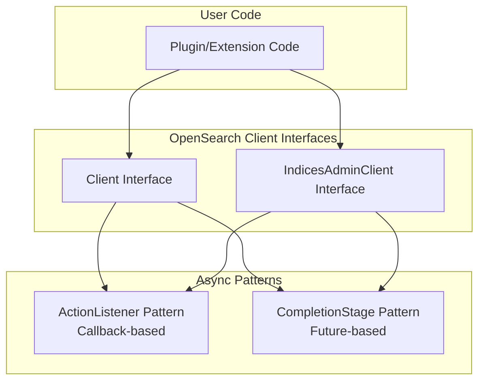
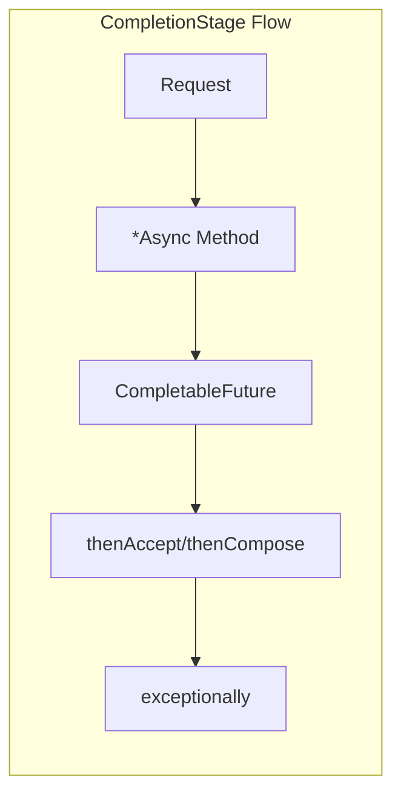

# Client API Enhancements

## Summary

The Client API Enhancements feature provides `CompletionStage` variants to OpenSearch's internal Java client interfaces (`Client` and `IndicesAdminClient`). This modernizes the asynchronous programming model by offering an alternative to the traditional callback-based `ActionListener` pattern, enabling cleaner, more maintainable code through functional-style method chaining.

## Details

### Architecture



### Data Flow



### Components

| Component | Description |
|-----------|-------------|
| `Client` | Main client interface for document and search operations |
| `IndicesAdminClient` | Administrative client for index management operations |
| `CompletionStage<T>` | Java interface representing a stage of async computation |
| `CompletableFuture<T>` | Implementation used internally to bridge ActionListener |

### Configuration

This feature requires no configuration. The new methods are available as default interface methods.

### Usage Example

**Document Operations:**
```java
// Index a document
client.indexAsync(new IndexRequest("my-index").source(jsonMap))
    .thenAccept(response -> {
        System.out.println("Document indexed: " + response.getId());
    })
    .exceptionally(e -> {
        logger.error("Indexing failed", e);
        return null;
    });

// Search with chaining
client.searchAsync(searchRequest)
    .thenCompose(searchResponse -> {
        // Process results and perform follow-up operation
        return client.clearScrollAsync(new ClearScrollRequest());
    })
    .thenAccept(clearResponse -> {
        System.out.println("Search and cleanup complete");
    });
```

**Index Administration:**
```java
// Create index if not exists
client.admin().indices().existsAsync(new IndicesExistsRequest("my-index"))
    .thenCompose(existsResponse -> {
        if (!existsResponse.isExists()) {
            return client.admin().indices().createAsync(
                new CreateIndexRequest("my-index")
                    .settings(Settings.builder()
                        .put("index.number_of_shards", 1)
                        .put("index.number_of_replicas", 1))
            );
        }
        return CompletableFuture.completedFuture(null);
    })
    .thenAccept(result -> System.out.println("Index ready"));

// Refresh and get stats
client.admin().indices().refreshAsync(new RefreshRequest("my-index"))
    .thenCompose(refreshResponse -> 
        client.admin().indices().statsAsync(new IndicesStatsRequest().indices("my-index"))
    )
    .thenAccept(stats -> {
        System.out.println("Doc count: " + stats.getTotal().getDocs().getCount());
    });
```

### Supported Operations

#### Client Interface Methods

| Category | Methods |
|----------|---------|
| Document | `indexAsync`, `updateAsync`, `deleteAsync`, `getAsync`, `multiGetAsync` |
| Bulk | `bulkAsync` |
| Search | `searchAsync`, `searchScrollAsync`, `multiSearchAsync`, `clearScrollAsync` |
| Analysis | `termVectorsAsync`, `multiTermVectorsAsync`, `explainAsync`, `fieldCapsAsync` |
| Views | `searchViewAsync`, `listViewNamesAsync` |

#### IndicesAdminClient Interface Methods

| Category | Methods |
|----------|---------|
| Lifecycle | `existsAsync`, `createAsync`, `deleteAsync`, `openAsync`, `closeAsync` |
| Maintenance | `refreshAsync`, `flushAsync`, `forceMergeAsync`, `upgradeAsync` |
| Mappings | `getMappingsAsync`, `putMappingAsync`, `getFieldMappingsAsync` |
| Settings | `getSettingsAsync`, `updateSettingsAsync` |
| Aliases | `aliasesAsync`, `getAliasesAsync` |
| Templates | `putTemplateAsync`, `deleteTemplateAsync`, `getTemplatesAsync` |
| Data Streams | `createDataStreamAsync`, `deleteDataStreamAsync`, `getDataStreamsAsync` |
| Views | `createViewAsync`, `getViewAsync`, `deleteViewAsync`, `updateViewAsync` |
| Ingestion | `pauseIngestionAsync`, `resumeIngestionAsync`, `getIngestionStateAsync` |
| Other | `statsAsync`, `recoveriesAsync`, `segmentsAsync`, `shardStoresAsync`, `addBlockAsync`, `validateQueryAsync`, `resizeIndexAsync`, `rolloverIndexAsync`, `resolveIndexAsync`, `analyzeAsync`, `clearCacheAsync`, `getIndexAsync`, `segmentReplicationStatsAsync` |

## Limitations

- These are internal Java APIs for plugin/extension development, not the external REST client
- Default implementations wrap `ActionListener`, so no performance improvement over callback pattern
- Requires Java 8+ for `CompletionStage` support

## Related PRs

| Version | PR | Description |
|---------|-----|-------------|
| v3.3.0 | [#18998](https://github.com/opensearch-project/OpenSearch/pull/18998) | Add CompletionStage variants to Client interface |
| v3.3.0 | [#19161](https://github.com/opensearch-project/OpenSearch/pull/19161) | Add CompletionStage variants to IndicesAdminClient |

## References

- [PR #18998](https://github.com/opensearch-project/OpenSearch/pull/18998): Initial implementation
- [PR #19161](https://github.com/opensearch-project/OpenSearch/pull/19161): IndicesAdminClient extension
- [Java CompletionStage API](https://docs.oracle.com/javase/8/docs/api/java/util/concurrent/CompletionStage.html): Java documentation

## Change History

- **v3.3.0** (2025-08): Initial implementation with CompletionStage variants for Client and IndicesAdminClient interfaces
