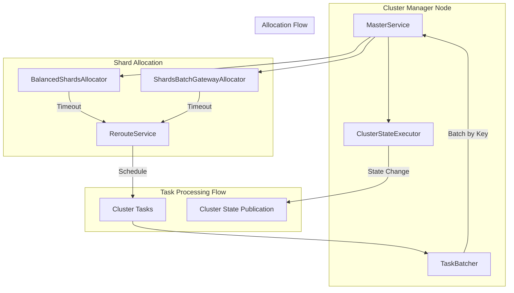
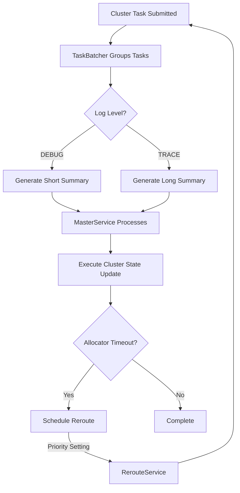

---
tags:
  - indexing
  - observability
  - performance
---

# Cluster Management

## Summary

Cluster management in OpenSearch encompasses the coordination and optimization of cluster-wide operations, including task batching, shard allocation, and reroute scheduling. These internal mechanisms ensure efficient cluster state updates and recovery operations, particularly important for large-scale deployments with many shards.

## Details

### Architecture



### Data Flow



### Components

| Component | Description |
|-----------|-------------|
| `MasterService` | Coordinates cluster state updates on the cluster manager node |
| `TaskBatcher` | Batches cluster tasks by key for efficient processing |
| `BalancedShardsAllocator` | Allocates shards across nodes for balanced distribution |
| `ShardsBatchGatewayAllocator` | Batch allocator for existing shard recovery |
| `RerouteService` | Schedules reroute operations for shard allocation |

### Configuration

| Setting | Description | Default |
|---------|-------------|---------|
| `cluster.routing.allocation.balanced_shards_allocator.schedule_reroute.priority` | Priority for followup reroute when balanced allocator times out | `NORMAL` |
| `cluster.routing.allocation.shards_batch_gateway_allocator.schedule_reroute.priority` | Priority for followup reroute when batch gateway allocator times out | `NORMAL` |

Valid priority values: `NORMAL`, `HIGH`, `URGENT`

### Usage Example

Configure reroute priority for clusters experiencing task starvation:

```yaml
# opensearch.yml
cluster.routing.allocation.balanced_shards_allocator.schedule_reroute.priority: high
cluster.routing.allocation.shards_batch_gateway_allocator.schedule_reroute.priority: high
```

Dynamic configuration via API:

```json
PUT _cluster/settings
{
  "persistent": {
    "cluster.routing.allocation.balanced_shards_allocator.schedule_reroute.priority": "high",
    "cluster.routing.allocation.shards_batch_gateway_allocator.schedule_reroute.priority": "high"
  }
}
```

## Limitations

- Reroute priority settings only affect tasks triggered by allocator timeouts
- DEBUG logging shows abbreviated task summaries; enable TRACE for full details
- Priority escalation should be used cautiously as it may affect other cluster operations

## Change History

- **v3.0.0** (2025-03-18): Added configurable reroute priority settings, optimized MasterService logging to reduce recovery time for large clusters

## References

### Documentation
- [Cluster Allocation Explain API](https://docs.opensearch.org/3.0/api-reference/cluster-api/cluster-allocation/): Official documentation
- [Creating a Cluster](https://docs.opensearch.org/3.0/tuning-your-cluster/): Cluster tuning guide

### Pull Requests
| Version | PR | Description | Related Issue |
|---------|-----|-------------|---------------|
| v3.0.0 | [#14795](https://github.com/opensearch-project/OpenSearch/pull/14795) | Reduce logging in DEBUG for MasterService:run | [#12249](https://github.com/opensearch-project/OpenSearch/issues/12249) |
| v3.0.0 | [#16445](https://github.com/opensearch-project/OpenSearch/pull/16445) | Change priority for scheduling reroute during timeout |   |

### Issues (Design / RFC)
- [Issue #12249](https://github.com/opensearch-project/OpenSearch/issues/12249): Reduce TaskBatcher excessive logging in DEBUG mode
