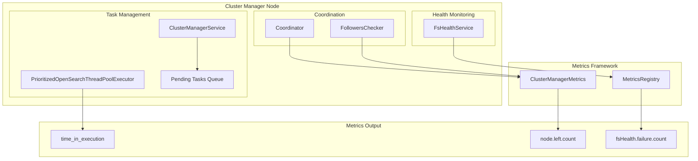
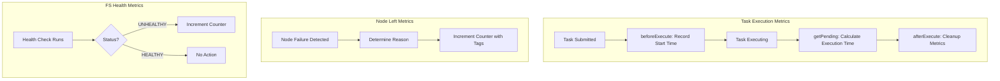

# Cluster Manager Metrics

## Summary

Cluster Manager Metrics provide observability into the cluster manager node's operations, including task execution latency, node departure events, and filesystem health. These metrics help operators identify performance bottlenecks, diagnose cluster instability, and monitor the health of the cluster manager.

## Details

### Architecture



### Data Flow



### Components

| Component | Class | Description |
|-----------|-------|-------------|
| Task Metrics Tracker | `TaskMetrics` | Inner class in `PrioritizedOpenSearchThreadPoolExecutor` that tracks task start time |
| Pending Task | `PendingClusterTask` | Extended to include `timeInExecution` field |
| Pending Tasks Response | `PendingClusterTasksResponse` | Extended to serialize execution time in API response |
| Cluster Manager Metrics | `ClusterManagerMetrics` | Central metrics class with `nodeLeftCounter` |
| Coordinator | `Coordinator` | Emits node-left metrics when removing nodes |
| FS Health Service | `FsHealthService` | Emits filesystem health failure metrics |

### Configuration

| Setting | Description | Default |
|---------|-------------|---------|
| `monitor.fs.health.enabled` | Enable filesystem health monitoring | `true` |
| `monitor.fs.health.refresh_interval` | Interval between health checks | `30s` |
| `monitor.fs.health.slow_path_logging_threshold` | Threshold for slow path logging | `5s` |

### Metrics Reference

#### time_in_execution (API Field)

Available in `/_cluster/pending_tasks` response:

| Field | Type | Description |
|-------|------|-------------|
| `time_in_execution_millis` | Long | Milliseconds the task has been executing |
| `time_in_execution` | String | Human-readable duration (e.g., "19.7s") |

#### node.left.count (Counter)

Incremented when a node leaves the cluster:

| Tag | Description |
|-----|-------------|
| `follower_node_id` | The ID of the node that left |
| `reason` | Reason for departure |

Reason values:
- `disconnected`: Node connection was lost
- `lagging`: Node fell behind in cluster state updates
- `follower.check.fail`: Follower check retry count exceeded
- `health.check.fail`: Node health check failed

#### fsHealth.failure.count (Counter)

Incremented when filesystem health check fails. No tags.

### Usage Example

#### Query Pending Tasks with Execution Time

```bash
curl -X GET "localhost:9200/_cluster/pending_tasks?pretty"
```

```json
{
  "tasks": [
    {
      "insert_order": 1,
      "priority": "URGENT",
      "source": "create-index [test], cause [api]",
      "executing": true,
      "time_in_queue_millis": 5000,
      "time_in_queue": "5s",
      "time_in_execution_millis": 4500,
      "time_in_execution": "4.5s"
    }
  ]
}
```

#### Interpreting Metrics

- High `time_in_execution` values indicate slow cluster state updates
- Frequent `node.left.count` increments suggest cluster instability
- `fsHealth.failure.count` increments indicate storage issues

## Limitations

- Task execution time is only tracked for tasks currently in the executor
- Node-left metrics require the metrics framework to be enabled
- FS health metrics depend on health monitoring being enabled
- Metrics are node-local and need aggregation for cluster-wide view

## Change History

- **v3.1.0** (2025-06): Initial implementation with three metrics: task execution time, node-left counter, and FS health failure counter

## References

### Documentation
- [CAT Pending Tasks API](https://docs.opensearch.org/3.0/api-reference/cat/cat-pending-tasks/): API documentation
- [Metrics Reference](https://docs.opensearch.org/3.0/monitoring-your-cluster/pa/reference/): Performance Analyzer metrics
- [Cluster Manager Task Throttling](https://docs.opensearch.org/3.0/tuning-your-cluster/cluster-manager-task-throttling/): Related cluster manager documentation

### Pull Requests
| Version | PR | Description | Related Issue |
|---------|-----|-------------|---------------|
| v3.1.0 | [#17780](https://github.com/opensearch-project/OpenSearch/pull/17780) | Added time_in_execution to pending tasks API | [#11818](https://github.com/opensearch-project/OpenSearch/issues/11818) |
| v3.1.0 | [#18421](https://github.com/opensearch-project/OpenSearch/pull/18421) | Added node-left metric with reason tags |   |
| v3.1.0 | [#18435](https://github.com/opensearch-project/OpenSearch/pull/18435) | Added FS health check failure metric |   |

### Issues (Design / RFC)
- [Issue #11818](https://github.com/opensearch-project/OpenSearch/issues/11818): Original feature request for task execution latency
