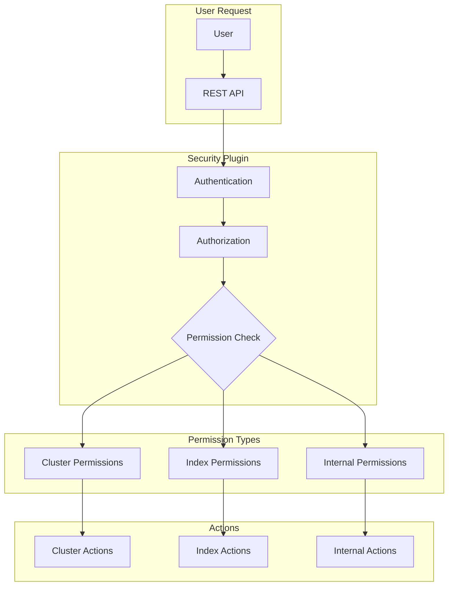

---
tags:
  - indexing
  - security
---

# Cluster Permissions

## Summary

OpenSearch uses a permission-based access control system to manage what actions users can perform on the cluster. Cluster permissions control access to cluster-wide operations like monitoring, administration, and management tasks. This feature documentation covers the `CatShardsAction` permission and its evolution across OpenSearch versions.

## Details

### Architecture



### Permission Types

| Type | Prefix | Description |
|------|--------|-------------|
| Cluster | `cluster:` | Cluster-wide operations (admin, monitor) |
| Index | `indices:` | Index-specific operations (read, write, admin) |
| Internal | `internal:` | Internal operations (not exposed to users) |

### CatShardsAction Permission

The `CatShardsAction` is responsible for handling the `_cat/shards` API, which displays shard allocation information across the cluster.

#### Permission Evolution

| Version | Permission | Behavior |
|---------|------------|----------|
| < 2.17 | N/A (direct handler) | Index-level permissions only |
| 2.17 - 2.x | `cluster:monitor/shards` | Required explicit cluster permission |
| 3.0.0+ | `internal:monitor/shards` | No explicit permission required |

### Configuration

#### Role Definition Example

```yaml
# Role with read access to specific indexes
read_only_role:
  reserved: false
  cluster_permissions: []
  index_permissions:
    - index_patterns:
        - 'logs-*'
        - 'metrics-*'
      allowed_actions:
        - 'indices:data/read/*'
        - 'indices:monitor/stats'
  tenant_permissions: []
```

#### Testing Permissions

To verify a user's permissions for the `_cat/shards` API:

```bash
# Test as a specific user
curl -u user:password -X GET "https://localhost:9200/_cat/shards?v"
```

If permissions are insufficient, you'll receive an error like:

```json
{
  "error": {
    "root_cause": [{
      "type": "security_exception",
      "reason": "no permissions for [cluster:monitor/shards] and User [name=user, ...]"
    }]
  },
  "status": 403
}
```

### Usage Example

```bash
# List all shards
GET _cat/shards?v

# List shards for specific index
GET _cat/shards/my-index?v

# List shards with additional columns
GET _cat/shards?v&h=index,shard,prirep,state,docs,store,node
```

## Limitations

- The `_cat/shards` API shows shard information only for indexes the user has access to
- Cluster-level permissions cannot be scoped to specific indexes
- Internal permissions are not configurable by users

## Change History

- **v3.0.0** (2025-05-06): Changed `CatShardsAction` permission from `cluster:monitor/shards` to `internal:monitor/shards`, restoring pre-2.17 behavior for non-admin users
- **v2.17.0** (2024-09-17): Introduced `CatShardsAction` with `cluster:monitor/shards` permission for pagination and cancellation support

## References

### Documentation
- [CAT shards API](https://docs.opensearch.org/3.0/api-reference/cat/cat-shards/): Official documentation
- [Permissions](https://docs.opensearch.org/3.0/security/access-control/permissions/): Security permissions reference
- [Default action groups](https://docs.opensearch.org/3.0/security/access-control/default-action-groups/): Predefined permission groups

### Pull Requests
| Version | PR | Description | Related Issue |
|---------|-----|-------------|---------------|
| v3.0.0 | [#17203](https://github.com/opensearch-project/OpenSearch/pull/17203) | Changed CatShardsAction to internal to allow non-admin users |   |
| v3.0.0 | [#18185](https://github.com/opensearch-project/OpenSearch/pull/18185) | Adding new permission for _cat/shard action to 3.0 release notes |   |

### Issues (Design / RFC)
- [Issue #17199](https://github.com/opensearch-project/OpenSearch/issues/17199): Bug report - Make CatShardsAction internal
