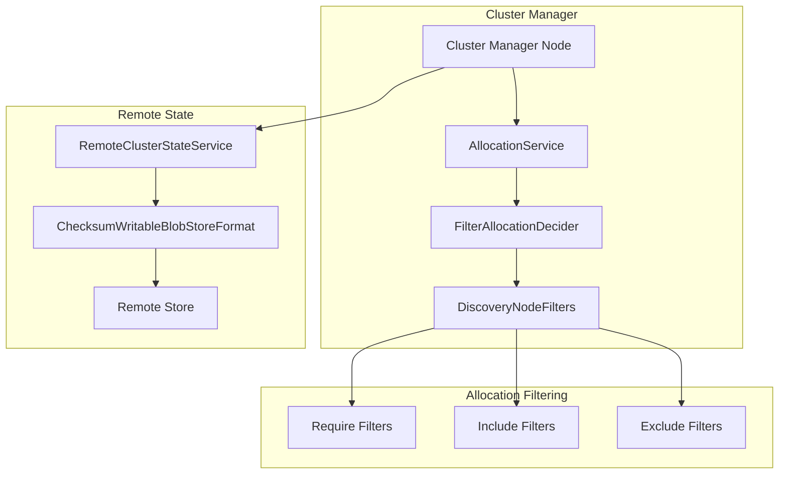

---
tags:
  - indexing
---

# Cluster State & Allocation

## Summary

Cluster state allocation in OpenSearch manages how shards are distributed across nodes in the cluster. This includes allocation filtering (controlling which nodes can host specific shards) and remote cluster state publication (persisting cluster state to remote storage for durability). These components work together to ensure cluster stability, proper shard placement, and disaster recovery capabilities.

## Details

### Architecture



### Components

| Component | Description |
|-----------|-------------|
| `AllocationService` | Orchestrates shard allocation decisions across the cluster |
| `FilterAllocationDecider` | Decides if a shard can be allocated to a node based on filters |
| `DiscoveryNodeFilters` | Manages node attribute filters for allocation decisions |
| `RemoteClusterStateService` | Handles remote cluster state upload and download |
| `ChecksumWritableBlobStoreFormat` | Serializes/deserializes cluster state entities with version awareness |

### Allocation Filtering

Allocation filters control shard placement using node attributes:

| Filter Type | Setting Prefix | Behavior |
|-------------|----------------|----------|
| Require | `cluster.routing.allocation.require.*` | Node must match ALL specified attributes |
| Include | `cluster.routing.allocation.include.*` | Node must match ANY specified attribute |
| Exclude | `cluster.routing.allocation.exclude.*` | Node must NOT match ANY specified attribute |

### Remote Cluster State Entities

When remote cluster state publication is enabled, the following entities are serialized to remote storage:

| Entity | Class | Description |
|--------|-------|-------------|
| Discovery Nodes | `RemoteDiscoveryNodes` | Node membership information |
| Cluster Blocks | `RemoteClusterBlocks` | Cluster-level and index-level blocks |
| Routing Table | `RemoteIndexRoutingTable` | Shard allocation per index |
| Routing Table Diff | `RemoteRoutingTableDiff` | Incremental routing changes |
| Consistent Settings | `RemoteHashesOfConsistentSettings` | Hashes for settings consistency |
| Cluster State Customs | `RemoteClusterStateCustoms` | Custom cluster state extensions |

### Configuration

| Setting | Description | Default |
|---------|-------------|---------|
| `cluster.remote_store.state.enabled` | Enable remote cluster state | `false` |
| `cluster.remote_store.publication.enabled` | Enable remote publication | `false` |
| `cluster.remote_store.state.read_timeout` | Remote state download timeout | `20s` |
| `cluster.remote_store.state.global_metadata.upload_timeout` | Upload timeout | `20s` |

### Usage Example

```yaml
# Enable remote cluster state
cluster.remote_store.state.enabled: true
cluster.remote_store.publication.enabled: true

# Configure remote state repository
node.attr.remote_store.state.repository: my-remote-state-repo
node.attr.remote_store.repository.my-remote-state-repo.type: s3
node.attr.remote_store.repository.my-remote-state-repo.settings.bucket: my-bucket
node.attr.remote_store.repository.my-remote-state-repo.settings.region: us-east-1
```

```json
// Allocation filter example
PUT _cluster/settings
{
  "persistent": {
    "cluster.routing.allocation.exclude._name": "node-to-decommission"
  }
}
```

## Limitations

- Remote cluster state requires all cluster manager nodes to have access to the remote repository
- Allocation filter updates are eventually consistent across the cluster
- Mixed-version clusters may experience serialization issues with remote state (fixed in v3.4.0)

## Change History

- **v3.4.0** (2026-01-14): Fixed concurrent modification in allocation filters; Added version-aware serialization for remote state entities

## References

### Documentation
- [Remote Cluster State Documentation](https://docs.opensearch.org/3.0/tuning-your-cluster/availability-and-recovery/remote-store/remote-cluster-state/)
- [Cluster Settings - Allocation](https://docs.opensearch.org/3.0/install-and-configure/configuring-opensearch/cluster-settings/)

### Pull Requests
| Version | PR | Description | Related Issue |
|---------|-----|-------------|---------------|
| v3.4.0 | [#19701](https://github.com/opensearch-project/OpenSearch/pull/19701) | Fix concurrent modification in DiscoveryNodeFilters |   |
| v3.4.0 | [#20080](https://github.com/opensearch-project/OpenSearch/pull/20080) | Version-aware serialization for remote state entities | [#19843](https://github.com/opensearch-project/OpenSearch/issues/19843) |

### Issues (Design / RFC)
- [Issue #19843](https://github.com/opensearch-project/OpenSearch/issues/19843): Remote state backward compatibility bug
