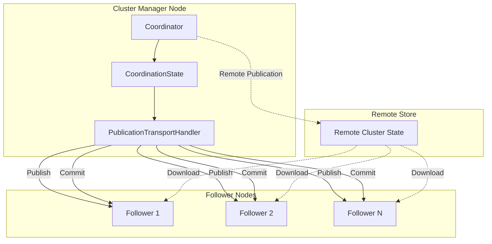
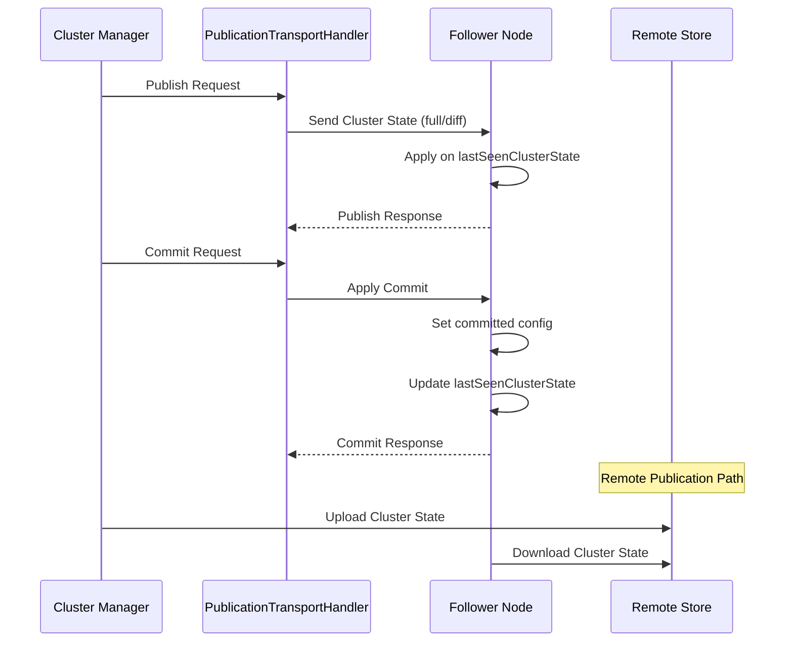

# Cluster State Management

## Summary

Cluster state management in OpenSearch handles the coordination and distribution of cluster metadata across all nodes. The cluster state contains critical information including index settings, mappings, shard allocation, cluster-level settings, and voting configurations. Proper management ensures cluster consistency and enables features like remote cluster state publication for improved durability.

## Details

### Architecture



### Cluster State Publication Flow



### Components

| Component | Description |
|-----------|-------------|
| `Coordinator` | Main lifecycle coordinator managing cluster state transitions between CANDIDATE, LEADER, and FOLLOWER modes |
| `CoordinationState` | Maintains the coordination state including current term, last accepted state, and voting configurations |
| `PublicationTransportHandler` | Handles transport-level publication of cluster state to follower nodes |
| `lastSeenClusterState` | Reference to the last cluster state seen by a node, used as base for applying diffs |
| `ApplyCommitRequest` | Request sent during commit phase to finalize cluster state changes |
| `preCommitState` | Reference to the cluster state that has been published but not yet applied locally (v2.18.0+) |
| `RemoteClusterStateCache` | In-memory cache for remote cluster state based on term-version (v2.18.0+) |

### Configuration

| Setting | Description | Default |
|---------|-------------|---------|
| `cluster.remote_store.state.enabled` | Enable remote cluster state storage | `false` |
| `cluster.remote_store.publication.enabled` | Enable remote cluster state publication | `false` |
| `cluster.publish.timeout` | Timeout for cluster state publication | `30s` |
| `cluster.publish.info_timeout` | Timeout before logging slow publication info | `10s` |
| `opensearch.experimental.optimization.termversion.precommit.enabled` | Enable pre-commit state usage for term-version checks (v2.18.0+) | `false` |

### Voting Configuration

The cluster state contains coordination metadata with two voting configurations:

- **Accepted Voting Configuration**: The configuration accepted during the publish phase
- **Committed Voting Configuration**: The configuration committed after successful publication

These configurations determine which nodes can participate in cluster manager elections and must remain consistent across all nodes.

### Usage Example

```yaml
# Enable remote cluster state in opensearch.yml
cluster.remote_store.state.enabled: true
cluster.remote_store.publication.enabled: true

# Remote state repository settings
node.attr.remote_store.state.repository: my-remote-state-repo
node.attr.remote_store.repository.my-remote-state-repo.type: s3
node.attr.remote_store.repository.my-remote-state-repo.settings.bucket: my-bucket
node.attr.remote_store.repository.my-remote-state-repo.settings.region: us-east-1
```

## Limitations

- Remote cluster state publication requires all nodes to have remote publication enabled
- Unsafe bootstrap scripts cannot be run when remote cluster state is enabled
- When majority of cluster manager nodes are lost, nodes must be replaced and reseeded to bootstrap a new cluster

## Change History

- **v2.18.0** (2024-10-29): Added fallback mechanism to use pre-commit state or remote cluster state on term-version mismatch, reducing unnecessary cluster state transfers in large clusters
- **v2.18.0** (2024-10-29): Fixed voting configuration mismatch by updating lastSeenClusterState in commit phase

## References

### Documentation
- [Remote Cluster State Documentation](https://docs.opensearch.org/2.18/tuning-your-cluster/availability-and-recovery/remote-store/remote-cluster-state/)

### Pull Requests
| Version | PR | Description |
|---------|-----|-------------|
| v2.18.0 | [#15424](https://github.com/opensearch-project/OpenSearch/pull/15424) | Fallback to remote cluster-state on term-version check mismatch |
| v2.18.0 | [#16215](https://github.com/opensearch-project/OpenSearch/pull/16215) | Fix: Update last seen cluster state in commit phase |

### Issues (Design / RFC)
- [Issue #15414](https://github.com/opensearch-project/OpenSearch/issues/15414): Feature request for leveraging ClusterState from Publish phase
