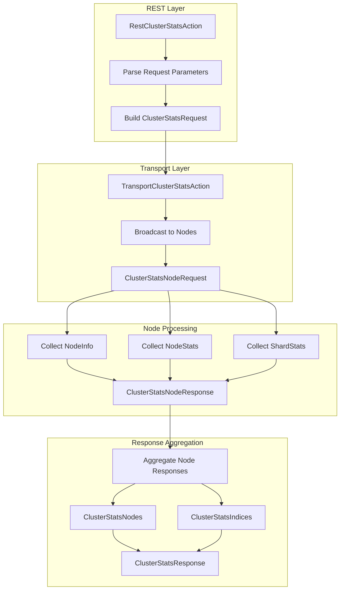
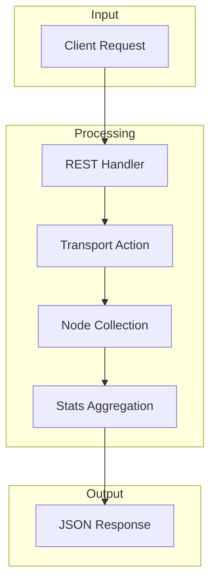

# Cluster Stats API

## Summary

The Cluster Stats API returns comprehensive statistics about an OpenSearch cluster, including node-level metrics (OS, JVM, process, filesystem) and index-level metrics (shards, documents, storage, caches). Starting from v2.18.0, the API supports URI path filtering to request specific metrics, improving performance for monitoring and observability use cases.

## Details

### Architecture



### Data Flow



### Components

| Component | Description |
|-----------|-------------|
| `RestClusterStatsAction` | REST handler that parses URI parameters and builds requests |
| `ClusterStatsRequest` | Request object containing metric filters and node filters |
| `ClusterStatsRequest.Metric` | Enum for node-level metrics (os, jvm, fs, process, etc.) |
| `ClusterStatsRequest.IndexMetric` | Enum for index-level metrics (shards, docs, store, etc.) |
| `TransportClusterStatsAction` | Transport action that coordinates node-level stats collection |
| `ClusterStatsNodeResponse` | Per-node response containing NodeInfo, NodeStats, and ShardStats |
| `ClusterStatsNodes` | Aggregated node statistics across the cluster |
| `ClusterStatsIndices` | Aggregated index statistics across the cluster |
| `ClusterStatsResponse` | Final response containing all aggregated statistics |

### Configuration

| Setting | Description | Default |
|---------|-------------|---------|
| `timeout` | Request timeout for cluster stats operation | 30s |

### API Endpoints

| Endpoint | Description |
|----------|-------------|
| `GET /_cluster/stats` | Get all cluster statistics |
| `GET /_cluster/stats/nodes/{nodeId}` | Get stats for specific nodes |
| `GET /_cluster/stats/{metric}/nodes/{nodeId}` | Get filtered node metrics |
| `GET /_cluster/stats/{metric}/{index_metric}/nodes/{nodeId}` | Get filtered node and index metrics |

### Supported Metrics

**Node Metrics:**
- `os` - Operating system statistics
- `process` - Process statistics
- `jvm` - JVM statistics
- `fs` - Filesystem statistics
- `plugins` - Plugin information
- `ingest` - Ingest pipeline statistics
- `network_types` - Network type information
- `discovery_types` - Discovery method information
- `packaging_types` - Distribution information
- `indices` - Index statistics (gateway to index metrics)

**Index Metrics:**
- `shards` - Shard distribution statistics
- `docs` - Document counts
- `store` - Storage statistics
- `fielddata` - Field data cache statistics
- `query_cache` - Query cache statistics
- `completion` - Completion suggester statistics
- `segments` - Lucene segment statistics
- `mappings` - Field type mapping statistics
- `analysis` - Analyzer configuration statistics

### Usage Example

**Get all cluster stats:**
```bash
GET /_cluster/stats
```

**Get stats for specific nodes:**
```bash
GET /_cluster/stats/nodes/node1,node2
```

**Get only OS and JVM metrics:**
```bash
GET /_cluster/stats/os,jvm/nodes/_all
```

**Get index docs and segments only:**
```bash
GET /_cluster/stats/indices/docs,segments/nodes/_all
```

**Combined filtering:**
```bash
GET /_cluster/stats/os,indices/shards,docs/nodes/_all
```

## Limitations

- Metric filtering requires OpenSearch 2.18.0+ (or 3.0.0+)
- The `_all` keyword cannot be combined with individual metrics
- Index metrics require the `indices` metric to be included in the request
- During rolling upgrades, filtered requests may fail if sent to older nodes

## Change History

- **v2.18.0** (2024-10-22): Added URI path filtering support for selective metric retrieval
- **v1.0.0**: Initial cluster stats API implementation

## References

### Documentation
- [Cluster Stats API Documentation](https://docs.opensearch.org/latest/api-reference/cluster-api/cluster-stats/)
- [PR #14447](https://github.com/opensearch-project/OpenSearch/pull/14447): Original motivation for performance improvements

### Pull Requests
| Version | PR | Description |
|---------|-----|-------------|
| v2.18.0 | [#15938](https://github.com/opensearch-project/OpenSearch/pull/15938) | URI path filtering support in cluster stats API |
