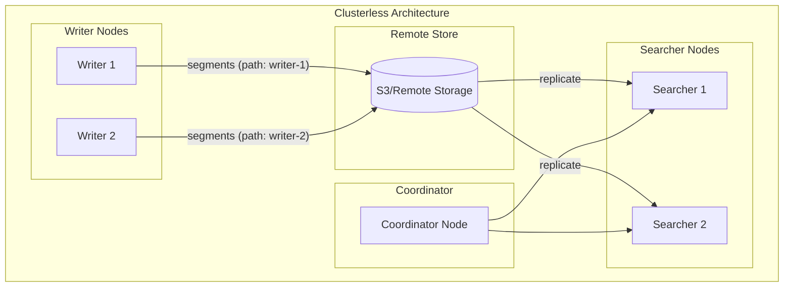
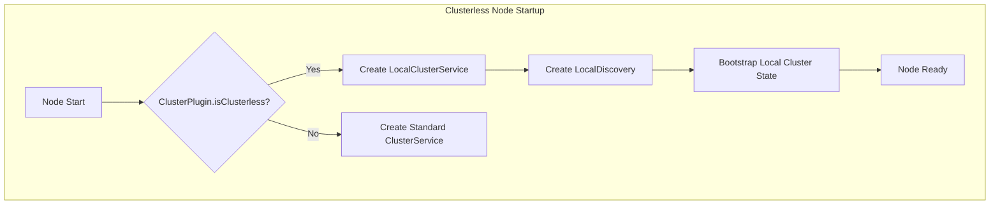

# Clusterless Mode

## Summary

Clusterless mode is an experimental capability that enables OpenSearch nodes to operate independently without joining a traditional cluster. This feature supports cloud-native architectures where data nodes can function as shared-nothing components, fetching index segments from remote storage without requiring cluster manager coordination.

Key benefits include:
- **Horizontal scalability**: Data nodes can scale linearly without shared bottlenecks
- **Reduced contention**: No waiting on cluster state propagation
- **Better fault isolation**: Node failures don't affect other nodes
- **Easier operations**: Nodes can be added/removed like microservices

## Details

### Architecture



### Data Flow



### Components

| Component | Description |
|-----------|-------------|
| `LocalClusterService` | ClusterService implementation that operates without cluster manager. Uses a dummy `ClusterManagerService` and manages only local cluster state |
| `LocalDiscovery` | Discovery implementation that only discovers the local node. Creates a bootstrap cluster state with just the local node |
| `LocalShardStateAction` | Handles shard state changes (started/failed) locally without communicating with cluster manager |
| `ClusterPlugin.isClusterless()` | Plugin interface method that signals the node should start in clusterless mode |

### Configuration

| Setting | Description | Default | Scope |
|---------|-------------|---------|-------|
| `index.remote_store.segment.path_prefix` | Unique identifier injected into remote store paths to support multiple writers | `null` | Index |

#### Path Prefix Validation Rules

- Remote store must be enabled (`index.remote_store.enabled: true`)
- Cannot contain path separators: `/`, `\`
- Cannot contain drive specifiers: `:`
- Empty or whitespace values are ignored (backward compatible)

### Remote Store Path Structure

Without path prefix (traditional):
```
remote_repository/hash/index-uuid/shard-id/segments/data/file
```

With path prefix (clusterless):
```
remote_repository/hash/index-uuid/shard-id/<path-prefix>/segments/data/file
```

### Usage Example

#### Implementing a Clusterless Plugin

```java
public class ClusterlessPlugin extends Plugin implements ClusterPlugin {
    
    @Override
    public boolean isClusterless() {
        return true;
    }
    
    // Additional plugin implementation for managing
    // cluster state, routing, and coordination
}
```

#### Configuring Writer Path Prefix

```json
PUT /my-index/_settings
{
  "index.remote_store.segment.path_prefix": "writer-node-1"
}
```

#### Configuring Searcher to Replicate from Specific Writer

```json
PUT /my-index/_settings
{
  "index.remote_store.segment.path_prefix": "writer-node-1"
}
```

## Limitations

- **Experimental**: Feature is experimental and APIs may change in future releases
- **Plugin required**: Requires custom plugin implementing `ClusterPlugin.isClusterless()`
- **No cluster state updates**: `submitStateUpdateTasks()` throws `UnsupportedOperationException`
- **Single node discovery**: Only local node is discoverable
- **No GatewayService**: Gateway service is not created in clusterless mode
- **Limited actions**: Some transport actions that require Discovery are not available

## Change History

- **v3.2.0** (2025-07): Initial experimental implementation with clusterless startup mode and custom remote store path prefix support

## References

### Documentation
- [Remote-backed storage documentation](https://docs.opensearch.org/3.2/tuning-your-cluster/availability-and-recovery/remote-store/index/)
- [Segment replication documentation](https://docs.opensearch.org/3.2/tuning-your-cluster/availability-and-recovery/segment-replication/index/)

### Pull Requests
| Version | PR | Description | Related Issue |
|---------|-----|-------------|---------------|
| v3.2.0 | [#18479](https://github.com/opensearch-project/OpenSearch/pull/18479) | Start in "clusterless" mode if a clusterless ClusterPlugin is loaded | [#17957](https://github.com/opensearch-project/OpenSearch/issues/17957) |
| v3.2.0 | [#18857](https://github.com/opensearch-project/OpenSearch/pull/18857) | Add support for custom remote store segment path prefix | [#18750](https://github.com/opensearch-project/OpenSearch/issues/18750) |

### Issues (Design / RFC)
- [Issue #17957](https://github.com/opensearch-project/OpenSearch/issues/17957): RFC - Cloud-native OpenSearch
- [Issue #18750](https://github.com/opensearch-project/OpenSearch/issues/18750): Feature request for custom remote store path component
