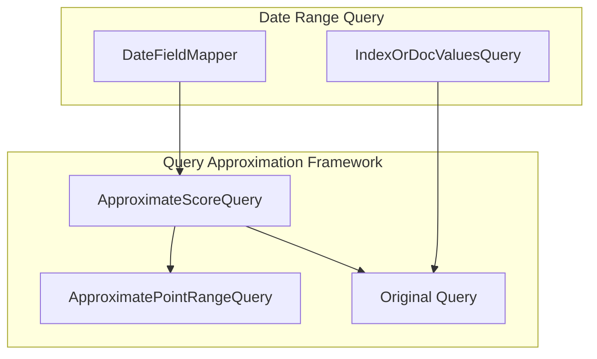

# Code Cleanup

## Summary

Code cleanup encompasses various internal improvements to the OpenSearch codebase that enhance maintainability, fix bugs, and optimize performance without changing user-facing APIs. These changes include removing redundant code, fixing inefficient patterns, and correcting typos.

## Details

### Architecture



### Components

| Component | Description |
|-----------|-------------|
| `ApproximateScoreQuery` | Entry-point wrapper for query approximation framework |
| `ApproximatePointRangeQuery` | Approximate version of point range queries |
| `DateFieldMapper` | Mapper for date fields, uses approximation for range queries |
| `QueryAnalyzer` | Percolator query analysis with optimized extraction logic |
| `RemoteStoreNodeAttribute` | Node attribute for remote store configuration |

### Key Improvements

#### Query Approximation Simplification

The approximation framework was simplified by removing the specialized `ApproximateIndexOrDocValuesQuery` class. The generic `ApproximateScoreQuery` now handles all cases:

- Wraps any original query (including `IndexOrDocValuesQuery`)
- Pairs with an `ApproximateQuery` for potential optimization
- Decides at runtime which query to execute based on context

#### Stream API Best Practices

Replaced inefficient Stream API patterns with traditional loops where appropriate:

- Avoid multiple stream traversals over the same collection
- Use boolean flags instead of `count()` for existence checks
- Combine related operations into single passes

### Configuration

No configuration changes. These are internal code improvements.

### Usage Example

These changes are internal and don't affect user-facing APIs. The query approximation framework is controlled by a feature flag:

```yaml
# opensearch.yml
opensearch.experimental.feature.approximate_point_range_query.enabled: true
```

## Limitations

- Internal changes only; no user-facing API modifications
- Query approximation requires feature flag to be enabled

## Related PRs

| Version | PR | Description |
|---------|-----|-------------|
| v2.18.0 | [#16273](https://github.com/opensearch-project/OpenSearch/pull/16273) | Remove ApproximateIndexOrDocValuesQuery |
| v2.18.0 | [#15386](https://github.com/opensearch-project/OpenSearch/pull/15386) | Fix inefficient Stream API call chains |
| v2.18.0 | [#15362](https://github.com/opensearch-project/OpenSearch/pull/15362) | Fix typo in RemoteStoreNodeAttribute.toString() |

## References

- [PR #16273](https://github.com/opensearch-project/OpenSearch/pull/16273): Query approximation framework cleanup
- [PR #15386](https://github.com/opensearch-project/OpenSearch/pull/15386): Stream API optimization in percolator
- [PR #15362](https://github.com/opensearch-project/OpenSearch/pull/15362): RemoteStoreNodeAttribute typo fix

## Change History

- **v2.18.0** (2024-11-05): Query approximation simplification, Stream API optimization, typo fix
