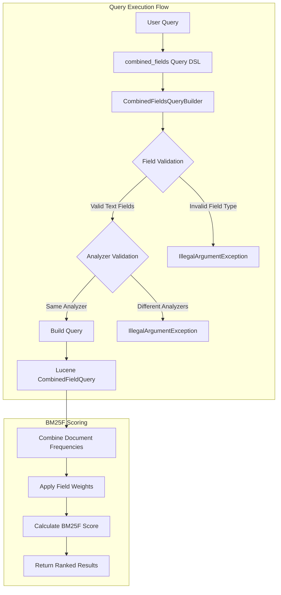
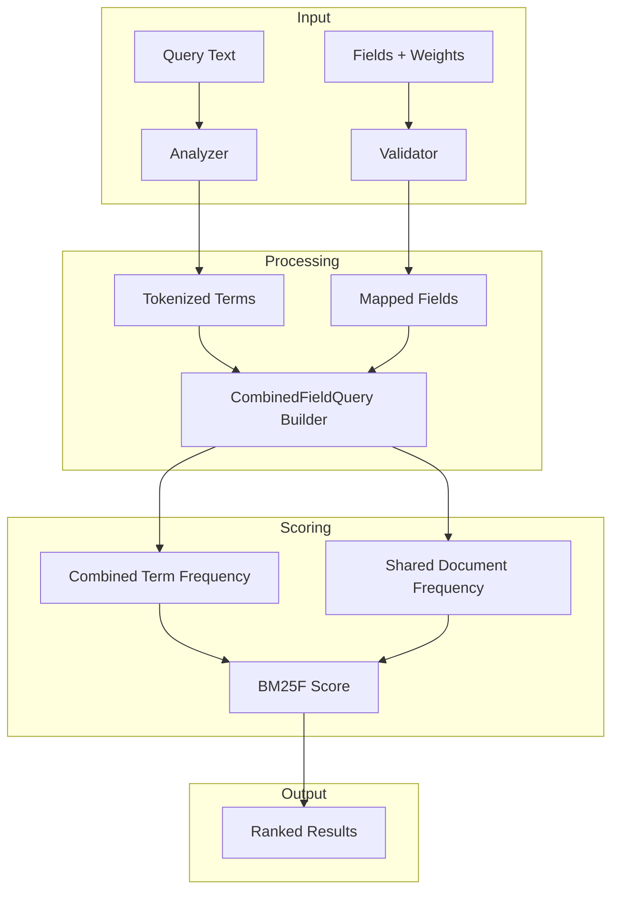

# Combined Fields Query

## Summary

The Combined Fields Query is a full-text search query type that treats multiple text fields as a single combined field for scoring purposes. It uses Lucene's `CombinedFieldQuery` to implement the BM25F (BM25 for multi-field documents) scoring algorithm, providing more accurate relevance ranking when searching across multiple related text fields such as title, body, and summary.

This query is particularly useful when you want to search across multiple fields that conceptually represent the same content (e.g., a document's title and body) and want the scoring to reflect how well the query matches the document as a whole, rather than scoring each field independently.

## Details

### Architecture



### Data Flow



### Components

| Component | Description |
|-----------|-------------|
| `CombinedFieldsQueryBuilder` | Main query builder class that handles query construction, validation, and serialization |
| `Builder` (inner class) | Extends Lucene's `QueryBuilder` to create `CombinedFieldQuery` instances with BM25F scoring |
| `CombinedFieldQuery` (Lucene) | Underlying Lucene query that implements the BM25F scoring algorithm |

### Configuration

| Parameter | Type | Description | Default |
|-----------|------|-------------|---------|
| `query` | String | The search text to be analyzed and matched against the specified fields | Required |
| `fields` | Array | List of text field names with optional boost values (e.g., `["title^3", "content^1.5", "summary"]`) | Required |
| `operator` | String | Boolean operator for combining terms: `AND` (all terms must match) or `OR` (any term can match) | `OR` |
| `minimum_should_match` | String | Minimum number of optional clauses that must match. Supports absolute numbers (`"2"`), percentages (`"75%"`), and complex expressions (`"2<75%"`) | None |
| `boost` | Float | Query-level boost factor applied to the entire query score | `1.0` |
| `_name` | String | Optional query name for identification in search responses | None |

### Usage Examples

#### Basic Usage

```json
GET articles/_search
{
  "query": {
    "combined_fields": {
      "query": "machine learning algorithms",
      "fields": ["title", "abstract", "content"]
    }
  }
}
```

#### With Field Boosting

```json
GET articles/_search
{
  "query": {
    "combined_fields": {
      "query": "distributed systems",
      "fields": ["title^3", "abstract^2", "content"],
      "operator": "AND"
    }
  }
}
```

#### With Minimum Should Match

```json
GET articles/_search
{
  "query": {
    "combined_fields": {
      "query": "natural language processing techniques",
      "fields": ["title^3", "summary^2", "body"],
      "operator": "or",
      "minimum_should_match": "75%"
    }
  }
}
```

### How BM25F Scoring Works

The BM25F algorithm extends the traditional BM25 scoring to handle multiple fields:

1. **Term Frequency Combination**: Term frequencies from all specified fields are combined, weighted by field boost values
2. **Shared Document Frequency**: Document frequency is calculated across all fields together, not per-field
3. **Unified Scoring**: The final score treats the document as if all fields were concatenated into a single field

This approach provides more intuitive scoring compared to alternatives like `multi_match` with `cross_fields`, which scores each field independently and then combines scores.

### Comparison with Other Multi-Field Queries

| Query Type | Scoring Approach | Use Case |
|------------|------------------|----------|
| `combined_fields` | BM25F (unified field scoring) | Related text fields representing same content |
| `multi_match` (best_fields) | Max score across fields | Different content types per field |
| `multi_match` (cross_fields) | Per-field scoring, combined | Mixed field types (may have issues) |
| `query_string` | Per-field with operators | Complex query syntax needed |

## Limitations

- **Text Fields Only**: Only supports text field types. Attempting to use keyword, numeric, date, or other field types will result in an `IllegalArgumentException`
- **Same Analyzer Required**: All specified fields must use the same search analyzer. Fields with different analyzers cannot be combined in a single query
- **No Phrase Support**: Phrase queries (quoted strings like `"exact phrase"`) are explicitly not supported and will throw an error
- **Experimental Status**: The feature is marked as `@opensearch.experimental`, indicating the API may change in future releases

## Change History

- **v3.2.0** (2025-07): Initial implementation of combined_fields query with BM25F scoring support

## References

### Blog Posts
- [BM25F and combined_fields query](https://opensourceconnections.com/blog/2021/06/30/better-term-centric-scoring-in-elasticsearch-with-bm25f-and-the-combined_fields-query/): Background on BM25F scoring algorithm and its benefits

### Pull Requests
| Version | PR | Description | Related Issue |
|---------|-----|-------------|---------------|
| v3.2.0 | [#18724](https://github.com/opensearch-project/OpenSearch/pull/18724) | Add combined_fields query to utilize Lucene's CombinedField (BM25F Text) | [#3996](https://github.com/opensearch-project/OpenSearch/issues/3996) |

### Issues (Design / RFC)
- [Issue #3996](https://github.com/opensearch-project/OpenSearch/issues/3996): Original feature request for combined_fields (BM25F) support
- [Documentation Issue #10209](https://github.com/opensearch-project/documentation-website/issues/10209): Documentation request for combined_fields query
