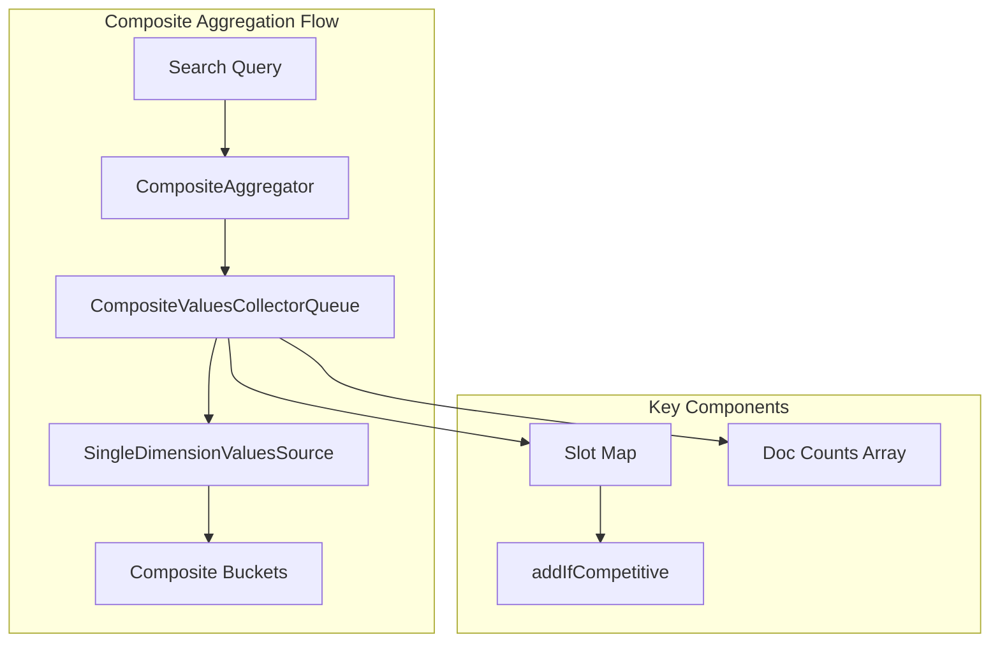
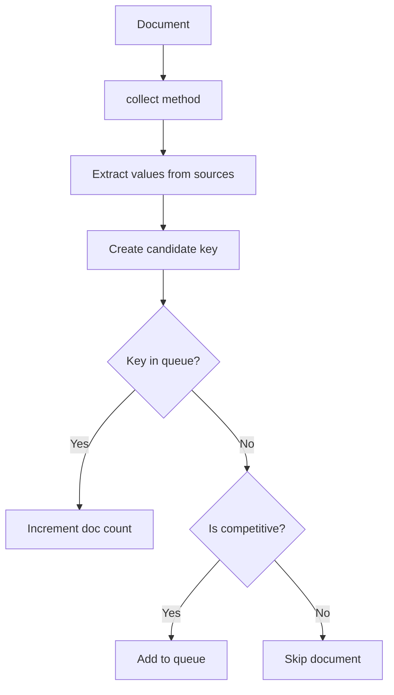

# Composite Aggregation

## Summary

Composite aggregation is a multi-bucket aggregation that creates composite buckets from different sources. It enables efficient pagination through large result sets by using an `after` parameter, making it ideal for scenarios requiring iteration over all unique combinations of field values.

## Details

### Architecture



### Components

| Component | Description |
|-----------|-------------|
| `CompositeAggregator` | Main aggregator that coordinates composite bucket collection |
| `CompositeValuesCollectorQueue` | Priority queue managing competitive composite keys |
| `SingleDimensionValuesSource` | Handles value extraction for each dimension |
| `CompositeValuesSourceConfig` | Configuration for each composite source |

### Data Flow



### Configuration

Composite aggregation is configured through the search API:

| Parameter | Description | Default |
|-----------|-------------|---------|
| `sources` | Array of value sources (terms, histogram, date_histogram) | Required |
| `size` | Number of composite buckets to return | 10 |
| `after` | Key to paginate after | None |

### Usage Example

```json
POST /logs/_search
{
  "size": 0,
  "aggs": {
    "my_buckets": {
      "composite": {
        "size": 100,
        "sources": [
          { "date": { "date_histogram": { "field": "@timestamp", "calendar_interval": "day" }}},
          { "product": { "terms": { "field": "product.keyword" }}},
          { "region": { "terms": { "field": "region.keyword" }}}
        ]
      },
      "aggs": {
        "avg_price": { "avg": { "field": "price" }}
      }
    }
  }
}
```

Pagination using `after`:

```json
POST /logs/_search
{
  "size": 0,
  "aggs": {
    "my_buckets": {
      "composite": {
        "size": 100,
        "sources": [...],
        "after": { "date": 1609459200000, "product": "widget", "region": "us-east" }
      }
    }
  }
}
```

## Limitations

- Cannot be used as a sub-aggregation
- Sources must be deterministic (no script with random values)
- Memory usage scales with `size` parameter and number of sources
- Thread safety in concurrent search scenarios requires careful handling

## Change History

- **v3.2.0**: Performance optimization - reusable Slot object, single-loop initialization, reduced GC pressure

## References

### Documentation
- [Bucket Aggregations](https://docs.opensearch.org/3.0/aggregations/bucket/index/): OpenSearch documentation

### Pull Requests
| Version | PR | Description | Related Issue |
|---------|-----|-------------|---------------|
| v3.2.0 | [#18531](https://github.com/opensearch-project/OpenSearch/pull/18531) | Optimize by removing unnecessary object allocations | [#18440](https://github.com/opensearch-project/OpenSearch/issues/18440) |

### Issues (Design / RFC)
- [Issue #18440](https://github.com/opensearch-project/OpenSearch/issues/18440): Composite Terms Aggregation Performance Improvement
