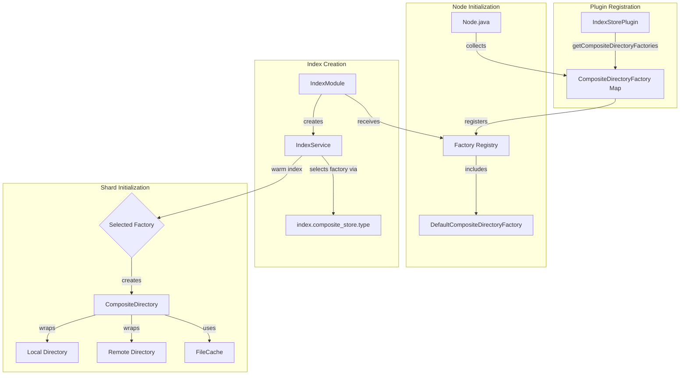
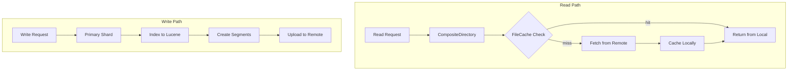

---
tags:
  - indexing
  - performance
---

# Composite Directory Factory

## Summary

Composite Directory Factory is a pluggable extension point in OpenSearch that enables custom implementations of composite directories for warm indices. Composite directories abstract data locality by managing both local and remote storage through a unified interface, using FileCache to optimize read performance. This factory pattern allows plugins to provide custom composite directory implementations tailored to specific storage requirements.

## Details

### Architecture



### Data Flow



### Components

| Component | Description |
|-----------|-------------|
| `IndexStorePlugin.CompositeDirectoryFactory` | Interface for creating composite directories per shard |
| `DefaultCompositeDirectoryFactory` | Default implementation using `CompositeDirectory` |
| `CompositeDirectory` | Directory implementation that abstracts local/remote storage |
| `FileCache` | LRU cache for locally caching remote file data |
| `TransferManager` | Handles data transfer between local and remote storage |

### Configuration

| Setting | Description | Default | Scope |
|---------|-------------|---------|-------|
| `index.composite_store.type` | Composite directory factory type to use | `default` | Index, Node |

### Usage Example

#### Implementing a Custom Factory

```java
public class MyCompositeDirectoryFactory implements IndexStorePlugin.CompositeDirectoryFactory {
    
    @Override
    public Directory newDirectory(
        IndexSettings indexSettings,
        ShardPath shardPath,
        IndexStorePlugin.DirectoryFactory localDirectoryFactory,
        Directory remoteDirectory,
        FileCache fileCache
    ) throws IOException {
        Directory localDirectory = localDirectoryFactory.newDirectory(indexSettings, shardPath);
        return new MyCustomCompositeDirectory(localDirectory, remoteDirectory, fileCache);
    }
}
```

#### Registering via Plugin

```java
public class MyStoragePlugin extends Plugin implements IndexStorePlugin {
    
    @Override
    public Map<String, CompositeDirectoryFactory> getCompositeDirectoryFactories() {
        return Map.of("my-storage", new MyCompositeDirectoryFactory());
    }
}
```

#### Using the Custom Factory

```json
PUT /my-warm-index
{
  "settings": {
    "index.composite_store.type": "my-storage",
    "index.number_of_replicas": 0
  }
}
```

## Limitations

- Only applicable to warm indices with the `WRITABLE_WARM_INDEX_SETTING` feature flag enabled
- Hot indices do not currently support composite directories
- The factory type `default` is reserved and cannot be overridden by plugins
- Custom implementations must handle all aspects of local/remote coordination

## Change History

- **v3.1.0**: Initial implementation - pluggable composite directory factory with default implementation

## References

### Documentation
- [Remote-backed storage documentation](https://docs.opensearch.org/3.1/tuning-your-cluster/availability-and-recovery/remote-store/index/)

### Pull Requests
| Version | PR | Description | Related Issue |
|---------|-----|-------------|---------------|
| v3.1.0 | [#17988](https://github.com/opensearch-project/OpenSearch/pull/17988) | Add composite directory factory | [#17982](https://github.com/opensearch-project/OpenSearch/issues/17982) |

### Issues (Design / RFC)
- [Issue #17982](https://github.com/opensearch-project/OpenSearch/issues/17982): Need for Composite Directory Factory
- [Issue #12809](https://github.com/opensearch-project/OpenSearch/issues/12809): Writable Warm feature
- [Issue #12781](https://github.com/opensearch-project/OpenSearch/issues/12781): Composite Directory
