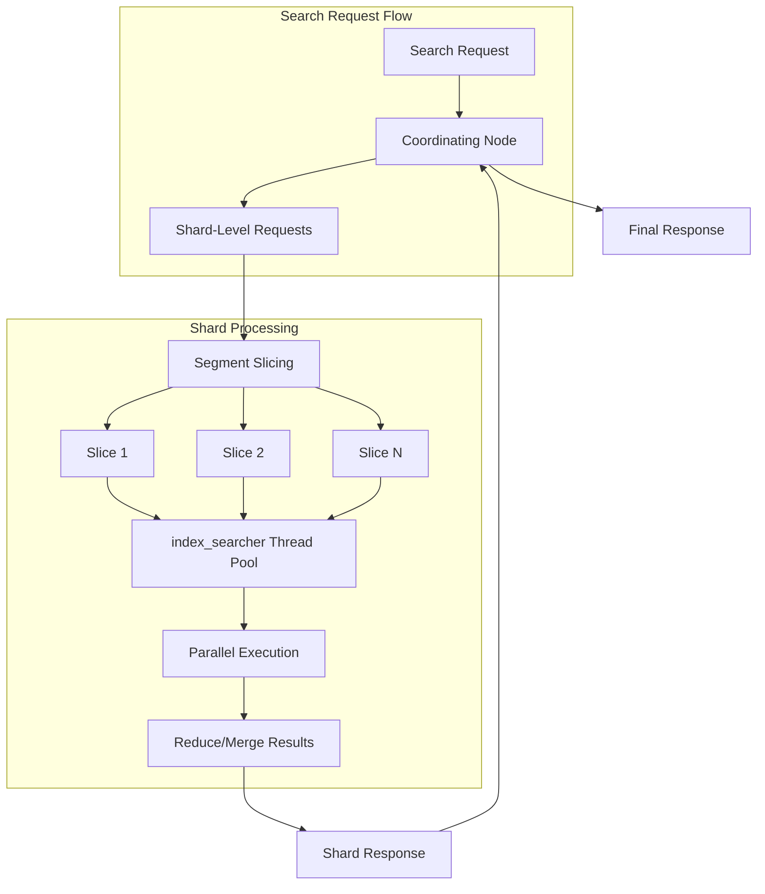
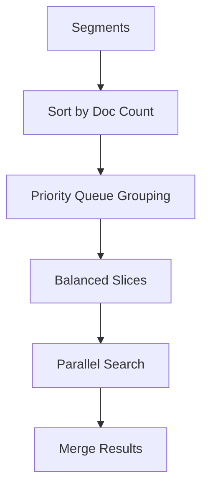

# Concurrent Segment Search

## Summary

Concurrent segment search is a performance optimization feature that enables parallel searching of Lucene segments during the query phase. Instead of searching segments sequentially, OpenSearch divides segments into slices and processes them concurrently using multiple threads, significantly improving search latency for resource-intensive queries.

## Details

### Architecture



### Data Flow



### Components

| Component | Description |
|-----------|-------------|
| `MaxTargetSliceSupplier` | Computes balanced leaf slices using priority queue-based grouping algorithm |
| `Group` | Tracks group index and document sum for priority queue ordering |
| `index_searcher` thread pool | Dedicated thread pool for executing slice searches |
| `ConcurrentSearchRequestDecider` | Pluggable decider for determining when to use concurrent search |

### Configuration

| Setting | Description | Default |
|---------|-------------|---------|
| `search.concurrent_segment_search.mode` | Controls concurrent search behavior: `auto`, `all`, or `none` | `auto` |
| `search.concurrent_segment_search.enabled` | Legacy setting to enable/disable concurrent search | `false` |
| `search.concurrent.max_slice_count` | Maximum number of slices per shard (0 = Lucene mechanism) | Calculated at startup |

### Slicing Mechanisms

#### Max Slice Count Mechanism (Default)

Uses a dynamically configurable maximum number of slices and distributes segments using a priority queue-based algorithm that balances document counts across slices.

Default calculation: `Math.max(1, Math.min(Runtime.getRuntime().availableProcessors() / 2, 4))`

#### Lucene Mechanism

Alternative mechanism that assigns a maximum of 250K documents or 5 segments (whichever is met first) to each slice.

### Usage Example

Enable concurrent segment search for all indexes:

```json
PUT _cluster/settings
{
   "persistent": {
      "search.concurrent_segment_search.mode": "all"
   }
}
```

Enable for a specific index:

```json
PUT <index-name>/_settings
{
    "index.search.concurrent_segment_search.mode": "all"
}
```

Configure slice count:

```json
PUT _cluster/settings
{
   "persistent": {
      "search.concurrent.max_slice_count": 4
   }
}
```

## Limitations

- Not supported with `terminate_after` search parameter
- Parent aggregations on join fields not supported
- `sampler` and `diversified_sampler` aggregations not supported
- Terms aggregations may have additional document count error due to slice-level `shard_size` application
- Sorting optimization may have varying performance depending on data layout

## Change History

- **v3.4.0** (2026-01-14): Performance optimization - omit MaxScoreCollector in SimpleTopDocsCollectorContext when sorting by score with concurrent segment search enabled (~10% latency improvement)
- **v3.3.0** (2025-10-30): Fixed assertion error when using field collapsing with concurrent segment search by removing setShardIndex parameter from CollapseTopFieldDocs.merge()
- **v3.2.0** (2025-07-31): Optimized segment grouping algorithm using priority queue for better load balancing
- **v3.0.0** (2025-04-24): **Breaking change** - Concurrent segment search enabled by default in `auto` mode. Default slice count formula: `Math.min(vCPU / 2, 4)`. Setting key renamed from `CONCURRENT_SEGMENT_SEARCH_TARGET_MAX_SLICE_COUNT_KEY` to `CONCURRENT_SEGMENT_SEARCH_MAX_SLICE_COUNT_KEY`. Aggregation workloads may experience increased CPU utilization.
- **v2.17.0**: Introduced `auto` mode with pluggable `ConcurrentSearchRequestDecider` for aggregation requests
- **v2.12.0**: GA release of concurrent segment search (disabled by default)

## References

### Documentation
- [Concurrent Segment Search Documentation](https://docs.opensearch.org/3.0/search-plugins/concurrent-segment-search/): Official documentation

### Blog Posts
- [Introducing concurrent segment search in OpenSearch](https://opensearch.org/blog/concurrent_segment_search/): Introduction blog post
- [Exploring concurrent segment search performance](https://opensearch.org/blog/concurrent-search-follow-up/): Performance analysis blog

### Pull Requests
| Version | PR | Description | Related Issue |
|---------|-----|-------------|---------------|
| v3.4.0 | [#19584](https://github.com/opensearch-project/OpenSearch/pull/19584) | Omit maxScoreCollector in SimpleTopDocsCollectorContext when concurrent segment search enabled |   |
| v3.3.0 | [#19053](https://github.com/opensearch-project/OpenSearch/pull/19053) | Fix assertion error when collapsing search results with concurrent segment search | [#19051](https://github.com/opensearch-project/OpenSearch/issues/19051) |
| v3.2.0 | [#18451](https://github.com/opensearch-project/OpenSearch/pull/18451) | Optimize grouping for segment concurrent search |   |
| v3.0.0 | [#17978](https://github.com/opensearch-project/OpenSearch/pull/17978) | Enable concurrent_segment_search auto mode by default | [#17981](https://github.com/opensearch-project/OpenSearch/issues/17981) |
| v2.17.0 | - | Introduced `auto` mode for aggregation requests |   |
| v2.12.0 | - | GA release of concurrent segment search (disabled by default) |   |

### Issues (Design / RFC)
- [Issue #7358](https://github.com/opensearch-project/OpenSearch/issues/7358): Original issue discussing slice computation mechanisms
- [Issue #19051](https://github.com/opensearch-project/OpenSearch/issues/19051): Assertion error with field collapsing
- [Issue #19111](https://github.com/opensearch-project/OpenSearch/issues/19111): Inconsistent field collapsing results
