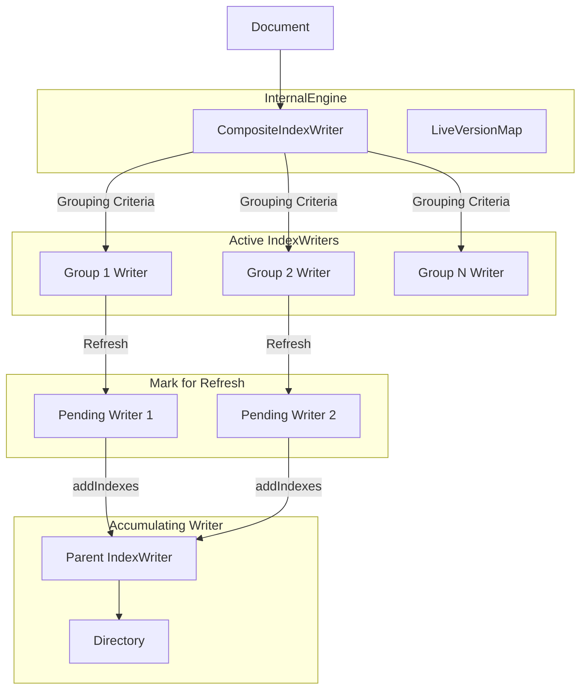
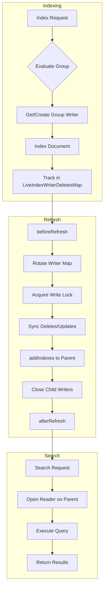
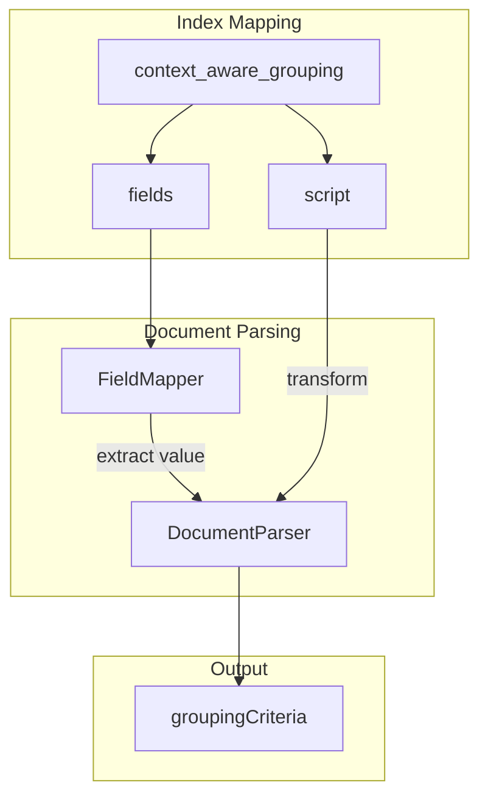
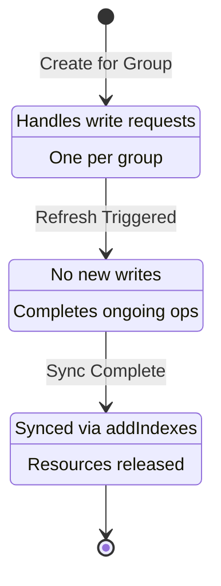

# Context Aware Segments

## Summary

Context Aware Segments is an indexing optimization feature that collocates related documents into the same segments based on a grouping criteria function. By aligning segment boundaries with anticipated query patterns, documents frequently queried together reside in the same segments, significantly improving query performance for workloads with predictable access patterns.

This feature is particularly beneficial for log analytics scenarios where users often query for anomalies (4xx and 5xx status codes) over success logs (2xx). By segregating anomalies and success logs into distinct segments, queries like "number of faults in the last hour" process only relevant segments, improving performance.

## Details

### Architecture



### Data Flow



### Components

| Component | Description |
|-----------|-------------|
| `CompositeIndexWriter` | Unified interface coordinating write operations with group-specific IndexWriters and managing reads through the accumulating parent IndexWriter |
| `ContextAwareGroupingFieldMapper` | Field mapper for parsing and validating `context_aware_grouping` mapping configuration |
| `ContextAwareGroupingFieldType` | Field type extending `CompositeMappedFieldType` for grouping criteria |
| `ContextAwareGroupingScript` | Script context for executing Painless scripts to compute grouping criteria |
| `DisposableIndexWriter` | Group-specific IndexWriter with lifecycle states: Active → Mark for Refresh → Close |
| `CriteriaBasedIndexWriterLookup` | Per-refresh-cycle lookup containing group-specific writers, update/delete tracking, and locking |
| `LiveIndexWriterDeletesMap` | Refresh-rotating map structure (similar to LiveVersionMap) tracking updates/deletions |
| `DocumentIndexWriter` | Interface abstracting IndexWriter operations for both standard and composite writers |
| `LuceneIndexWriter` | Standard IndexWriter wrapper for non-context-aware indices |
| `CriteriaBasedMergePolicy` | Merge policy ensuring segments from the same group are merged together |
| `CriteriaBasedCodec` | Codec attaching bucket attributes to segments for group identification |
| `CriteriaBasedDocValueFormat` | DocValue format attaching bucket attributes to field info |
| `BucketedCompositeDirectory` | Directory wrapper filtering out child-level directories |
| `LookupMapLockAcquisitionException` | Exception thrown when unable to acquire lock on lookup map |

### Grouping Criteria Mapper

The `context_aware_grouping` mapper defines how documents are grouped into segments:



#### Mapper Configuration

| Parameter | Description | Required |
|-----------|-------------|----------|
| `fields` | List of field names used to determine grouping (currently single field only) | Yes |
| `script` | Optional Painless script to transform field values into grouping criteria | No |

#### Supported Field Types for Grouping

- `double`, `float`, `integer` (numeric types)
- `text`, `keyword` (string types)
- `date`
- `ip`

#### Mapper Example

```json
PUT /logs-index
{
  "mappings": {
    "context_aware_grouping": {
      "fields": ["status_code"],
      "script": {
        "source": "String.valueOf(ctx.status_code / 100)"
      }
    },
    "properties": {
      "status_code": { "type": "integer" },
      "message": { "type": "text" }
    }
  }
}
```

### Configuration

| Setting | Description | Default | Dynamic |
|---------|-------------|---------|---------|
| `index.context_aware.enabled` | Enable context aware segments for the index | `false` | No (Final) |
| `index.context_aware.max_retry_on_lookup_map_acquisition_exception` | Maximum retries when lock acquisition fails | `15` | Yes |

### Feature Flag

| Flag | Description | Default |
|------|-------------|---------|
| `opensearch.experimental.feature.context_aware.migration.enabled` | Enable context aware segments feature at node level | `false` |

### Disposable IndexWriter States



### Locking Mechanism

The feature uses a multi-level locking strategy:

1. **ReentrantReadWriteLock (rwl)**: Existing engine-level lock ensuring IndexWriter isn't closed during indexing
2. **Per-Map ReentrantReadWriteLock**: Additional lock for each `CriteriaBasedIndexWriterLookup`
   - Read lock: Acquired during write/update/delete operations
   - Write lock: Acquired during refresh before rotating the writer map
3. **KeyedLock**: Per-document lock for version synchronization

### Version Synchronization

Updates and deletes across multiple IndexWriters require special handling:

1. **Updates**: Track in `LiveIndexWriterDeletesMap`; during refresh, soft-delete previous versions in parent writer
2. **Deletes**: Perform partial soft delete (delete without tombstone) in child writers; full delete in parent writer
3. **Dummy Tombstone**: Temporary document (id=-2) used for cross-writer soft deletes, hard-deleted before refresh completes

### Usage Example

```yaml
# opensearch.yml - Enable feature flag
opensearch.experimental.feature.context_aware.migration.enabled: true
```

```json
// Create index with context aware segments
PUT /logs-index
{
  "settings": {
    "index.context_aware.enabled": true,
    "index.context_aware.max_retry_on_lookup_map_acquisition_exception": 20
  },
  "mappings": {
    "properties": {
      "status_code": { "type": "integer" },
      "message": { "type": "text" },
      "@timestamp": { "type": "date" }
    }
  }
}
```

```json
// Index documents - they will be grouped by criteria
POST /logs-index/_doc
{
  "status_code": 500,
  "message": "Internal server error",
  "@timestamp": "2024-01-15T10:30:00Z"
}
```

## Limitations

- **Experimental**: Feature is behind a feature flag and not recommended for production
- **Grouping Field Updates**: Updates to document fields that determine grouping criteria are not supported
- **Search Idle Disabled**: Automatically disabled for context-aware indices to ensure periodic sync
- **Blocking Refresh**: Always uses blocking refresh when context aware is enabled
- **Index Setting Final**: `index.context_aware.enabled` cannot be changed after index creation
- **Node Restart Required**: Feature flag requires node restart to take effect

## Related PRs

| Version | PR | Description |
|---------|-----|-------------|
| v3.4.0 | [#19233](https://github.com/opensearch-project/OpenSearch/pull/19233) | Add a mapper for context aware segments grouping criteria |
| v3.4.0 | [#19098](https://github.com/opensearch-project/OpenSearch/pull/19098) | Add support for context aware segments |

## References

- [Issue #19530](https://github.com/opensearch-project/OpenSearch/issues/19530): LLD for Context Aware Segments
- [RFC #19223](https://github.com/opensearch-project/OpenSearch/issues/19223): Context aware segments user experience
- [RFC #18576](https://github.com/opensearch-project/OpenSearch/issues/18576): Context Aware Segments RFC

## Change History

- **v3.4.0** (2025-11-07): Added `context_aware_grouping` mapper for defining grouping criteria with Painless script support
- **v3.4.0** (2025-11-07): Initial implementation with CompositeIndexWriter, CriteriaBasedMergePolicy, and experimental feature flag
