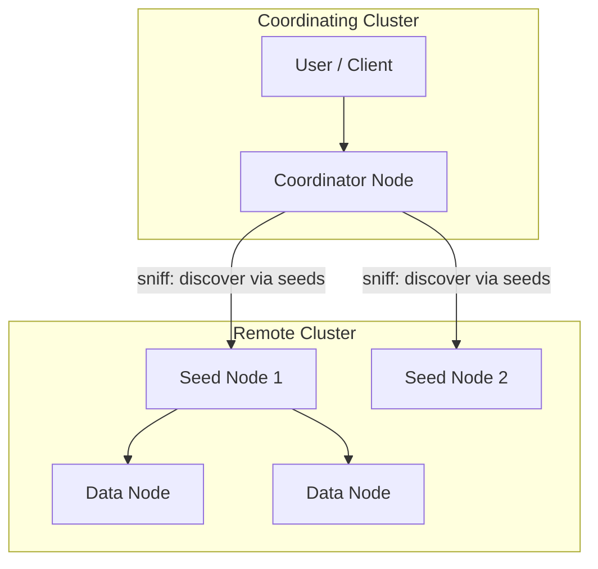

---
tags:
  - opensearch
---
# Cross-Cluster Search (CCS)

## Summary

Cross-cluster search (CCS) enables querying data across multiple OpenSearch clusters from a single coordinating cluster. It supports two connection modes — sniff and proxy — and integrates with the Security plugin for authentication and authorization across cluster boundaries.

## Details

### Architecture



### Connection Modes

| Mode | Description | Discovery |
|------|-------------|-----------|
| Sniff (default) | Connects to seed nodes and discovers the full cluster topology | Automatic via seed nodes |
| Proxy | Connects through a proxy address; no node discovery | Manual proxy configuration |

### Configuration

| Setting | Description | Default | Mode |
|---------|-------------|---------|------|
| `cluster.remote.<alias>.seeds` | List of seed node addresses (`host:port`) | — | Sniff |
| `cluster.remote.<alias>.cluster_name` | Expected remote cluster name for handshake validation | (empty) | Sniff |
| `cluster.remote.<alias>.node_connections` | Max connections per remote cluster | 30 | Sniff |
| `cluster.remote.<alias>.proxy` | Proxy address for sniff mode | (empty) | Sniff |
| `cluster.remote.<alias>.mode` | Connection mode (`sniff` or `proxy`) | `sniff` | Both |
| `cluster.remote.<alias>.proxy_address` | Proxy address for proxy mode | — | Proxy |
| `cluster.remote.<alias>.server_name` | TLS server name for proxy mode | (empty) | Proxy |
| `cluster.remote.<alias>.socket_connections` | Number of socket connections for proxy mode | 18 | Proxy |
| `skip_unavailable` | Whether to skip unavailable remote clusters | `false` | Both |

### Authentication Flow

1. Security plugin authenticates the user on the coordinating cluster
2. Backend roles are fetched on the coordinating cluster
3. The request (with authenticated user) is forwarded to the remote cluster
4. User permissions are evaluated on the remote cluster

### Required Permissions

Users need `READ` or `SEARCH` permissions on remote indexes. When `ccs_minimize_roundtrips=false`, the additional permission `indices:admin/shards/search_shards` is required.

### Query Syntax

```
GET /<remote_cluster_alias>:<index_name>/_search
```

Multiple remote clusters can be queried in a single request:
```
GET /cluster1:index1,cluster2:index2/_search
```

### Monitoring

The `_remote/info` API returns connection status for all configured remote clusters:

```
GET _remote/info
```

## Limitations

- Requires `remote_cluster_client` role in `node.roles` if roles are explicitly configured
- Authentication must be configured on both coordinating and remote clusters
- The `cluster_name` validation setting (v3.6.0+) only applies to sniff mode
- Cluster UUID validation is not yet supported

## Change History

- **v3.6.0**: Added optional `cluster_name` setting for sniff mode to validate the remote cluster name during handshake, preventing connections to wrong clusters when seeds become stale (https://github.com/opensearch-project/OpenSearch/pull/20532)

## References

### Documentation
- https://docs.opensearch.org/3.4/search-plugins/cross-cluster-search/
- https://docs.opensearch.org/3.4/api-reference/cluster-api/remote-info/

### Pull Requests
| Version | PR | Description |
|---------|-----|-------------|
| v3.6.0 | https://github.com/opensearch-project/OpenSearch/pull/20532 | Support expected remote cluster name in CCS sniff mode |
