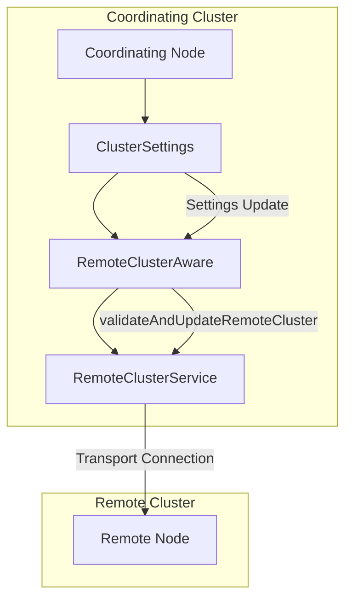
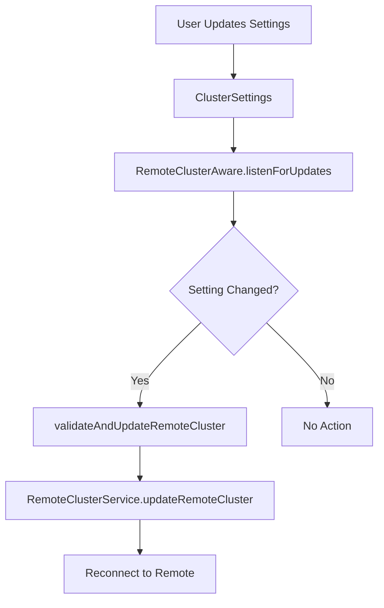

# Cross-Cluster Settings

## Summary

Cross-cluster settings control how OpenSearch connects to and interacts with remote clusters for cross-cluster search (CCS) and cross-cluster replication (CCR). These settings include connection parameters, authentication, and behavior when remote clusters become unavailable.

## Details

### Architecture



### Data Flow



### Components

| Component | Description |
|-----------|-------------|
| `RemoteClusterAware` | Base class that listens for remote cluster setting updates |
| `RemoteClusterService` | Manages connections to remote clusters |
| `RemoteConnectionStrategy` | Defines connection mode (sniff or proxy) |
| `SniffConnectionStrategy` | Discovers remote cluster nodes via seed nodes |
| `ProxyConnectionStrategy` | Connects through a proxy server |

### Configuration

| Setting | Description | Default |
|---------|-------------|---------|
| `cluster.remote.<alias>.seeds` | Seed node addresses for remote cluster | - |
| `cluster.remote.<alias>.skip_unavailable` | Return partial results if remote unavailable | `false` |
| `cluster.remote.<alias>.mode` | Connection mode: `sniff` or `proxy` | `sniff` |
| `cluster.remote.<alias>.proxy_address` | Proxy address (for proxy mode) | - |
| `cluster.remote.<alias>.compress` | Enable compression for remote connections | `false` |
| `cluster.remote.<alias>.ping_schedule` | Interval for keep-alive pings | `30s` |

### Usage Example

Configure a remote cluster connection:

```json
PUT _cluster/settings
{
  "persistent": {
    "cluster.remote": {
      "my-remote-cluster": {
        "seeds": ["remote-node1:9300", "remote-node2:9300"],
        "skip_unavailable": true
      }
    }
  }
}
```

Verify remote cluster connection:

```bash
GET _remote/info
```

Response:

```json
{
  "my-remote-cluster": {
    "connected": true,
    "mode": "sniff",
    "seeds": ["remote-node1:9300", "remote-node2:9300"],
    "num_nodes_connected": 2,
    "max_connections_per_cluster": 3,
    "initial_connect_timeout": "30s",
    "skip_unavailable": true
  }
}
```

Execute cross-cluster search:

```json
GET my-remote-cluster:my-index/_search
{
  "query": {
    "match_all": {}
  }
}
```

## Limitations

- Remote cluster connections require transport layer connectivity (port 9300 by default)
- `skip_unavailable` only affects search operations, not replication
- Proxy mode requires additional infrastructure setup

## Change History

- **v3.3.0** (2025-08-20): Fixed `skip_unavailable` setting persistence during seed node updates

## References

### Documentation
- [Cross-cluster search documentation](https://docs.opensearch.org/3.0/search-plugins/cross-cluster-search/): Official docs
- [Remote cluster information API](https://docs.opensearch.org/3.0/api-reference/cluster-api/remote-info/): API reference

### Pull Requests
| Version | PR | Description |
|---------|-----|-------------|
| v3.3.0 | [#18766](https://github.com/opensearch-project/OpenSearch/pull/18766) | Fix skip_unavailable setting changing to default during node drop |

### Issues (Design / RFC)
- [Issue #13798](https://github.com/opensearch-project/OpenSearch/issues/13798): Bug report for skip_unavailable reset issue
