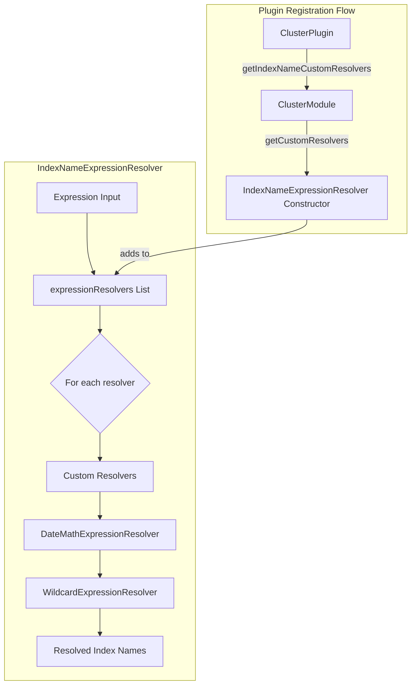
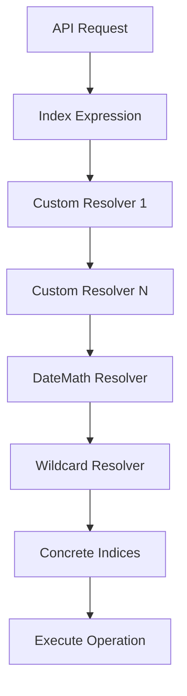

---
tags:
  - indexing
---

# Custom Index Name Resolver

## Summary

Custom Index Name Resolver is a plugin extensibility feature that allows cluster plugins to implement custom index name expression resolvers. This enables plugins to define their own wildcards, patterns, or expression syntax for resolving index names, extending beyond the built-in date math and wildcard resolution capabilities.

## Details

### Architecture



### Data Flow



### Components

| Component | Description |
|-----------|-------------|
| `IndexNameExpressionResolver` | Core class that manages the chain of expression resolvers |
| `ExpressionResolver` | Public interface for implementing custom resolvers |
| `Context` | Provides cluster state and options to resolvers during resolution |
| `ClusterPlugin.getIndexNameCustomResolvers()` | Plugin hook for registering custom resolvers |
| `ClusterModule.getCustomResolvers()` | Collects resolvers from all cluster plugins |

### Configuration

This feature does not require configuration. Custom resolvers are registered programmatically through the ClusterPlugin interface.

### Usage Example

**Implementing a Custom Resolver**

```java
import org.opensearch.cluster.metadata.IndexNameExpressionResolver;
import org.opensearch.cluster.metadata.IndexNameExpressionResolver.Context;
import org.opensearch.cluster.metadata.IndexNameExpressionResolver.ExpressionResolver;

public class TenantIndexResolver implements ExpressionResolver {
    
    private static final String TENANT_PREFIX = "_tenant:";
    
    @Override
    public List<String> resolve(Context context, List<String> expressions) {
        List<String> resolved = new ArrayList<>();
        
        for (String expression : expressions) {
            if (expression.startsWith(TENANT_PREFIX)) {
                String tenantId = expression.substring(TENANT_PREFIX.length());
                // Resolve to tenant-specific index pattern
                resolved.add("tenant-" + tenantId + "-*");
            } else {
                // Pass through unrecognized expressions
                resolved.add(expression);
            }
        }
        
        return resolved;
    }
}
```

**Registering the Resolver in a Plugin**

```java
import org.opensearch.plugins.ClusterPlugin;
import org.opensearch.plugins.Plugin;

public class TenantPlugin extends Plugin implements ClusterPlugin {
    
    @Override
    public Collection<IndexNameExpressionResolver.ExpressionResolver> getIndexNameCustomResolvers() {
        return Collections.singletonList(new TenantIndexResolver());
    }
}
```

**Using the Custom Expression**

```bash
# Search across all indices for tenant "acme"
GET /_tenant:acme/_search
{
  "query": { "match_all": {} }
}
```

### Key Implementation Details

1. **Resolution Order**: Custom resolvers execute first, followed by DateMathExpressionResolver, then WildcardExpressionResolver
2. **Thread Safety**: Resolvers must be thread-safe as they're shared across requests
3. **Deduplication**: Each resolver class can only be registered once; duplicates throw `IllegalArgumentException`
4. **Pass-through**: Resolvers should pass through expressions they don't handle

## Limitations

- Custom resolvers cannot modify or override built-in resolver behavior
- Resolver registration happens at node startup; dynamic registration is not supported
- Each resolver class can only be registered once across all plugins
- Custom expressions must not conflict with built-in patterns (wildcards, date math)

## Change History

- **v3.2.0** (2025-07-04): Initial implementation - Added support for custom index name resolvers through ClusterPlugin interface

## Related Features
- [OpenSearch Dashboards](../opensearch-dashboards/ai-chat.md)

## References

### Documentation
- [Resolve Index API](https://docs.opensearch.org/3.0/api-reference/index-apis/resolve-index/): Index resolution documentation

### Pull Requests
| Version | PR | Description | Related Issue |
|---------|-----|-------------|---------------|
| v3.2.0 | [#18593](https://github.com/opensearch-project/OpenSearch/pull/18593) | Initial implementation | [#18676](https://github.com/opensearch-project/OpenSearch/issues/18676) |

### Issues (Design / RFC)
- [Issue #18676](https://github.com/opensearch-project/OpenSearch/issues/18676): Original feature request
