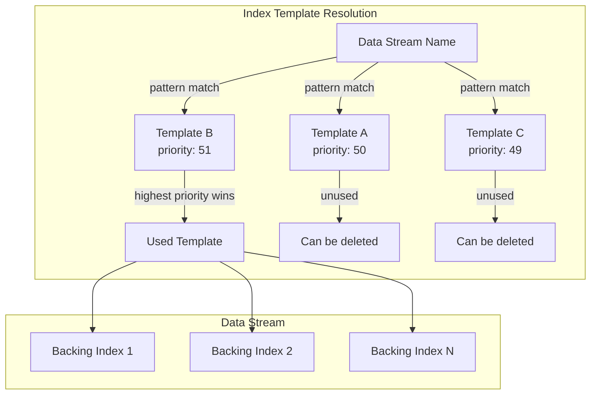
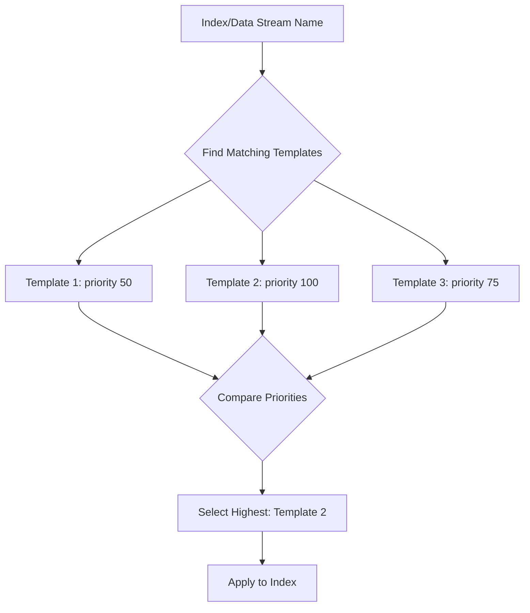

# Data Stream & Index Template

## Summary

Data streams provide a convenient way to manage time-series data in OpenSearch. They automatically handle index rollovers and simplify the management of continuously generated data like logs, events, and metrics. Index templates define the settings, mappings, and aliases that are applied when creating backing indexes for data streams.

When multiple index templates match a data stream's name pattern, OpenSearch uses the template with the highest priority value. This feature documentation covers the interaction between data streams and index templates, including template priority resolution and lifecycle management.

## Details

### Architecture



### Template Priority Resolution

When creating a data stream or its backing indexes, OpenSearch:

1. Finds all composable index templates whose patterns match the data stream name
2. Selects the template with the highest `priority` value
3. Applies that template's settings, mappings, and aliases to the backing index



### Components

| Component | Description |
|-----------|-------------|
| `MetadataIndexTemplateService` | Manages index template CRUD operations and template resolution |
| `ComposableIndexTemplate` | Represents a v2 index template with priority support |
| `DataStream` | Represents a data stream and its backing indexes |
| `findV2Template()` | Resolves the highest-priority matching template for an index name |
| `dataStreamsUsingTemplate()` | Identifies which data streams actively use a specific template |

### Configuration

| Setting | Description | Default |
|---------|-------------|---------|
| `priority` | Template priority for conflict resolution | `0` |
| `index_patterns` | Patterns to match index/data stream names | Required |
| `data_stream` | Object indicating this is a data stream template | `{}` for data streams |

### Usage Example

```json
// Create a base template with lower priority
PUT _index_template/logs-base
{
  "index_patterns": ["logs-*"],
  "data_stream": {},
  "priority": 100,
  "template": {
    "settings": {
      "number_of_shards": 1,
      "number_of_replicas": 1
    }
  }
}

// Create a specific template with higher priority
PUT _index_template/logs-nginx
{
  "index_patterns": ["logs-nginx-*"],
  "data_stream": {},
  "priority": 200,
  "template": {
    "settings": {
      "number_of_shards": 3,
      "number_of_replicas": 2
    }
  }
}

// Create data stream - uses logs-nginx template (priority 200)
PUT _data_stream/logs-nginx-access

// Check which template is used
GET _data_stream/logs-nginx-access

// Delete unused template (works in v3.4.0+)
DELETE _index_template/logs-base
```

## Limitations

- Template priority must be a non-negative integer
- When priorities are equal, behavior is undefined (avoid this scenario)
- Legacy (v1) index templates don't support the `priority` field
- Data stream templates require the `data_stream` object to be present

## Change History

- **v3.4.0** (2025-12-09): Fixed bug preventing deletion of unused index templates that match data stream patterns but have lower priority than the active template

## References

### Documentation
- [Data Streams Documentation](https://docs.opensearch.org/3.0/im-plugin/data-streams/): Official documentation
- [Index Templates Documentation](https://docs.opensearch.org/3.0/im-plugin/index-templates/): Template configuration guide

### Pull Requests
| Version | PR | Description |
|---------|-----|-------------|
| v3.4.0 | [#20102](https://github.com/opensearch-project/OpenSearch/pull/20102) | Fix deletion of unused templates matching data streams |

### Issues (Design / RFC)
- [Issue #20078](https://github.com/opensearch-project/OpenSearch/issues/20078): Bug report for template deletion failure
- [Issue #9194](https://github.com/opensearch-project/OpenSearch/issues/9194): Earlier related fix
