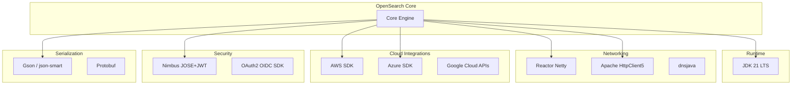

# Dependency Management

## Summary

OpenSearch maintains a comprehensive set of dependencies for core functionality, including networking, security, cloud integrations, and build tooling. Regular dependency updates ensure security patches, performance improvements, and compatibility with modern Java runtimes.

## Details

### Architecture



### Components

| Component | Purpose | Current Version |
|-----------|---------|-----------------|
| JDK | Java runtime | 21 LTS |
| AWS SDK | S3, STS, and other AWS service integrations | 2.30.31 |
| Reactor Netty | Reactive networking for async operations | 1.2.3 |
| Apache HttpClient5 | HTTP client for REST operations | 5.4.1 |
| Azure SDK | Azure Blob Storage integration | 12.30.0 |
| Nimbus JOSE+JWT | JWT token handling | 10.0.2 |
| Gson | JSON serialization | 2.13.0 |
| Jetty | Embedded web server | 9.4.57 |
| Logback | Logging framework | 1.5.18 |
| zstd-jni | Zstandard compression | 1.5.6-1 |

### Dependency Categories

#### Runtime Dependencies
- **JDK**: Core Java runtime, currently JDK 21 LTS
- **Logging**: Logback for structured logging

#### Networking Dependencies
- **Reactor Netty**: Reactive streams-based networking
- **Apache HttpClient5**: Synchronous and async HTTP operations
- **dnsjava**: DNS resolution

#### Cloud Provider SDKs
- **AWS SDK**: S3 repository, STS authentication
- **Azure SDK**: Azure Blob Storage repository
- **Google Cloud APIs**: GCS repository support

#### Security Dependencies
- **Nimbus JOSE+JWT**: JWT token parsing and validation
- **OAuth2 OIDC SDK**: OpenID Connect authentication

#### Build Dependencies
- **Gradle plugins**: japicmp, ospackage-base
- **CI tools**: dependabot-changelog-helper, lychee-action

### Configuration

Dependency versions are managed in Gradle build files:

```groovy
// buildSrc/version.properties
versions.reactor_netty = 1.2.3
versions.httpcore5 = 5.3.1
versions.httpclient5 = 5.4.1
versions.awssdk = 2.30.31
```

### Usage Example

Dependencies are automatically resolved during build:

```bash
# Build with all dependencies
./gradlew assemble

# Check for dependency updates
./gradlew dependencyUpdates

# Verify dependency licenses
./gradlew checkLicenses
```

## Limitations

- Dependency updates may introduce breaking changes
- Some dependencies have transitive dependency conflicts
- Cloud SDK versions must be coordinated across plugins
- Security patches may require immediate updates outside normal release cycles

## Related PRs

| Version | PR | Description |
|---------|-----|-------------|
| v3.0.0 | [#17515](https://github.com/opensearch-project/OpenSearch/pull/17515) | Switch to JDK 21 LTS |
| v3.0.0 | [#17396](https://github.com/opensearch-project/OpenSearch/pull/17396) | AWS SDK 2.30.31 |
| v3.0.0 | [#17322](https://github.com/opensearch-project/OpenSearch/pull/17322) | Reactor Netty 1.2.3 |
| v3.0.0 | [#16757](https://github.com/opensearch-project/OpenSearch/pull/16757) | HttpClient5 upgrade |
| v3.0.0 | [#17607](https://github.com/opensearch-project/OpenSearch/pull/17607) | Nimbus JOSE+JWT 10.0.2 |
| v3.0.0 | [#17562](https://github.com/opensearch-project/OpenSearch/pull/17562) | Azure Storage 12.30.0 |

## References

- [Issue #15927](https://github.com/opensearch-project/OpenSearch/issues/15927): ExtendedSocketOption support
- [OpenSearch Dependency Policy](https://github.com/opensearch-project/OpenSearch/blob/main/DEVELOPER_GUIDE.md)

## Change History

- **v3.0.0** (2025-05-06): JDK 21 LTS default, AWS SDK 2.30.x, Reactor Netty 1.2.x, 30 dependency updates
