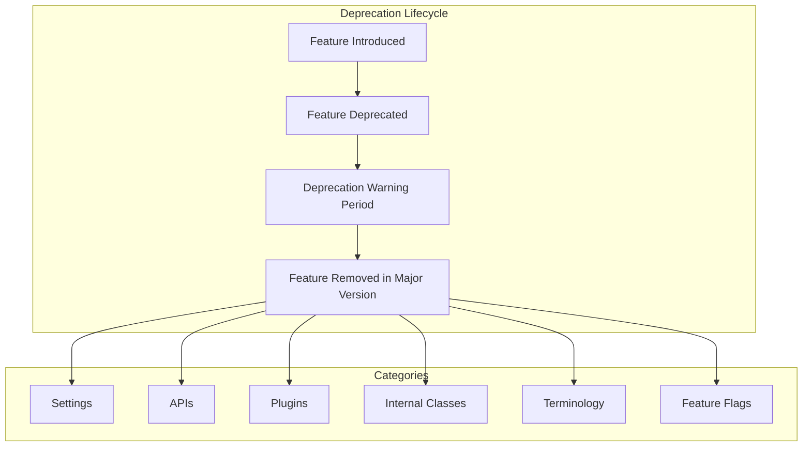
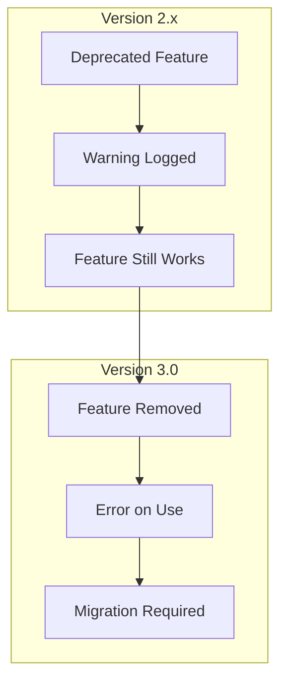

---
tags:
  - search
---

# Deprecated Code Cleanup

## Summary

OpenSearch maintains code quality by periodically removing deprecated features, settings, and APIs. This cleanup process ensures the codebase remains maintainable while providing clear migration paths for users. Major version releases (like 3.0) are the primary opportunity for removing deprecated functionality that has been marked for removal. The deprecation lifecycle follows a pattern: features are first deprecated with warnings in minor versions, then removed in the next major version.

## Details

### Architecture



### Data Flow



### Deprecation Categories

| Category | Description | Impact |
|----------|-------------|--------|
| Settings | Configuration options in opensearch.yml | Cluster startup may fail |
| APIs | REST endpoints and parameters | Client applications may break |
| Plugins | Bundled or optional plugins | Functionality unavailable |
| Internal Classes | Java classes and methods | Plugin compatibility |
| Terminology | Naming conventions | Documentation/code updates |
| Feature Flags | Experimental feature toggles | Features become GA or removed |

### Components Affected in v3.0.0

| Component | Type | Status |
|-----------|------|--------|
| Thread Pool Settings | Settings | Removed |
| Index Store mmap.extensions | Settings | Removed |
| transport-nio Plugin | Plugin | Removed |
| COMPAT Locale Provider | Internal | Removed |
| PathHierarchy (CamelCase) | Tokenizer | Deprecated |
| JodaCompatibleZonedDateTime methods | API | Removed |
| batch_size parameter | API | Removed |
| System index REST access | API | Removed |
| k-NN index settings | Settings | Removed |
| SQL DELETE statement | API | Removed |
| OpenDistro endpoints | API | Removed |
| performance-analyzer-rca | Plugin | Removed |
| Legacy notebooks | Feature | Removed |

### Configuration

#### Removed Settings Reference

| Setting | Version Deprecated | Version Removed | Replacement |
|---------|-------------------|-----------------|-------------|
| `thread_pool.test.max_queue_size` | 2.0 | 3.0 | None |
| `thread_pool.test.min_queue_size` | 2.0 | 3.0 | None |
| `index.store.hybrid.mmap.extensions` | 2.x | 3.0 | Auto-detection |
| `knn.plugin.enabled` | 2.x | 3.0 | Always enabled |
| `index.knn.algo_param.ef_construction` | 2.x | 3.0 | Method parameters |
| `index.knn.algo_param.m` | 2.x | 3.0 | Method parameters |
| `index.knn.space_type` | 2.x | 3.0 | Method parameters |
| `plugins.sql.delete.enabled` | 2.x | 3.0 | None |
| `plugins.sql.pagination.api` | 2.x | 3.0 | Point in Time |

#### New Limits in v3.0.0

| Setting | Default | Description |
|---------|---------|-------------|
| JSON nesting depth | 1,000 | Maximum depth for JSON objects/arrays |
| JSON property name length | 50,000 | Maximum length for property names |
| `index.query.max_nested_depth` | 20 | Maximum nesting for nested queries |
| Document ID length | 512 bytes | Enforced on all APIs including Bulk |

### Usage Example

#### Checking for Deprecated Settings
```bash
# Check opensearch.yml for deprecated settings before upgrade
grep -E "(thread_pool\.test\.|mmap\.extensions|knn\.plugin\.enabled)" opensearch.yml
```

#### Migrating k-NN Index Settings
```json
// Before (deprecated index settings)
PUT /my-index
{
  "settings": {
    "index.knn": true,
    "index.knn.algo_param.ef_construction": 256,
    "index.knn.algo_param.m": 16,
    "index.knn.space_type": "l2"
  },
  "mappings": {
    "properties": {
      "my_vector": {
        "type": "knn_vector",
        "dimension": 128
      }
    }
  }
}

// After (method parameters)
PUT /my-index
{
  "settings": {
    "index.knn": true
  },
  "mappings": {
    "properties": {
      "my_vector": {
        "type": "knn_vector",
        "dimension": 128,
        "method": {
          "name": "hnsw",
          "space_type": "l2",
          "engine": "faiss",
          "parameters": {
            "ef_construction": 256,
            "m": 16
          }
        }
      }
    }
  }
}
```

#### Migrating Tokenizer Names
```json
// Before (deprecated CamelCase)
{
  "settings": {
    "analysis": {
      "tokenizer": {
        "my_tokenizer": {
          "type": "PathHierarchy",
          "delimiter": "/"
        }
      }
    }
  }
}

// After (snake_case)
{
  "settings": {
    "analysis": {
      "tokenizer": {
        "my_tokenizer": {
          "type": "path_hierarchy",
          "delimiter": "/"
        }
      }
    }
  }
}
```

### Migration Guide

1. **Pre-Upgrade Checklist**
   - Upgrade to JDK 21 or later
   - Review `opensearch.yml` for deprecated settings
   - Audit Painless scripts for deprecated methods
   - Check analyzer configurations for CamelCase tokenizer names
   - Verify custom plugins don't depend on removed classes
   - Migrate legacy notebooks to `.kibana` index format

2. **During Upgrade**
   - Remove deprecated settings from configuration files
   - Update k-NN index mappings to use method parameters
   - Update SQL queries to use Point in Time pagination

3. **Post-Upgrade Verification**
   - Check cluster health
   - Verify all indexes are accessible
   - Test search and indexing operations
   - Validate plugin functionality

## Limitations

- Deprecated code removal is permanent in major versions
- No runtime compatibility layer for removed features
- Custom plugins may require updates
- NMSLIB engine deprecated; new indexes should use Faiss or Lucene
- Legacy notebooks not accessible after upgrade to 3.0

## Change History

- **v3.0.0** (2025-04-29): Major deprecated code cleanup including:
  - Thread pool settings removed
  - COMPAT locale provider removed
  - transport-nio plugin removed
  - k-NN index settings removed (use method parameters)
  - SQL DELETE statement and OpenDistro endpoints removed
  - Legacy notebooks removed
  - Non-inclusive terminology replaced in Java APIs
  - JodaCompatibleZonedDateTime deprecated methods removed
  - batch_size parameter removed from Bulk API
  - System index REST API access removed
  - New JSON processing limits introduced
- **v2.0.0** (2022-05-26): Initial deprecation of non-inclusive terminology, thread pool settings marked for removal, mapping types parameter removed

## Related Features
- [OpenSearch Dashboards](../opensearch-dashboards/ai-chat.md)

## References

### Documentation
- [Breaking Changes Documentation](https://docs.opensearch.org/3.0/breaking-changes/)
- [JEP 411](https://openjdk.org/jeps/411): Deprecate the Security Manager for Removal

### Blog Posts
- [OpenSearch 3.0 Blog Post](https://opensearch.org/blog/opensearch-3-0-what-to-expect/)

### Pull Requests
| Version | PR | Description | Related Issue |
|---------|-----|-------------|---------------|
| v3.0.0 | [#2595](https://github.com/opensearch-project/OpenSearch/issues/2595) | Cleanup deprecated thread pool settings |   |
| v3.0.0 | [#1683](https://github.com/opensearch-project/OpenSearch/issues/1683) | Replace blacklist/whitelist terminology |   |
| v3.0.0 | [#3346](https://github.com/opensearch-project/OpenSearch/pull/3346) | Remove JodaCompatibleZonedDateTime deprecated methods | [#3156](https://github.com/opensearch-project/OpenSearch/issues/3156) |
| v3.0.0 | [#9392](https://github.com/opensearch-project/OpenSearch/pull/9392) | Remove mmap.extensions setting | [#8297](https://github.com/opensearch-project/OpenSearch/issues/8297) |
| v3.0.0 | [#13988](https://github.com/opensearch-project/OpenSearch/pull/13988) | Remove COMPAT locale provider | [#11550](https://github.com/opensearch-project/OpenSearch/issues/11550) |
| v3.0.0 | [#16887](https://github.com/opensearch-project/OpenSearch/issues/16887) | Remove transport-nio plugin |   |
| v3.0.0 | [#10894](https://github.com/opensearch-project/OpenSearch/pull/10894) | Deprecate CamelCase PathHierarchy tokenizer | [#2773](https://github.com/opensearch-project/OpenSearch/issues/2773) |
| v3.0.0 | [#14283](https://github.com/opensearch-project/OpenSearch/issues/14283) | Remove deprecated batch_size parameter |   |
| v3.0.0 | [#4042](https://github.com/opensearch-project/OpenSearch/pull/4042) | Rename Plugin classes to Module | [#4034](https://github.com/opensearch-project/OpenSearch/issues/4034) |
| v3.0.0 | [#2564](https://github.com/opensearch-project/k-NN/pull/2564) | k-NN breaking changes for 3.0 |   |
| v3.0.0 | [#5089](https://github.com/opensearch-project/security/pull/5089) | Fix Blake2b hash implementation | [#4274](https://github.com/opensearch-project/security/issues/4274) |
| v3.0.0 | [#5224](https://github.com/opensearch-project/security/pull/5224) | Remove whitelist settings | [#1483](https://github.com/opensearch-project/OpenSearch/issues/1483) |
| v3.0.0 | [#3306](https://github.com/opensearch-project/sql/pull/3306) | Remove SparkSQL support | [#3286](https://github.com/opensearch-project/sql/issues/3286) |
| v3.0.0 | [#3326](https://github.com/opensearch-project/sql/pull/3326) | Remove opendistro settings and endpoints | [#3282](https://github.com/opensearch-project/sql/issues/3282) |
| v3.0.0 | [#3337](https://github.com/opensearch-project/sql/pull/3337) | Deprecate SQL Delete statement | [#3281](https://github.com/opensearch-project/sql/issues/3281) |
| v3.0.0 | [#2406](https://github.com/opensearch-project/dashboards-observability/pull/2406) | Remove legacy notebooks | [#2350](https://github.com/opensearch-project/dashboards-observability/issues/2350) |
| v2.0.0 | [#1940](https://github.com/opensearch-project/OpenSearch/issues/1940) | Remove mapping types parameter |   |

### Issues (Design / RFC)
- [Meta Issue #5243](https://github.com/opensearch-project/opensearch-build/issues/5243): Full list of breaking changes
- [Issue #2773](https://github.com/opensearch-project/OpenSearch/issues/2773): List of deprecated code removal in 3.0
- [Issue #5214](https://github.com/opensearch-project/OpenSearch/issues/5214): Remove deprecated terms from Java API
