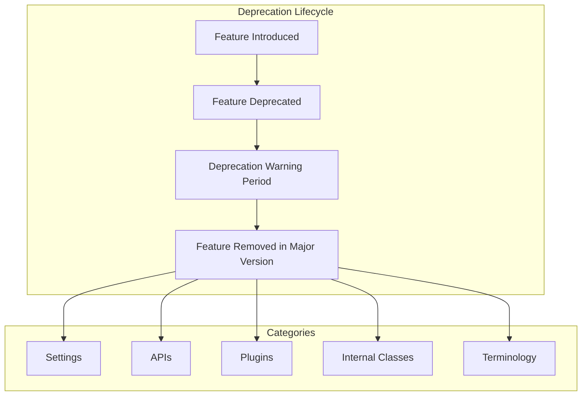

# Deprecated Code Cleanup

## Summary

OpenSearch maintains code quality by periodically removing deprecated features, settings, and APIs. This cleanup process ensures the codebase remains maintainable while providing clear migration paths for users. Major version releases (like 3.0) are the primary opportunity for removing deprecated functionality that has been marked for removal.

## Details

### Architecture



### Deprecation Categories

| Category | Description | Impact |
|----------|-------------|--------|
| Settings | Configuration options in opensearch.yml | Cluster startup may fail |
| APIs | REST endpoints and parameters | Client applications may break |
| Plugins | Bundled or optional plugins | Functionality unavailable |
| Internal Classes | Java classes and methods | Plugin compatibility |
| Terminology | Naming conventions | Documentation/code updates |

### Removed in v3.0.0

#### Thread Pool Settings
```yaml
# Removed settings
thread_pool.test.max_queue_size
thread_pool.test.min_queue_size
```

#### Index Store Settings
```yaml
# Removed setting
index.store.hybrid.mmap.extensions
```
The hybridfs store type now automatically determines optimal file handling without explicit extension configuration.

#### Locale Provider
The COMPAT locale provider was removed due to JDK 21 deprecation (JEP 411). OpenSearch now uses CLDR locale data exclusively.

#### Tokenizer Naming
CamelCase tokenizer names are deprecated:
- `PathHierarchy` → `path_hierarchy`

#### Feature Flags
Experimental feature flags removed when features became GA:
- `PLUGGABLE_CACHE` - Tiered caching now always available
- `APPROXIMATE_POINT_RANGE_QUERY_SETTING` - Range query approximation now standard

#### Legacy Version Constants
All `LegacyESVersion` constants removed:
- V_7_0_* through V_7_10_*
- V_1_* constants

#### Non-inclusive Terminology
- "blacklist" → "allow list"
- "whitelist" → "deny list"
- "master" → "cluster manager"

### Migration Guide

1. **Review Configuration**: Check `opensearch.yml` for deprecated settings
2. **Update Scripts**: Replace deprecated datetime methods in Painless scripts
3. **Update Analyzers**: Use snake_case tokenizer names
4. **Test Plugins**: Verify custom plugins don't depend on removed classes
5. **Update Clients**: Ensure client applications use current API parameters

## Limitations

- Deprecated code removal is permanent in major versions
- No runtime compatibility layer for removed features
- Custom plugins may require updates

## Related PRs

| Version | PR | Description |
|---------|-----|-------------|
| v3.0.0 | [#3346](https://github.com/opensearch-project/OpenSearch/pull/3346) | Remove JodaCompatibleZonedDateTime deprecated methods |
| v3.0.0 | [#9392](https://github.com/opensearch-project/OpenSearch/pull/9392) | Remove mmap.extensions setting |
| v3.0.0 | [#13988](https://github.com/opensearch-project/OpenSearch/pull/13988) | Remove COMPAT locale provider |
| v3.0.0 | [#17344](https://github.com/opensearch-project/OpenSearch/pull/17344) | Remove PLUGGABLE_CACHE feature flag |
| v3.0.0 | [#17769](https://github.com/opensearch-project/OpenSearch/pull/17769) | Remove ApproximatePointRangeQuery feature flag |
| v3.0.0 | [#4042](https://github.com/opensearch-project/OpenSearch/pull/4042) | Rename Plugin classes to Module |
| v3.0.0 | [#10894](https://github.com/opensearch-project/OpenSearch/pull/10894) | Deprecate CamelCase PathHierarchy tokenizer |
| v2.0.0 | [#2595](https://github.com/opensearch-project/OpenSearch/pull/2595) | Cleanup deprecated thread pool settings |
| v2.0.0 | [#1683](https://github.com/opensearch-project/OpenSearch/pull/1683) | Replace blacklist/whitelist terminology |

## References

- [Breaking Changes Documentation](https://docs.opensearch.org/3.0/breaking-changes/)
- [Issue #2773](https://github.com/opensearch-project/OpenSearch/issues/2773): List of deprecated code removal in 3.0
- [JEP 411](https://openjdk.org/jeps/411): Deprecate the Security Manager for Removal

## Change History

- **v3.0.0** (2025-05-06): Major deprecated code cleanup including thread pool settings, locale provider, feature flags, and legacy version constants
- **v2.0.0** (2022-05-26): Initial deprecation of non-inclusive terminology, thread pool settings marked for removal
