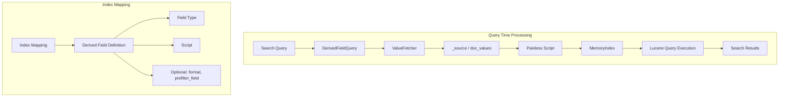
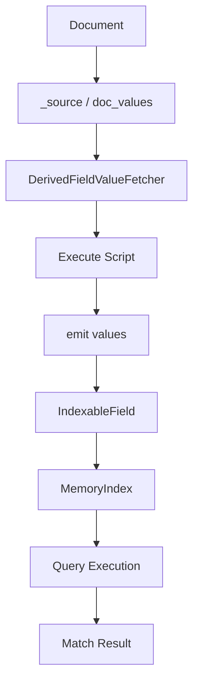

# Derived Fields

## Summary

Derived fields allow you to create new fields dynamically by executing scripts on existing fields at query time. The source data can come from either the `_source` field or doc values. Once defined in an index mapping or search request, derived fields can be queried like regular fields, enabling real-time data transformation without reindexing.

## Details

### Architecture



### Data Flow



### Components

| Component | Description |
|-----------|-------------|
| `DerivedFieldQuery` | Wraps a Lucene query to execute against derived field values |
| `DerivedFieldValueFetcher` | Retrieves source values and executes scripts to produce derived values |
| `DerivedFieldScript` | Painless script context for derived field computation |
| `MemoryIndex` | In-memory Lucene index used to execute queries against derived values |

### Supported Field Types

| Type | Emit Format | Multi-valued |
|------|-------------|--------------|
| `boolean` | `emit(boolean)` | No |
| `date` | `emit(long timeInMillis)` | Yes |
| `double` | `emit(double)` | Yes |
| `float` | `emit(float)` | Yes |
| `geo_point` | `emit(double lat, double lon)` | Yes |
| `ip` | `emit(String ip)` | Yes |
| `keyword` | `emit(String)` | Yes |
| `long` | `emit(long)` | Yes |
| `object` | `emit(String json)` | Yes |
| `text` | `emit(String)` | Yes |

### Configuration

| Setting | Description | Default |
|---------|-------------|---------|
| `index.query.derived_field.enabled` | Enable/disable derived fields at index level | `true` |
| `search.derived_field.enabled` | Enable/disable derived fields at cluster level | `true` |
| `search.allow_expensive_queries` | Must be `true` for derived fields to work | `true` |

### Usage Example

Define a derived field in index mapping:

```json
PUT /logs/_mapping
{
  "derived": {
    "method": {
      "type": "keyword",
      "script": {
        "source": "emit(doc['request.keyword'].value.splitOnToken(' ')[1])"
      }
    },
    "timestamp": {
      "type": "date",
      "format": "epoch_millis",
      "script": {
        "source": "emit(Long.parseLong(doc['request.keyword'].value.splitOnToken(' ')[0]))"
      }
    }
  }
}
```

Query the derived field:

```json
POST /logs/_search
{
  "query": {
    "bool": {
      "must": [
        { "term": { "method": "GET" } },
        { "range": { "timestamp": { "gte": "now-1d" } } }
      ]
    }
  },
  "fields": ["method", "timestamp"]
}
```

### Performance Optimization

Use `prefilter_field` to prune the search space:

```json
PUT /logs/_mapping
{
  "derived": {
    "method": {
      "type": "keyword",
      "script": {
        "source": "emit(doc['request.keyword'].value.splitOnToken(' ')[1])"
      },
      "prefilter_field": "request"
    }
  }
}
```

## Limitations

- **Scoring and sorting**: Not yet supported on derived fields
- **Aggregations**: Most types supported since v2.17; geographic, significant terms/text, and scripted metric aggregations not supported
- **Dashboard support**: Fields not displayed in available fields list (can still filter by name)
- **Chained derived fields**: One derived field cannot reference another
- **Join field type**: Derived fields not supported for join fields
- **Performance**: Computed at query time, may impact performance on large datasets

## Change History

- **v3.3.0**: Fixed query rewrite for range queries on derived fields by implementing selective rewrite based on query type
- **v2.17.0**: Added support for most aggregation types on derived fields
- **v2.15.0**: Initial implementation of derived fields feature

## References

### Documentation
- [Documentation](https://docs.opensearch.org/3.0/field-types/supported-field-types/derived/): Official derived field documentation

### Pull Requests
| Version | PR | Description |
|---------|-----|-------------|
| v3.3.0 | [#19496](https://github.com/opensearch-project/OpenSearch/pull/19496) | Fix derived field rewrite to handle range queries |
| v2.17.0 | - | Added aggregation support for derived fields |
| v2.15.0 | - | Initial implementation of derived fields |

### Issues (Design / RFC)
- [Issue #19337](https://github.com/opensearch-project/OpenSearch/issues/19337): Bug report for derived field rewrite issues with range queries
