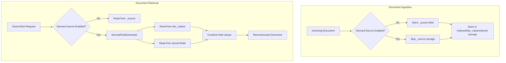
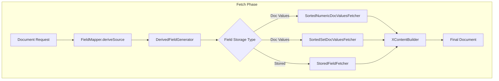

# Derived Source

## Summary

Derived Source is a storage optimization feature that eliminates the need to store the `_source` field during document ingestion. Instead of duplicating data, OpenSearch dynamically reconstructs documents from `doc_values` and stored fields on demand. This approach can reduce storage costs by up to 2x while maintaining full search functionality and supporting operations like reindexing, updates, scripted updates, and recovery.

The feature is particularly beneficial for time-series data and aggregation-heavy workloads where the original document body is rarely needed but aggregations like `min`, `max`, `avg`, `sum`, or `terms` are frequently used.

## Details

### Architecture



### Data Flow



### Components

| Component | Description |
|-----------|-------------|
| `DerivedFieldGenerator` | Core class that generates derived source based on field mapping and storage preferences |
| `FieldValueFetcher` | Abstract base class for fetching field values from Lucene |
| `SortedNumericDocValuesFetcher` | Fetches numeric values from sorted numeric doc values |
| `SortedSetDocValuesFetcher` | Fetches string values from sorted set doc values (keyword, IP fields) |
| `StoredFieldFetcher` | Fetches values from stored fields using `SingleFieldsVisitor` |
| `FieldValueType` | Enum with values `DOC_VALUES` and `STORED` indicating storage preference |
| `DerivedSourceDirectoryReader` | FilterDirectoryReader that wraps readers to support derived source (v3.2.0+) |
| `DerivedSourceLeafReader` | LeafReader wrapper providing access to derived source (v3.2.0+) |
| `DerivedSourceStoredFieldsReader` | StoredFieldsReader that injects `_source` field by deriving it dynamically (v3.2.0+) |
| `TranslogOperationHelper` | Helper class for comparing translog operations with derived source support (v3.2.0+) |

### Configuration

| Setting | Description | Default |
|---------|-------------|---------|
| `index.derived_source.enabled` | Enable derived source for the index | `false` |
| `index.derived_source.translog.enabled` | Enable derived source for translog operations (dynamic, v3.2.0+) | Same as `index.derived_source.enabled` |

### Supported Field Types

| Field Type | Doc Values | Stored Field | Notes |
|------------|-----------|--------------|-------|
| Date | ✓ | ✓ | Uses first format from format list |
| Date Nanos | ✓ | ✓ | Uses first format from format list |
| Integer | ✓ | ✓ | Multi-value sorted |
| Long | ✓ | ✓ | Multi-value sorted |
| Float | ✓ | ✓ | Multi-value sorted |
| Double | ✓ | ✓ | Multi-value sorted |
| Half Float | ✓ | ✓ | Some precision loss possible |
| Unsigned Long | ✓ | ✓ | Multi-value sorted |
| Byte | ✓ | ✓ | Multi-value sorted |
| Short | ✓ | ✓ | Multi-value sorted |
| Scaled Float | ✓ | ✓ | Precision loss due to scaling factor |
| Boolean | ✓ | ✓ | String values converted to boolean |
| IP | ✓ | ✓ | Multi-value deduplicated and sorted |
| Constant Keyword | N/A | ✓ | Returns constant value from mapping |
| Geo Point | ✓ | ✓ | Always returns `{"lat": val, "lon": val}` format |
| Keyword | ✓ | ✓ | Multi-value deduplicated and sorted |
| Text | N/A | ✓ | Requires `store: true` |
| Wildcard | ✓ | N/A | Requires doc_values enabled |

### Usage Example

```json
PUT sample-index
{
  "settings": {
    "index": {
      "derived_source": {
        "enabled": true
      }
    }
  },
  "mappings": {
    "properties": {
      "hostName": { "type": "keyword" },
      "hostIp": { "type": "ip" },
      "zone": { "type": "keyword" },
      "@timestamp": { "type": "date" },
      "cpu": { "type": "float" },
      "jvm": { "type": "float" }
    }
  }
}
```

### Performance Benchmarks

| Workload | Storage Reduction | Indexing Throughput | Merge Time Reduction |
|----------|------------------|---------------------|---------------------|
| nyc_taxis | 41% | Up to 18% improvement | 20-48% |
| http logs | 43% | Up to 18% improvement | 20-48% |
| elb logs | 58% | Up to 18% improvement | 20-48% |

Search latency may increase by 10-100% depending on the number of documents retrieved, as reading from multiple field locations is slower than reading from a single `_source` field.

## Limitations

- **Index-level setting**: Must be configured at index creation time, cannot be changed afterward
- **Field restrictions**:
  - Fields with `copy_to` parameter are not supported
  - Keyword fields with `ignore_above` or `normalizer` are not supported
  - Text fields require `store: true`
  - Wildcard fields require `doc_values: true`
- **Data representation changes**:
  - Multi-value keyword fields are deduplicated and sorted
  - Multi-value numeric fields are sorted
  - Date fields use the first format from the format list
  - Geo point values always output in `{"lat": lat_val, "lon": lon_val}` format
- **Precision considerations**:
  - Geo point fields may have precision loss (~4.19e-8 for latitude, ~8.38e-8 for longitude)
  - Half float fields may have precision loss
  - Scaled float fields have precision loss due to scaling factor

## Change History

- **v3.2.0** (2026-01-10): Integration across get/search/recovery paths - Added DerivedSourceDirectoryReader, DerivedSourceLeafReader, DerivedSourceStoredFieldsReader, TranslogOperationHelper; Added dynamic `index.derived_source.translog.enabled` setting; Fixed flaky test issues from reverted PR #18054; Added Star-Tree mapper compatibility
- **v3.1.0** (2026-01-10): Initial implementation - Added derive source support for basic field types including Date, Number, Boolean, IP, Keyword, Text, Geo Point, Constant Keyword, Scaled Float, and Wildcard

## References

### Documentation
- [Documentation: Derived source](https://docs.opensearch.org/latest/field-types/metadata-fields/source/#derived-source)

### Blog Posts
- [Blog: Save up to 2x on storage with derived source](https://opensearch.org/blog/save-up-to-2x-on-storage-with-derived-source/)

### Pull Requests
| Version | PR | Description |
|---------|-----|-------------|
| v3.2.0 | [#18565](https://github.com/opensearch-project/OpenSearch/pull/18565) | Add integration of derived source feature across various paths like get/search/recovery |
| v3.1.0 | [#17759](https://github.com/opensearch-project/OpenSearch/pull/17759) | Adding support for derive source feature and implementing it for various type of field mappers |

### Issues (Design / RFC)
- [Issue #17073](https://github.com/opensearch-project/OpenSearch/issues/17073): Add support for deriving source field in FieldMapper
- [Issue #9568](https://github.com/opensearch-project/OpenSearch/issues/9568): Optimizing Data Storage and Retrieval for Time Series data
- [Issue #17048](https://github.com/opensearch-project/OpenSearch/issues/17048): META - Enabling Derived Source in OpenSearch
