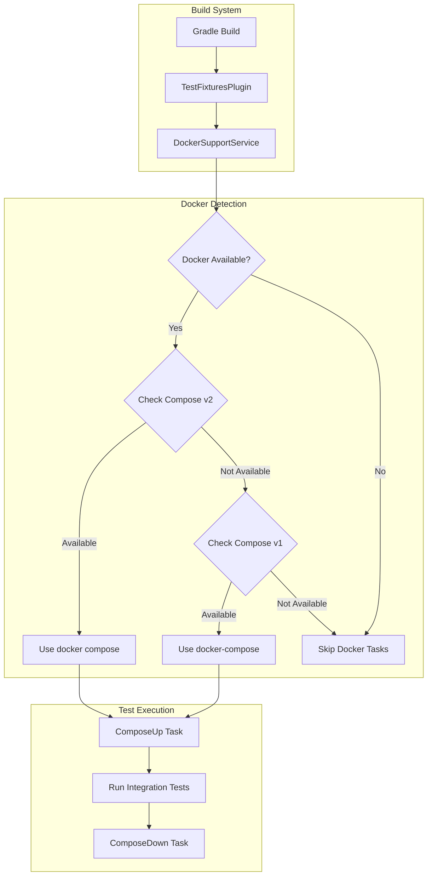

# Docker Compose v2 Support

## Summary

The TestFixturesPlugin in OpenSearch's build system supports Docker Compose for running integration tests that require external services (like GCS, S3, Azure storage emulators). This feature ensures compatibility with both Docker Compose v1 (`docker-compose`) and Docker Compose v2 (`docker compose`), allowing developers on modern systems to run these tests without issues.

## Details

### Architecture



### Data Flow


### Components

| Component | Description |
|-----------|-------------|
| `DockerSupportService` | Service that detects Docker and Docker Compose availability |
| `DockerAvailability` | Data class holding Docker availability status |
| `TestFixturesPlugin` | Gradle plugin that manages Docker-based test fixtures |
| `ComposeExtension` | Configuration for Docker Compose integration |

### Configuration

| Setting | Description | Default |
|---------|-------------|---------|
| `useDockerComposeV2` | Whether to use Docker Compose v2 syntax | Auto-detected |
| `executable` | Path to Docker/Docker Compose binary | Auto-detected |
| `COMPOSE_HTTP_TIMEOUT` | HTTP timeout for Docker Compose operations | 120 seconds |

### Detection Logic

The system checks for Docker Compose availability in the following order:

1. **Docker Compose v2**: Runs `docker compose version` to check if the compose plugin is available
2. **Docker Compose v1**: Checks for `docker-compose` binary in standard locations:
   - Unix: `/usr/local/bin/docker-compose`, `/usr/bin/docker-compose`
   - Windows: `%PROGRAMFILES%\Docker\Docker\resources\bin\docker-compose.exe`

### Usage Example

```groovy
// build.gradle - Using test fixtures
plugins {
    id 'opensearch.testfixtures'
}

testFixtures {
    // Fixtures are automatically configured based on docker-compose.yml
}

// docker-compose.yml in project root
version: '3'
services:
  gcs-fixture:
    image: fake-gcs-server
    ports:
      - "4443:4443"
```

Running tests:
```bash
# Tests automatically use available Docker Compose version
./gradlew :plugins:repository-gcs:test
```

## Limitations

- Requires Docker to be installed and running on the system
- Docker Compose v2 requires Docker CLI with the compose plugin installed
- Test fixtures are skipped entirely if neither Docker Compose version is available
- CI environments may need Docker Compose throttling to avoid parallel execution issues

## Related PRs

| Version | PR | Description |
|---------|-----|-------------|
| v2.18.0 | [#16049](https://github.com/opensearch-project/OpenSearch/pull/16049) | Add support for docker compose v2 in TestFixturesPlugin |

## References

- [Issue #16050](https://github.com/opensearch-project/OpenSearch/issues/16050): Original bug report
- [Docker Compose v2 Migration](https://docs.docker.com/compose/releases/migrate/): Official Docker documentation
- [opensearch-api-specification#457](https://github.com/opensearch-project/opensearch-api-specification/issues/457): Similar update in API specification repo

## Change History

- **v2.18.0** (2024-10-22): Added Docker Compose v2 support alongside existing v1 support
