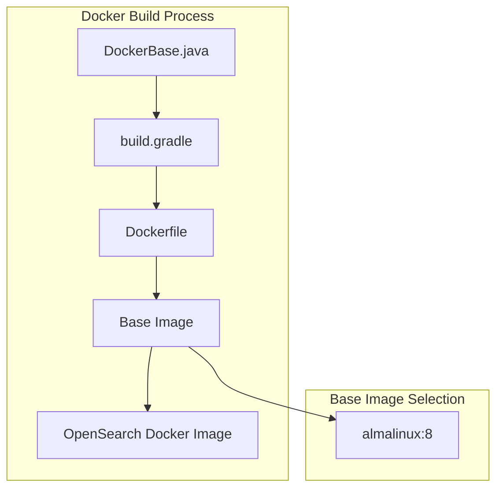

---
tags:
  - security
---

# Docker Image Base

## Summary

OpenSearch Docker images are built on a Linux base image that provides the foundation for running OpenSearch in containerized environments. The base image selection impacts security updates, package availability, and long-term support. OpenSearch has migrated from CentOS 8 to AlmaLinux 8 to ensure continued maintenance and security patches.

## Details

### Architecture



### Components

| Component | Description |
|-----------|-------------|
| `DockerBase.java` | Enum defining available base images for Docker builds |
| `build.gradle` | Gradle build configuration for Docker image creation |
| `Dockerfile` | Docker build instructions using the selected base image |

### Supported Base Images

| Base Image | Status | Notes |
|------------|--------|-------|
| AlmaLinux 8 | Current | RHEL 8 compatible, actively maintained |
| CentOS 8 | Deprecated | EOL, no longer supported |

### Configuration

The Docker base image is configured in the build system:

```java
// buildSrc/src/main/java/org/opensearch/gradle/DockerBase.java
public enum DockerBase {
    ALMALINUX("almalinux:8");
    
    private final String image;
}
```

### Installed Packages

The Docker image includes these essential packages:

| Package | Purpose |
|---------|---------|
| `nmap-ncat` | Network connectivity testing |
| `shadow-utils` | User/group management |
| `zip` | Archive creation |
| `unzip` | Archive extraction |

### Usage Example

```bash
# Pull the official OpenSearch Docker image
docker pull opensearchproject/opensearch:latest

# Run OpenSearch container
docker run -d -p 9200:9200 -p 9600:9600 \
  -e "discovery.type=single-node" \
  opensearchproject/opensearch:latest
```

## Limitations

- Only AlmaLinux 8 is supported as the base image for official builds
- Custom base images require modifications to the build system
- ARM64 and x64 architectures are supported

## Change History

- **v3.3.0** (2025-08-27): Migrated from CentOS 8 to AlmaLinux 8 base image

## References

### Documentation
- [OpenSearch Docker Installation](https://docs.opensearch.org/3.3/install-and-configure/install-opensearch/docker/)
- [Compatible Operating Systems](https://docs.opensearch.org/3.3/install-and-configure/os-comp/)
- [CentOS Docker Hub Deprecation](https://hub.docker.com/_/centos)
- [AlmaLinux](https://almalinux.org/)

### Pull Requests
| Version | PR | Description | Related Issue |
|---------|-----|-------------|---------------|
| v3.3.0 | [#19154](https://github.com/opensearch-project/OpenSearch/pull/19154) | Replace centos:8 with almalinux:8 |   |

### Issues (Design / RFC)
- [opensearch-build Issue #4573](https://github.com/opensearch-project/opensearch-build/issues/4573): OS compatibility changes
