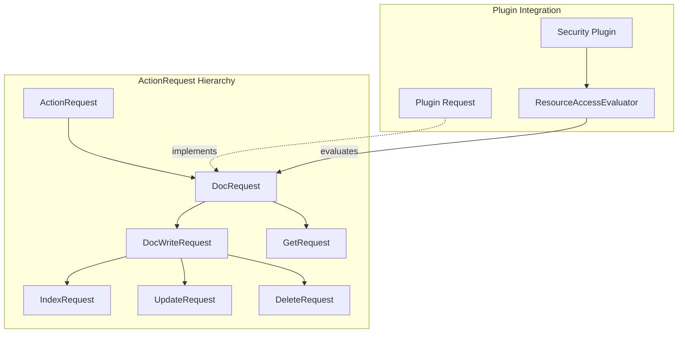
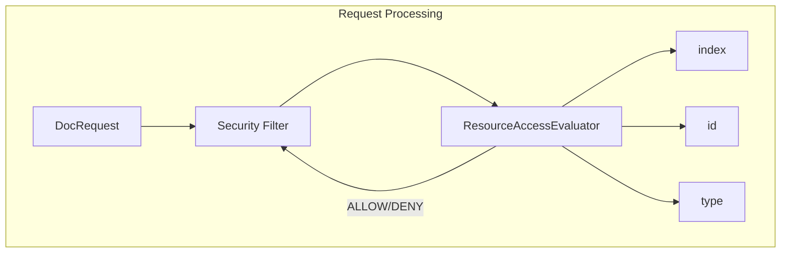
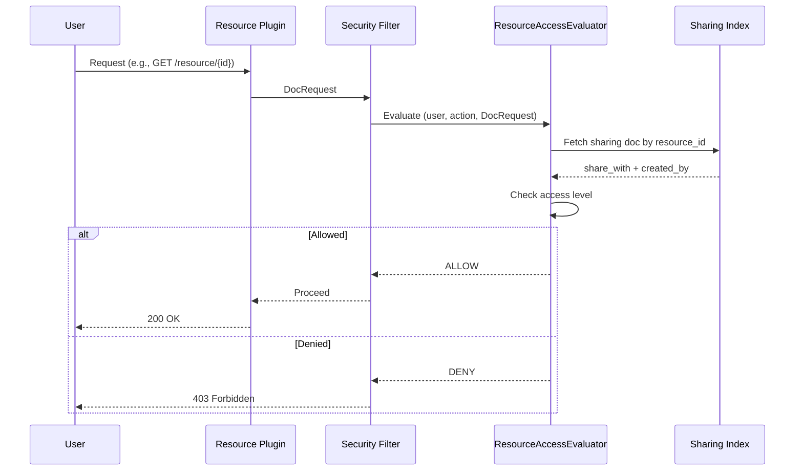

---
tags:
  - indexing
  - ml
  - security
---

# DocRequest Interface

## Summary

The `DocRequest` interface provides a generic abstraction for ActionRequests that operate on a single document in OpenSearch. It serves as a foundation for categorizing document-level operations and enables the Security plugin to implement fine-grained resource-level access control for plugin-defined resources such as ML models, anomaly detectors, and report definitions.

## Details

### Architecture



### Data Flow



### Components

| Component | Description |
|-----------|-------------|
| `DocRequest` | Generic interface for single-document operations |
| `DocRequest.index()` | Returns the target index name |
| `DocRequest.id()` | Returns the document ID |
| `DocRequest.type()` | Returns the resource type for sharing context |
| `DocWriteRequest` | Extended interface for write operations (Index, Update, Delete) |
| `GetRequest` | Read operation that now implements `DocRequest` |

### Configuration

This feature does not require configuration. It is a core API change that plugins can optionally leverage.

For resource sharing functionality, the Security plugin settings are:

| Setting | Description | Default |
|---------|-------------|---------|
| `plugins.security.experimental.resource_sharing.enabled` | Enable resource sharing | `false` |
| `plugins.security.experimental.resource_sharing.protected_types` | Resource types with access control | `[]` |

### Usage Example

#### Implementing DocRequest in a Plugin

```java
/**
 * Request to get a report definition - implements DocRequest for resource sharing
 */
public class GetReportDefinitionRequest extends ActionRequest implements DocRequest {
    private final String index;
    private final String reportId;
    
    public GetReportDefinitionRequest(String index, String reportId) {
        this.index = index;
        this.reportId = reportId;
    }
    
    @Override
    public String index() {
        return index;
    }
    
    @Override
    public String id() {
        return reportId;
    }
    
    @Override
    public String type() {
        return "report_definition";
    }
    
    @Override
    public ActionRequestValidationException validate() {
        return null;
    }
}
```

#### Security Plugin Integration

When a plugin implements `DocRequest`, the Security plugin can automatically evaluate access:



## Limitations

- Only applicable to single-document operations
- Resource sharing requires Security plugin with experimental feature enabled
- The `type()` method must be overridden for custom resource types
- Bulk operations are not directly supported (individual items in bulk use `DocWriteRequest`)

## Change History

- **v3.3.0** (2026-01-10): Added `type()` method to DocRequest interface for resource sharing; Anomaly Detection plugin implements resource types for detectors and forecasters
- **v3.1.0** (2025-05-15): Initial implementation - introduced `DocRequest` interface, updated `DocWriteRequest` to extend it, and made `GetRequest` implement it

## Related Features
- [OpenSearch Dashboards](../opensearch-dashboards/ai-chat.md)

## References

### Blog Posts
- [Blog: Introducing resource sharing](https://opensearch.org/blog/introducing-resource-sharing-a-new-access-control-model-for-opensearch/): A new access control model for OpenSearch

### Pull Requests
| Version | PR | Description | Related Issue |
|---------|-----|-------------|---------------|
| v3.3.0 | [opensearch#19313](https://github.com/opensearch-project/OpenSearch/pull/19313) | Add new extensible method to DocRequest to specify type | [#4500](https://github.com/opensearch-project/security/issues/4500) |
| v3.3.0 | [anomaly-detection#1566](https://github.com/opensearch-project/anomaly-detection/pull/1566) | Adds resource types to DocRequests in Anomaly Detection |   |
| v3.1.0 | [#18269](https://github.com/opensearch-project/OpenSearch/pull/18269) | Create generic DocRequest to better categorize ActionRequests | [#4500](https://github.com/opensearch-project/security/issues/4500) |

### Issues (Design / RFC)
- [Issue #4500](https://github.com/opensearch-project/security/issues/4500): Resource Permissions and Sharing (Security plugin)
