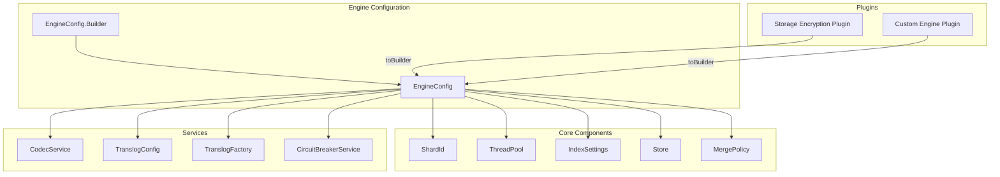

# Engine Config

## Summary

`EngineConfig` is a configuration class that holds all settings required to create an OpenSearch `Engine` instance. It encapsulates over 25 configuration parameters including shard settings, thread pools, merge policies, translog configuration, and more. The class uses a Builder pattern for construction and provides a `toBuilder()` method for creating modified copies.

## Details

### Architecture



### Components

| Component | Description |
|-----------|-------------|
| `EngineConfig` | Immutable configuration holder for Engine creation |
| `EngineConfig.Builder` | Fluent builder for constructing EngineConfig instances |
| `toBuilder()` | Method to create a pre-populated Builder from existing config |
| `CodecService` | Service for managing Lucene codecs |

### Configuration Fields

| Field | Type | Description |
|-------|------|-------------|
| `shardId` | `ShardId` | Identifier for the shard |
| `threadPool` | `ThreadPool` | Thread pool for async operations |
| `indexSettings` | `IndexSettings` | Index-level settings |
| `warmer` | `Engine.Warmer` | Searcher warmer for new segments |
| `store` | `Store` | Access to the Lucene directory |
| `mergePolicy` | `MergePolicy` | Lucene merge policy |
| `analyzer` | `Analyzer` | Default analyzer for indexing |
| `similarity` | `Similarity` | Similarity for scoring |
| `codecService` | `CodecService` | Codec management service |
| `eventListener` | `Engine.EventListener` | Engine event callbacks |
| `queryCache` | `QueryCache` | Query result cache |
| `queryCachingPolicy` | `QueryCachingPolicy` | Policy for query caching |
| `translogConfig` | `TranslogConfig` | Translog configuration |
| `translogFactory` | `TranslogFactory` | Factory for creating translogs |
| `flushMergesAfter` | `TimeValue` | Time after which to flush merges |
| `circuitBreakerService` | `CircuitBreakerService` | Memory circuit breaker |
| `globalCheckpointSupplier` | `LongSupplier` | Global checkpoint tracker |
| `retentionLeasesSupplier` | `Supplier<RetentionLeases>` | Retention leases provider |
| `primaryTermSupplier` | `LongSupplier` | Primary term supplier |
| `isReadOnlyReplica` | `boolean` | Read-only replica flag |
| `leafSorter` | `Comparator<LeafReader>` | Segment ordering comparator |

### Usage Example

#### Creating a New EngineConfig

```java
EngineConfig config = new EngineConfig.Builder()
    .shardId(shardId)
    .threadPool(threadPool)
    .indexSettings(indexSettings)
    .warmer(warmer)
    .store(store)
    .mergePolicy(mergePolicy)
    .analyzer(analyzer)
    .similarity(similarity)
    .codecService(codecService)
    .eventListener(eventListener)
    .queryCache(queryCache)
    .queryCachingPolicy(queryCachingPolicy)
    .translogConfig(translogConfig)
    .translogFactory(new InternalTranslogFactory())
    .flushMergesAfter(flushMergesAfter)
    .circuitBreakerService(circuitBreakerService)
    .globalCheckpointSupplier(globalCheckpointSupplier)
    .retentionLeasesSupplier(retentionLeasesSupplier)
    .primaryTermSupplier(primaryTermSupplier)
    .build();
```

#### Modifying an Existing Config (v3.3.0+)

```java
// Create a modified copy with a custom translog factory
EngineConfig encryptedConfig = existingConfig.toBuilder()
    .translogFactory(new EncryptedTranslogFactory())
    .build();
```

### Index Settings

| Setting | Description | Default |
|---------|-------------|---------|
| `index.codec` | Lucene codec for writing segments | `default` |
| `index.codec.compression_level` | Compression level (1-6) for zstd codecs | `3` |
| `index.optimize_auto_generated_id` | Optimize for auto-generated IDs | `true` |
| `index.use_compound_file` | Use compound file format | `true` |

## Limitations

- `EngineConfig` is effectively immutable after construction
- The `toBuilder()` method creates shallow copies of mutable objects
- Some settings like `codecName` are derived from `IndexSettings` and cannot be directly modified

## Related PRs

| Version | PR | Description |
|---------|-----|-------------|
| v3.3.0 | [#19054](https://github.com/opensearch-project/OpenSearch/pull/19054) | Add toBuilder() method for easy config modification |

## References

- [opensearch-storage-encryption](https://github.com/opensearch-project/opensearch-storage-encryption): Plugin that motivated the toBuilder() addition
- [EngineConfig.java](https://github.com/opensearch-project/OpenSearch/blob/main/server/src/main/java/org/opensearch/index/engine/EngineConfig.java): Source code

## Change History

- **v3.3.0**: Added `toBuilder()` method; promoted `EngineConfig.Builder` and `CodecService` to public API
