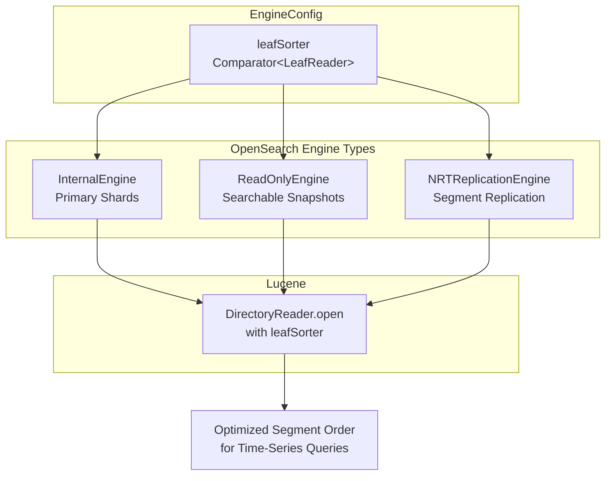
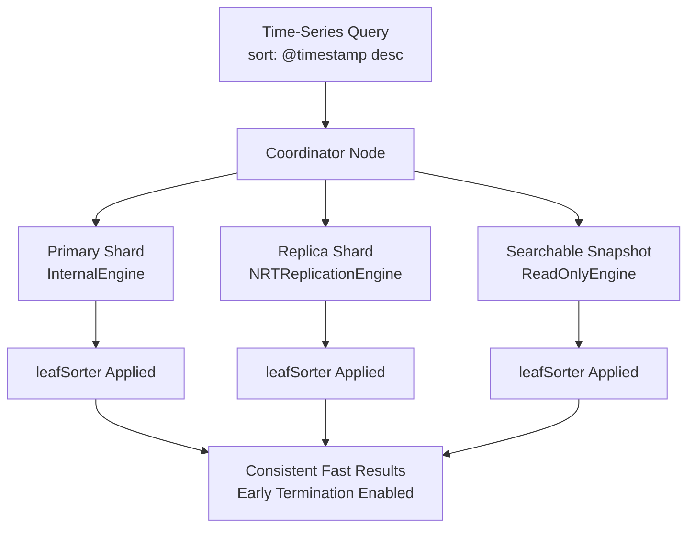

# Engine Optimization Fixes

## Summary

Engine optimization fixes address performance inconsistencies across different OpenSearch engine types. The primary fix ensures that timestamp sort optimizations (leafSorter) work consistently across `InternalEngine`, `ReadOnlyEngine`, and `NRTReplicationEngine`, providing uniform time-series query performance regardless of shard type or replication strategy.

## Details

### Architecture



### Data Flow



### Components

| Component | Description |
|-----------|-------------|
| `InternalEngine` | Primary engine for read/write shards, has IndexWriter |
| `ReadOnlyEngine` | Engine for searchable snapshots, read-only access |
| `NRTReplicationEngine` | Engine for segment replication replicas |
| `NRTReplicationReaderManager` | Manages DirectoryReader refresh for segment replication |
| `EngineConfig` | Configuration holder including leafSorter comparator |
| `leafSorter` | Comparator that orders segments by timestamp for optimization |

### How leafSorter Works

The `leafSorter` is a `Comparator<LeafReader>` that determines the order in which Lucene segments are visited during search. For time-series data sorted by timestamp descending:

1. Segments are ordered by their maximum timestamp value (descending)
2. When searching with `sort: @timestamp desc`, the most recent segments are searched first
3. Once enough results are found, remaining segments can be skipped (early termination)

### Configuration

No explicit configuration is required. The leafSorter is automatically configured based on index settings when:

- Index has a timestamp field (typically `@timestamp`)
- Index sort is configured for timestamp-based ordering

### Usage Example

```json
// Index with timestamp sort (automatic optimization)
PUT /logs-2024
{
  "settings": {
    "index": {
      "sort.field": "@timestamp",
      "sort.order": "desc"
    }
  },
  "mappings": {
    "properties": {
      "@timestamp": { "type": "date" },
      "message": { "type": "text" }
    }
  }
}

// Query benefits from leafSorter optimization on all engine types
GET /logs-*/_search
{
  "size": 100,
  "sort": [{ "@timestamp": "desc" }],
  "query": {
    "bool": {
      "filter": [
        { "range": { "@timestamp": { "gte": "now-1d" } } }
      ]
    }
  }
}
```

## Limitations

- Optimization only applies to timestamp-sorted queries matching the index sort order
- Requires index-level sort configuration for full benefit
- Early termination depends on query structure and result requirements

## Related PRs

| Version | PR | Description |
|---------|-----|-------------|
| v3.2.0 | [#18639](https://github.com/opensearch-project/OpenSearch/pull/18639) | Fix leafSorter optimization for ReadOnlyEngine and NRTReplicationEngine |

## References

- [Issue #17579](https://github.com/opensearch-project/OpenSearch/issues/17579): Original bug report
- [Segment Replication](https://docs.opensearch.org/3.0/tuning-your-cluster/availability-and-recovery/segment-replication/index/): Segment replication documentation
- [Searchable Snapshots](https://docs.opensearch.org/3.0/tuning-your-cluster/availability-and-recovery/snapshots/searchable_snapshot/): Searchable snapshots documentation

## Change History

- **v3.2.0** (2025-07-23): Fix leafSorter optimization for ReadOnlyEngine and NRTReplicationEngine
