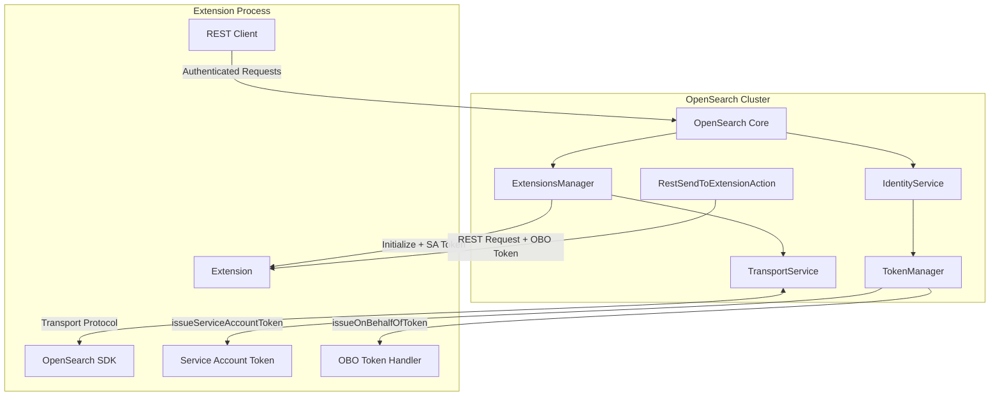

---
tags:
  - indexing
  - security
---

# Extensions Framework

## Summary

The Extensions Framework provides a way to extend OpenSearch functionality through isolated, independently running processes. Unlike plugins that run within the OpenSearch process, extensions run as separate processes or on remote nodes, offering better isolation, independent scaling, and cleaner interfaces. The framework includes security features for authentication token handling, enabling extensions to act on behalf of users and maintain their own identity.

## Details

### Architecture



### Data Flow


### Components

| Component | Description |
|-----------|-------------|
| `ExtensionsManager` | Manages extension lifecycle, initialization, and communication |
| `IdentityService` | Provides identity and token management services |
| `TokenManager` | Interface for issuing and validating authentication tokens |
| `OnBehalfOfClaims` | Claims for OBO tokens (audience, subject, expiration) |
| `AuthToken` | Base interface for authentication tokens |
| `BasicAuthToken` | Basic authentication token implementation |
| `BearerAuthToken` | Bearer token implementation |
| `RestSendToExtensionAction` | REST handler for forwarding requests to extensions |
| `InitializeExtensionRequest` | Request sent to initialize an extension |
| `RestActionsRequestHandler` | Handles extension REST action registration |

### Configuration

| Setting | Description | Default |
|---------|-------------|---------|
| `opensearch.experimental.feature.extensions.enabled` | Enable extensions feature | `false` |
| Extension-specific settings | Defined by individual extensions | Varies |

### Token Types

#### Service Account Token

- Issued during extension initialization
- Represents the extension's identity
- Used for accessing extension's reserved system indices
- Generated using `TokenManager.issueServiceAccountToken(extensionId)`

#### On Behalf Of (OBO) Token

- Generated for each user request forwarded to an extension
- Contains claims about the original user
- Enables extensions to act with user's permissions
- Generated using `TokenManager.issueOnBehalfOfToken(subject, claims)`

### Usage Example

**Extension Registration (extensions.yml)**:

```yaml
extensions:
  - name: my-extension
    uniqueId: my-extension-id
    hostAddress: 127.0.0.1
    port: 4532
    version: 1.0.0
    opensearchVersion: 3.0.0
    minimumCompatibleVersion: 3.0.0
```

**Token Manager Implementation**:

```java
public class ShiroTokenManager implements TokenManager {
    
    @Override
    public AuthToken issueOnBehalfOfToken(Subject subject, OnBehalfOfClaims claims) {
        String password = generatePassword();
        byte[] rawEncoded = Base64.getUrlEncoder()
            .encode((claims.getAudience() + ":" + password).getBytes(UTF_8));
        String header = "Basic " + new String(rawEncoded, UTF_8);
        BasicAuthToken token = new BasicAuthToken(header);
        shiroTokenPasswordMap.put(token, password);
        return token;
    }
    
    @Override
    public AuthToken issueServiceAccountToken(String audience) {
        String password = generatePassword();
        byte[] rawEncoded = Base64.getUrlEncoder().withoutPadding()
            .encode((audience + ":" + password).getBytes(UTF_8));
        String header = "Basic " + new String(rawEncoded, UTF_8);
        BasicAuthToken token = new BasicAuthToken(header);
        shiroTokenPasswordMap.put(token, password);
        return token;
    }
}
```

**OnBehalfOfClaims**:

```java
public class OnBehalfOfClaims {
    private final String audience;    // Extension ID
    private final String subject;     // User principal name
    private final Long expiration;    // Token expiration time
    private final Long not_before;    // Token valid from
    private final Long issued_at;     // Token issue time
    
    // Default expiration: 5 minutes from issue time
    public OnBehalfOfClaims(String aud, String subject) {
        this(aud, subject, System.currentTimeMillis() / 1000 + 300);
    }
}
```

## Limitations

- Extensions framework is experimental and not recommended for production use
- Token rotation for service accounts is not yet implemented
- Security plugin implementation of token interfaces is pending
- Extensions cannot yet run in a horizontally scaled configuration
- Real-time anomaly detection support in extensions is still in development

## Change History

- **v3.0.0** (2024-09-17): Added On Behalf Of token passing and Service Account token issuance for extensions

## References

### Documentation
- [Extensions Documentation](https://docs.opensearch.org/3.0/developer-documentation/extensions/): Official OpenSearch extensions documentation
- [Extension Design Documentation](https://opensearch-project.github.io/opensearch-sdk-java/DESIGN.html): Detailed design documentation
- [OpenSearch SDK Java](https://github.com/opensearch-project/opensearch-sdk-java): Java SDK for building extensions

### Blog Posts
- [Introducing Extensions Blog](https://opensearch.org/blog/introducing-extensions-for-opensearch/): Blog post introducing extensions architecture

### Pull Requests
| Version | PR | Description | Related Issue |
|---------|-----|-------------|---------------|
| v3.0.0 | [#8679](https://github.com/opensearch-project/OpenSearch/pull/8679) | Implement on behalf of token passing for extensions | [#2764](https://github.com/opensearch-project/security/issues/2764) |
| v3.0.0 | [#9618](https://github.com/opensearch-project/OpenSearch/pull/9618) | Provide service accounts tokens to extensions | [#3176](https://github.com/opensearch-project/security/issues/3176) |

### Issues (Design / RFC)
- [Issue #2764](https://github.com/opensearch-project/security/issues/2764): Determine how auth tokens are forwarded to Extensions
- [Issue #3176](https://github.com/opensearch-project/security/issues/3176): Issue and ferry a Service Account Token to an Extension on bootstrap
