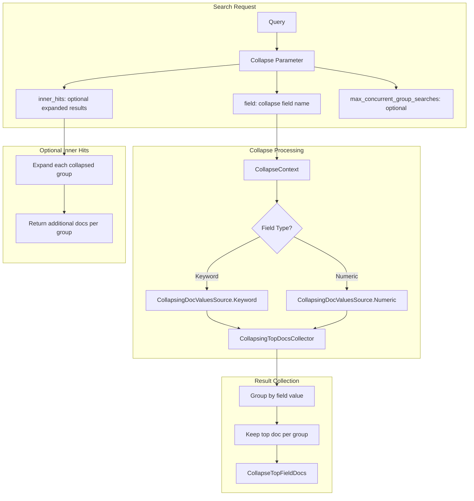
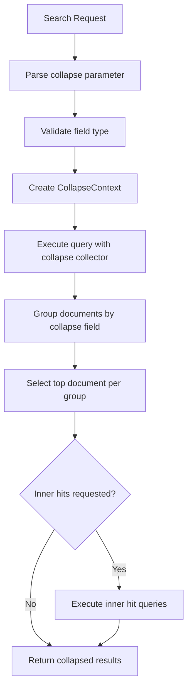

# Field Collapsing

## Summary

Field collapsing groups search results by a specified field value, returning only the top document within each group. This reduces redundancy by eliminating duplicate entries based on a common field, making it useful for scenarios like showing one product per category or one article per author.

## Details

### Architecture



### Data Flow



### Components

| Component | Description |
|-----------|-------------|
| `CollapseBuilder` | Builds collapse configuration from search request |
| `CollapseContext` | Holds collapse field info and creates collectors |
| `CollapsingTopDocsCollector` | Lucene collector that groups and collapses results |
| `CollapsingDocValuesSource` | Extracts collapse field values from doc values |
| `CollapseTopFieldDocs` | Result container with collapsed hits and field values |

### Configuration

| Setting | Description | Default |
|---------|-------------|---------|
| `collapse.field` | Field to collapse on (required) | - |
| `collapse.inner_hits` | Inner hits configuration for expanded results | null |
| `collapse.inner_hits.name` | Name for inner hits group | - |
| `collapse.inner_hits.size` | Number of inner hits per group | 3 |
| `collapse.max_concurrent_group_searches` | Max concurrent inner hit searches | Based on data nodes and thread pool |

### Usage Example

```json
// Basic collapse
GET /products/_search
{
  "query": { "match": { "description": "laptop" } },
  "collapse": { "field": "brand" },
  "sort": [{ "price": "asc" }]
}

// Collapse with inner hits
GET /products/_search
{
  "query": { "match": { "description": "laptop" } },
  "collapse": {
    "field": "brand",
    "inner_hits": {
      "name": "by_brand",
      "size": 3,
      "sort": [{ "price": "asc" }]
    }
  },
  "sort": [{ "rating": "desc" }]
}

// Collapse with search_after (v3.3.0+)
GET /products/_search
{
  "query": { "match_all": {} },
  "collapse": { "field": "category" },
  "sort": [{ "category": "asc" }],
  "search_after": ["electronics"],
  "size": 10
}
```

## Limitations

- Only `keyword` and `numeric` field types are supported for collapsing
- Cannot be used with scroll context
- Cannot be used with rescore
- When using `search_after` (v3.3.0+):
  - Collapse field and sort field must be the same
  - Secondary sort fields are not supported
- Total hits reflects all matching documents before collapsing, not the number of collapsed groups
- Aggregations are not affected by collapse (computed on all matching documents)

## Change History

- **v3.3.0** (2026): Added `search_after` pagination support for field collapsing (requires collapse field = sort field)

## References

### Documentation
- [Collapse search results documentation](https://docs.opensearch.org/3.0/search-plugins/searching-data/collapse-search/): Official documentation
- [Collapse processor documentation](https://docs.opensearch.org/3.0/search-plugins/search-pipelines/collapse-processor/): Search pipeline collapse processor

### Pull Requests
| Version | PR | Description |
|---------|-----|-------------|
| v3.3.0 | [#19261](https://github.com/opensearch-project/OpenSearch/pull/19261) | Field collapsing supports search_after |

### Issues (Design / RFC)
- [Issue #3725](https://github.com/opensearch-project/OpenSearch/issues/3725): Feature request for search_after support
