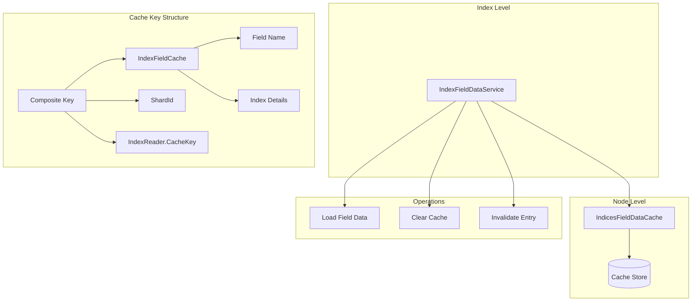
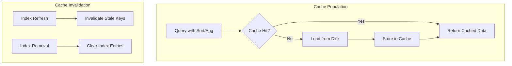

# Field Data Cache

## Summary

The Field Data Cache is a node-level cache in OpenSearch that stores field data used for sorting, aggregations, and scripting on text fields. It loads field values into memory for efficient access during search operations. The cache uses a composite key structure and provides mechanisms for cache clearing during index operations.

## Details

### Architecture



### Data Flow



### Components

| Component | Description |
|-----------|-------------|
| `IndicesFieldDataCache` | Node-level cache that stores field data across all indices |
| `IndexFieldDataService` | Index-level service managing field data operations |
| `IndexFieldCache` | Per-index cache wrapper containing field name and index details |
| `CircuitBreakerService` | Memory protection to prevent OOM from excessive cache growth |

### Configuration

| Setting | Description | Default |
|---------|-------------|---------|
| `indices.fielddata.cache.size` | Maximum size of the field data cache | Unbounded |
| `indices.breaker.fielddata.limit` | Circuit breaker limit for field data | 40% of JVM heap |
| `indices.breaker.fielddata.overhead` | Multiplier for field data memory estimation | 1.03 |

### Cache Clearing Scenarios

1. **Index Refresh**: During shard refresh, stale cache entries are invalidated synchronously
2. **Index Removal**: When an index is deleted, all associated cache entries are cleared
3. **Manual Clear**: Using the Clear Cache API to explicitly clear field data

### Usage Example

View field data cache usage per node:
```bash
GET _cat/fielddata?v
```

Clear field data cache for specific index:
```bash
POST /my-index/_cache/clear?fielddata=true
```

## Limitations

- Field data cache size is unbounded by default, controlled only by circuit breakers
- Cache clearing during index removal iterates over all cache keys (inefficient for large caches)
- No integration with tiered caching (heap + disk) as of v3.2.0

## Related PRs

| Version | PR | Description |
|---------|-----|-------------|
| v3.2.0 | [#18888](https://github.com/opensearch-project/OpenSearch/pull/18888) | Close IndexFieldDataService asynchronously |

## References

- [Issue #13862](https://github.com/opensearch-project/OpenSearch/issues/13862): Optimize FieldDataCache removal flow
- [CAT Field Data API](https://docs.opensearch.org/3.0/api-reference/cat/cat-field-data/): View field data cache memory usage
- [Clear Cache API](https://docs.opensearch.org/3.0/api-reference/index-apis/clear-index-cache/): Clear index caches including field data

## Change History

- **v3.2.0** (2025-08): Changed `IndexFieldDataService.close()` to clear cache asynchronously, preventing cluster applier thread blocking during index removal
