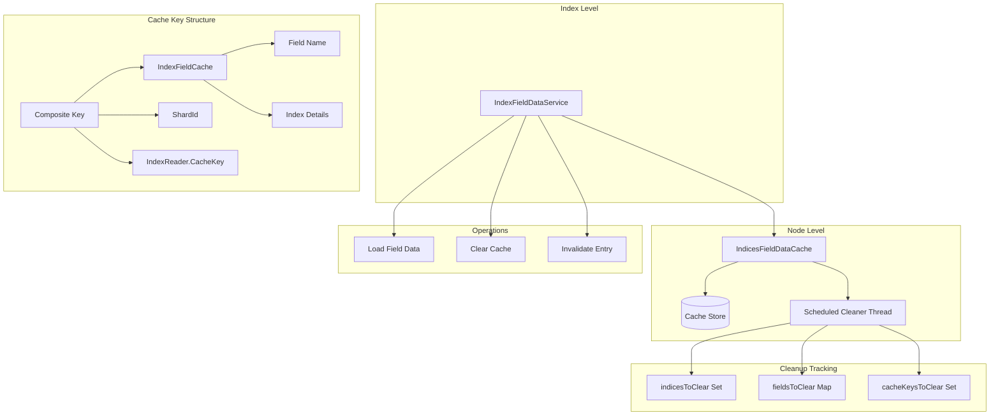
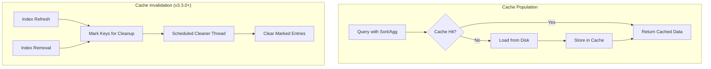

# Field Data Cache

## Summary

The Field Data Cache is a node-level cache in OpenSearch that stores field data used for sorting, aggregations, and scripting on text fields. It loads field values into memory for efficient access during search operations. Starting from v3.3.0, the cache has a default size limit of 35% of heap and supports dynamic configuration.

## Details

### Architecture



### Data Flow



### Components

| Component | Description |
|-----------|-------------|
| `IndicesFieldDataCache` | Node-level cache that stores field data across all indices |
| `IndexFieldDataService` | Index-level service managing field data operations |
| `IndexFieldCache` | Per-index cache wrapper containing field name and index details |
| `CircuitBreakerService` | Memory protection to prevent OOM from excessive cache growth |
| `Scheduled Cleaner Thread` | Background thread for asynchronous cache cleanup (v3.3.0+) |

### Configuration

| Setting | Description | Default | Dynamic |
|---------|-------------|---------|---------|
| `indices.fielddata.cache.size` | Maximum size of the field data cache | 35% of heap (v3.3.0+), unbounded (pre-v3.3.0) | Yes (v3.3.0+) |
| `indices.breaker.fielddata.limit` | Circuit breaker limit for field data | 40% of JVM heap | Yes |
| `indices.breaker.fielddata.overhead` | Multiplier for field data memory estimation | 1.03 | Yes |

### Cache Clearing Scenarios

1. **Index Refresh**: During shard refresh, stale cache entries are marked for cleanup
2. **Index Removal**: When an index is deleted, all associated cache entries are marked for cleanup
3. **Manual Clear**: Using the Clear Cache API to explicitly clear field data
4. **Segment Close**: When index reader segments close, associated entries are invalidated

### Usage Example

View field data cache usage per node:
```bash
GET _cat/fielddata?v
```

Clear field data cache for specific index:
```bash
POST /my-index/_cache/clear?fielddata=true
```

Update cache size dynamically (v3.3.0+):
```bash
PUT _cluster/settings
{
  "persistent": {
    "indices.fielddata.cache.size": "30%"
  }
}
```

## Limitations

- No integration with tiered caching (heap + disk) as of v3.3.0
- Cache size changes trigger eviction asynchronously (not immediate)

## Change History

- **v3.3.0** (2025-09): Added default 35% heap limit, made cache size setting dynamic, optimized cache clearing from O(FN) to O(N) with scheduled cleaner thread
- **v3.2.0** (2025-08): Changed `IndexFieldDataService.close()` to clear cache asynchronously, preventing cluster applier thread blocking during index removal

## References

### Documentation
- [CAT Field Data API](https://docs.opensearch.org/3.0/api-reference/cat/cat-field-data/): View field data cache memory usage
- [Clear Cache API](https://docs.opensearch.org/3.0/api-reference/index-apis/clear-index-cache/): Clear index caches including field data

### Pull Requests
| Version | PR | Description |
|---------|-----|-------------|
| v3.3.0 | [#19152](https://github.com/opensearch-project/OpenSearch/pull/19152) | Make field data cache size setting dynamic and add default limit |
| v3.3.0 | [#19116](https://github.com/opensearch-project/OpenSearch/pull/19116) | Remove unnecessary looping in field data cache clear |
| v3.2.0 | [#18888](https://github.com/opensearch-project/OpenSearch/pull/18888) | Close IndexFieldDataService asynchronously |

### Issues (Design / RFC)
- [Issue #19104](https://github.com/opensearch-project/OpenSearch/issues/19104): Change default settings for field data cache size
- [Issue #13862](https://github.com/opensearch-project/OpenSearch/issues/13862): Optimize FieldDataCache removal flow
