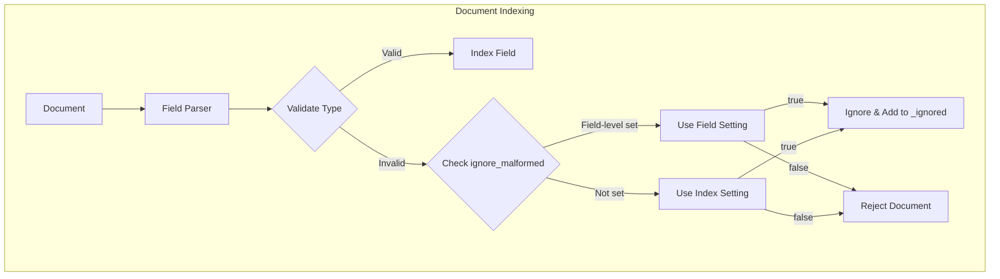

---
tags:
  - indexing
---

# Field Mapping

## Summary

Field mapping in OpenSearch defines how documents and their fields are stored and indexed. This includes support for the `ignore_malformed` parameter, which controls how OpenSearch handles documents containing fields with incorrect data types.

The `ignore_malformed` parameter can be set at both the index level and the field level, with field-level settings taking precedence over index-level settings.

## Details

### Architecture



### Components

| Component | Description |
|-----------|-------------|
| `FieldMapper` | Base class for all field mappers, provides `ignoreMalformed()` method |
| `DateFieldMapper` | Handles date field parsing with ignore_malformed support |
| `IpFieldMapper` | Handles IP address field parsing with ignore_malformed support |
| `NumberFieldMapper` | Handles numeric field parsing with ignore_malformed support |
| `ScaledFloatFieldMapper` | Handles scaled float fields with scaling factor |
| `RangeFieldMapper` | Handles range field types (ip_range, date_range, etc.) |
| `AbstractGeometryFieldMapper` | Base for geo_point, geo_shape, xy_point, xy_shape |
| `DerivedFieldMapper` | Handles derived fields with ignore_malformed support |

### Configuration

| Setting | Description | Default |
|---------|-------------|---------|
| `index.mapping.ignore_malformed` | Index-level setting to ignore malformed values | `false` |
| `ignore_malformed` (field-level) | Field-level setting that overrides index-level | Inherits from index |

### Supported Field Types

The `ignore_malformed` parameter is supported by the following field types:

| Field Type | Description |
|------------|-------------|
| `date` | Date and datetime values |
| `ip` | IPv4 and IPv6 addresses |
| `integer`, `long`, `short`, `byte` | Integer numeric types |
| `float`, `double`, `half_float` | Floating-point numeric types |
| `scaled_float` | Scaled floating-point stored as long |
| `geo_point` | Geographic point coordinates |
| `geo_shape` | Geographic shapes |
| `xy_point` | Cartesian point coordinates |
| `xy_shape` | Cartesian shapes |
| `ip_range`, `date_range`, etc. | Range field types |
| `derived` | Derived fields |

### Usage Example

**Index-level setting with field-level override:**
```json
PUT /my-index
{
  "settings": {
    "index.mapping.ignore_malformed": true
  },
  "mappings": {
    "properties": {
      "timestamp": {
        "type": "date"
      },
      "price": {
        "type": "scaled_float",
        "scaling_factor": 100
      },
      "strict_id": {
        "type": "integer",
        "ignore_malformed": false
      }
    }
  }
}
```

**Indexing with malformed data:**
```json
// timestamp and price will accept malformed values (index-level: true)
// strict_id will reject malformed values (field-level: false)
PUT /my-index/_doc/1
{
  "timestamp": "invalid-date",
  "price": 19.99,
  "strict_id": 12345
}
```

**Querying ignored fields:**
```json
GET /my-index/_search
{
  "query": {
    "exists": {
      "field": "_ignored"
    }
  }
}
```

### Scaled Float Field Type

The `scaled_float` type stores floating-point values as long integers by multiplying by a scaling factor:

```json
PUT /products
{
  "mappings": {
    "properties": {
      "price": {
        "type": "scaled_float",
        "scaling_factor": 100
      }
    }
  }
}
```

A value of `19.99` with `scaling_factor: 100` is stored as `1999`.

## Limitations

- `ignore_malformed` does not apply to all field types (e.g., `keyword`, `text`)
- When a field is ignored, it is not searchable but the document is still indexed
- Ignored fields are tracked in the `_ignored` metadata field

## Change History

- **v3.2.0** (2025-08): Fixed field-level `ignore_malformed` to properly override index-level setting; Fixed `scaled_float` `encodePoint` method bug

## References

### Documentation
- [Numeric field types](https://docs.opensearch.org/3.0/field-types/supported-field-types/numeric/): Official documentation
- [Mapping parameters](https://docs.opensearch.org/3.0/field-types/mapping-parameters/index/): Mapping parameter reference

### Pull Requests
| Version | PR | Description | Related Issue |
|---------|-----|-------------|---------------|
| v3.2.0 | [#18706](https://github.com/opensearch-project/OpenSearch/pull/18706) | Fix field-level ignore_malformed override | [#16599](https://github.com/opensearch-project/OpenSearch/issues/16599) |
| v3.2.0 | [#18952](https://github.com/opensearch-project/OpenSearch/pull/18952) | Fix scaled_float encodePoint method | [#18546](https://github.com/opensearch-project/OpenSearch/issues/18546) |

### Issues (Design / RFC)
- [Issue #16599](https://github.com/opensearch-project/OpenSearch/issues/16599): Bug report for ignore_malformed override
