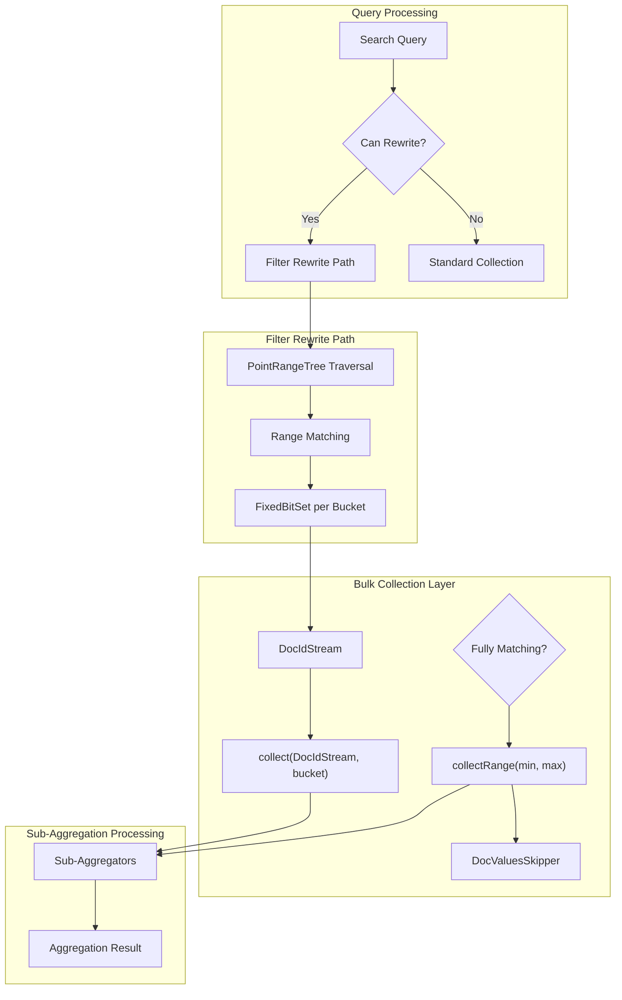
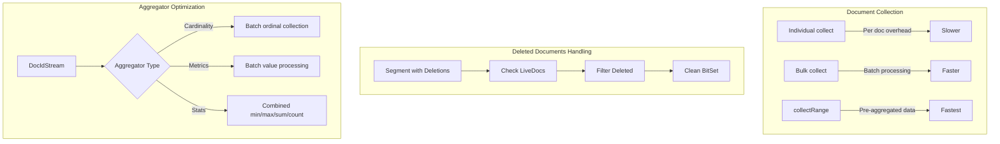

# Filter Rewrite Optimization

## Summary

Filter rewrite optimization is a performance enhancement for aggregations that leverages Lucene's PointRangeTree traversal to efficiently collect documents into buckets. When combined with bulk collection APIs, this optimization significantly reduces per-document processing overhead by batching document collection operations. The feature is particularly effective for range-based bucket aggregations with sub-aggregations.

## Details

### Architecture



### Data Flow



### Components

| Component | Description |
|-----------|-------------|
| `SubAggRangeCollector` | Range collector that builds FixedBitSet for each bucket and triggers bulk sub-aggregation collection |
| `DocIdStreamHelper` | Helper to create BitSetDocIdStream from FixedBitSet (accesses Lucene package-private class) |
| `LeafBucketCollector` | Base collector with bulk collection APIs: `collect(DocIdStream, long)` and `collectRange(int, int)` |
| `AvgAggregator` | Optimized with bulk collection using Kahan summation for numerical accuracy |
| `SumAggregator` | Optimized with bulk collection using Kahan summation |
| `MinAggregator` | Optimized with bulk collection for minimum value tracking |
| `MaxAggregator` | Optimized with bulk collection for maximum value tracking |
| `StatsAggregator` | Optimized with bulk collection for combined statistics |
| `CardinalityAggregator` | Optimized with bulk ordinal collection for HyperLogLog++ |

### Configuration

Filter rewrite optimization is enabled by default. The following conditions must be met:

| Condition | Description |
|-----------|-------------|
| Numeric field | Aggregation field must be numeric (long, date, etc.) |
| Point values | Field must have point values indexed |
| Range-based aggregation | Works with range, date_histogram, auto_date_histogram |
| No script | Aggregation must not use scripts |

### Bulk Collection APIs

#### collect(DocIdStream, long)

Processes multiple document IDs into a single bucket:

```java
@ExperimentalApi
public void collect(DocIdStream stream, long owningBucketOrd) throws IOException {
    stream.forEach((doc) -> collect(doc, owningBucketOrd));
}
```

Aggregators override this to batch-process values:

```java
// Example: AvgAggregator bulk collection
public void collect(DocIdStream stream, long bucket) throws IOException {
    setKahanSummation(bucket);
    final int[] count = { 0 };
    stream.forEach((doc) -> {
        if (values.advanceExact(doc)) {
            int valueCount = values.docValueCount();
            count[0] += valueCount;
            for (int i = 0; i < valueCount; i++) {
                kahanSummation.add(values.nextValue());
            }
        }
    });
    counts.increment(bucket, count[0]);
    sums.set(bucket, kahanSummation.value());
    compensations.set(bucket, kahanSummation.delta());
}
```

#### collectRange(int, int)

Collects a contiguous range of document IDs, enabling use of pre-aggregated data from DocValuesSkipper:

```java
public void collectRange(int min, int max) throws IOException {
    for (int docId = min; docId < max; docId++) {
        collect(docId, 0);
    }
}
```

This API is called when:
- Query rewrites to MatchAllDocsQuery
- PointRangeQuery fully matches a segment
- Doc-value range queries match contiguous ranges

### Usage Example

```json
// Range aggregation with sub-aggregations
GET /metrics/_search
{
  "size": 0,
  "aggs": {
    "by_range": {
      "range": {
        "field": "value",
        "ranges": [
          { "from": 0, "to": 100 },
          { "from": 100, "to": 500 },
          { "from": 500, "to": 1000 }
        ]
      },
      "aggs": {
        "avg_metric": { "avg": { "field": "metric" } },
        "sum_metric": { "sum": { "field": "metric" } },
        "unique_users": { 
          "cardinality": { 
            "field": "user_id",
            "execution_hint": "ordinals"
          }
        }
      }
    }
  }
}

// Date histogram with metrics sub-aggregations
GET /logs/_search
{
  "size": 0,
  "aggs": {
    "by_hour": {
      "date_histogram": {
        "field": "@timestamp",
        "fixed_interval": "1h"
      },
      "aggs": {
        "response_stats": { "stats": { "field": "response_time" } },
        "min_latency": { "min": { "field": "latency" } },
        "max_latency": { "max": { "field": "latency" } }
      }
    }
  }
}
```

## Limitations

- Filter rewrite requires numeric fields with point values indexed
- Script-based aggregations cannot use filter rewrite
- `collectRange` optimization requires specific query patterns (MatchAllDocsQuery, fully matching PointRangeQuery)
- Performance gains vary based on data distribution and segment characteristics
- Deleted documents add overhead for LiveDocs filtering

## Change History

- **v3.4.0** (2026-01): Added bulk collection APIs (`collect(DocIdStream, long)`, `collectRange(int, int)`), deleted documents handling, and optimized implementations for avg, sum, min, max, stats, and cardinality aggregations

## References

### Documentation
- [Range Aggregation Documentation](https://docs.opensearch.org/3.0/aggregations/bucket/range/)
- [Date Histogram Documentation](https://docs.opensearch.org/3.0/aggregations/bucket/date-histogram/)
- [Lucene PR #14401](https://github.com/apache/lucene/pull/14401): Enable collectors to take advantage of pre-aggregated data

### Pull Requests
| Version | PR | Description |
|---------|-----|-------------|
| v3.4.0 | [#19643](https://github.com/opensearch-project/OpenSearch/pull/19643) | Handle deleted documents for filter rewrite sub-aggregation optimization |
| v3.4.0 | [#19933](https://github.com/opensearch-project/OpenSearch/pull/19933) | Add bulk collect API for filter rewrite sub-aggregation optimization |
| v3.4.0 | [#20009](https://github.com/opensearch-project/OpenSearch/pull/20009) | Allow collectors take advantage of preaggregated data using collectRange API |
| v3.4.0 | [#20067](https://github.com/opensearch-project/OpenSearch/pull/20067) | Bulk collection logic for metrics and cardinality aggregations |
| v3.0.0 | [#17447](https://github.com/opensearch-project/OpenSearch/pull/17447) | Support sub agg in filter rewrite optimization (initial implementation) |

### Issues (Design / RFC)
- [Issue #19642](https://github.com/opensearch-project/OpenSearch/issues/19642): Handle deleted documents for filter rewrite subaggregation optimization
- [Issue #19324](https://github.com/opensearch-project/OpenSearch/issues/19324): [META] Use Lucene bulk collection API to speed up aggregation
- [Issue #20031](https://github.com/opensearch-project/OpenSearch/issues/20031): [META] Advanced Query Engine Performance Optimizations in OpenSearch
