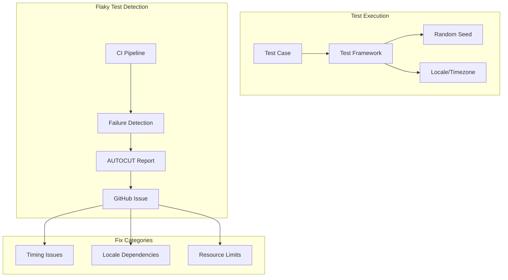

# Flaky Test Fixes

## Summary

OpenSearch maintains a robust test suite to ensure code quality and reliability. Flaky tests—tests that pass or fail intermittently without code changes—can undermine CI/CD reliability and developer productivity. This feature tracks fixes for flaky tests across the OpenSearch codebase, improving test stability and build reliability.

## Details

### Architecture



### Components

| Component | Description |
|-----------|-------------|
| `IntervalBuilder` | Builds interval queries with disjunction limit checking |
| `IntervalsSourceProvider` | Provides interval sources with early validation |
| `AbstractQueryTestCase` | Base test class with improved exception handling |
| `KeyStoreUtils` | Certificate generation utilities with locale-independent behavior |

### Common Flaky Test Patterns

| Pattern | Cause | Solution |
|---------|-------|----------|
| Random seed sensitivity | Test behavior varies with random input | Add bounds checking, handle edge cases |
| Locale/timezone dependency | Date/string formatting varies by locale | Use `Locale.ROOT` and explicit formatting |
| Resource limits | Queries exceed Lucene clause limits | Add early validation before execution |
| Timing issues | Race conditions in async operations | Use proper synchronization, increase timeouts |

### Configuration

No user configuration required. These are internal test framework improvements.

### Usage Example

```java
// Example: Checking disjunction count before combining interval sources
public static boolean canCombineSources(List<IntervalsSource> sources) {
    int sourceIndex = 0;
    long disjunctionCount = 1;

    while (sourceIndex < sources.size()) {
        disjunctionCount = disjunctionCount 
            * sources.get(sourceIndex).pullUpDisjunctions().size();
        if (disjunctionCount > IndexSearcher.getMaxClauseCount()) {
            return false;
        }
        sourceIndex += 1;
    }
    return true;
}
```

## Limitations

- Flaky test fixes are reactive—new flaky tests may emerge as code evolves
- Some timing-related flakiness may require environment-specific tuning
- Random seed reproduction may not always capture the exact failure conditions

## Related PRs

| Version | PR | Description |
|---------|-----|-------------|
| v3.3.0 | [#19332](https://github.com/opensearch-project/OpenSearch/pull/19332) | Fix Flaky IntervalQueryBuilderTests |
| v3.3.0 | [#19327](https://github.com/opensearch-project/OpenSearch/pull/19327) | Fix flaky test in SecureReactorNetty4HttpServerTransportTests |

## References

- [Issue #19167](https://github.com/opensearch-project/OpenSearch/issues/19167): IntervalQueryBuilderTests flaky test report
- [Issue #17486](https://github.com/opensearch-project/OpenSearch/issues/17486): SecureReactorNetty4HttpServerTransportTests flaky test report
- [OpenSearch Gradle Check Metrics](https://metrics.opensearch.org/_dashboards/app/dashboards#/view/e5e64d40-ed31-11ee-be99-69d1dbc75083): Flaky test tracking dashboard

## Change History

- **v3.3.0**: Fixed IntervalQueryBuilderTests disjunction limit and SecureReactorNetty4HttpServerTransportTests locale issues
