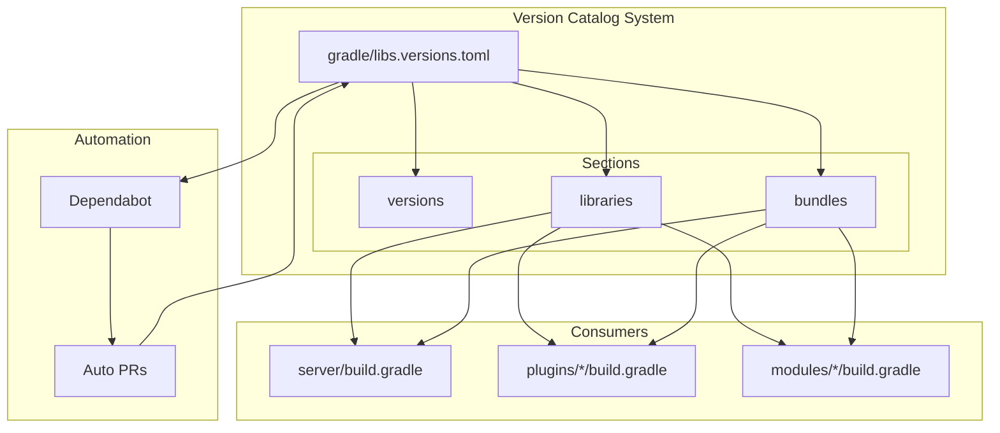
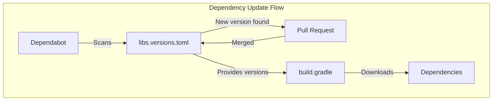

---
tags:
  - search
---

# Gradle Build System

## Summary

The Gradle Build System feature modernizes OpenSearch's dependency management by migrating from the legacy `buildSrc/version.properties` file to Gradle's native version catalog (`gradle/libs.versions.toml`). This enables automated dependency updates via Dependabot, centralizes version management, and simplifies build configurations across the project.

## Details

### Architecture



### Data Flow



### Components

| Component | Description |
|-----------|-------------|
| `gradle/libs.versions.toml` | Central version catalog file in TOML format |
| `[versions]` section | Defines version variables for dependencies |
| `[libraries]` section | Defines library coordinates with version references |
| `[bundles]` section | Groups related libraries for convenient import |
| Dependabot | GitHub's automated dependency update service |

### Configuration

The version catalog (`gradle/libs.versions.toml`) structure:

| Section | Purpose | Example |
|---------|---------|---------|
| `[versions]` | Define version variables | `netty = "4.2.9.Final"` |
| `[libraries]` | Define library coordinates | `netty-buffer = { group = "io.netty", name = "netty-buffer", version.ref = "netty" }` |
| `[bundles]` | Group related libraries | `netty = ["netty-buffer", "netty-codec", ...]` |

### Usage Example

Version catalog definition:
```toml
[versions]
netty = "4.2.9.Final"
reactor_netty = "1.3.1"

[libraries]
netty-buffer = { group = "io.netty", name = "netty-buffer", version.ref = "netty" }
netty-codec = { group = "io.netty", name = "netty-codec", version.ref = "netty" }
reactor-netty-core = { group = "io.projectreactor.netty", name = "reactor-netty-core", version.ref = "reactor_netty" }

[bundles]
netty = ["netty-buffer", "netty-codec"]
```

Using in build.gradle:
```groovy
dependencies {
    // Single library
    api libs.netty.buffer
    
    // Bundle (multiple libraries)
    api libs.bundles.netty
    
    // Test dependencies
    testImplementation libs.reactor.test
}
```

## Limitations

- Incremental migration: Not all modules have been converted to use the version catalog
- Some dependencies may still reference `buildSrc/version.properties`
- Dependabot only monitors dependencies in the version catalog, not legacy properties files
- Bundle changes require updating both the catalog and consuming build files

## Change History

- **v3.0.0** (2025-05-06): Added Netty and Reactor Netty bundles, converted transport-reactor-netty4 plugin
- **v2.19.0** (2025-02-11): Initial implementation of Gradle version catalog, migrated core dependencies from buildSrc/version.properties

## References

### Documentation
- [Gradle Version Catalogs](https://docs.gradle.org/current/userguide/platforms.html): Official Gradle documentation
- [Dependabot Gradle Support](https://docs.github.com/en/code-security/dependabot/dependabot-version-updates/configuration-options-for-the-dependabot.yml-file#gradle): GitHub Dependabot configuration

### Pull Requests
| Version | PR | Description | Related Issue |
|---------|-----|-------------|---------------|
| v3.0.0 | [#17233](https://github.com/opensearch-project/OpenSearch/pull/17233) | Convert transport-reactor-netty4 to use gradle version catalog |   |
| v2.19.0 | [#16284](https://github.com/opensearch-project/OpenSearch/pull/16284) | Initial implementation of Gradle version catalog | [#3782](https://github.com/opensearch-project/OpenSearch/issues/3782) |

### Issues (Design / RFC)
- [Issue #3782](https://github.com/opensearch-project/OpenSearch/issues/3782): Original feature request for Dependabot support
