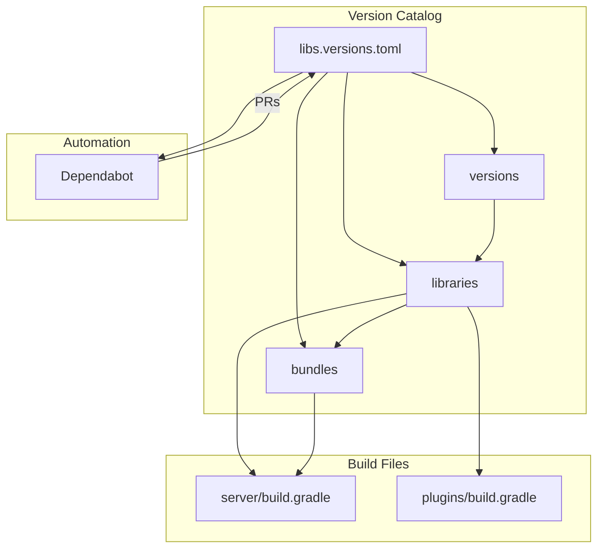

---
tags:
  - opensearch
---
# Gradle Version Catalog

## Summary

OpenSearch uses Gradle version catalog (`gradle/libs.versions.toml`) to centralize dependency version management. This enables automated dependency updates via Dependabot and provides a single source of truth for library versions across the project.

## Details

### Architecture



### Components

| Component | Location | Description |
|-----------|----------|-------------|
| Version Catalog | `gradle/libs.versions.toml` | Centralized dependency definitions |
| Versions Section | `[versions]` | Version number declarations |
| Libraries Section | `[libraries]` | Individual library definitions |
| Bundles Section | `[bundles]` | Grouped dependencies |

### Configuration

The version catalog file (`gradle/libs.versions.toml`) uses TOML format:

```toml
[versions]
lucene = "9.12.0"
log4j = "2.24.1"
joda = "2.12.7"

[libraries]
lucene-core = { group = "org.apache.lucene", name = "lucene-core", version.ref = "lucene" }
log4japi = { group = "org.apache.logging.log4j", name = "log4j-api", version.ref = "log4j" }
jodatime = { group = "joda-time", name = "joda-time", version.ref = "joda" }

[bundles]
lucene = ["lucene-core", "lucene-analysis-common", "lucene-queries", ...]
```

### Usage Example

In `build.gradle` files:

```groovy
dependencies {
    // Single library
    api libs.jodatime
    api libs.log4japi
    
    // Bundle (multiple libraries)
    api libs.bundles.lucene
    
    // Optional dependency
    api libs.spatial4j, optional
}
```

## Limitations

- Migration is incremental; not all modules use the version catalog yet
- Some dependencies may still be declared directly in `build.gradle` files
- Plugin projects may require separate migration efforts

## Change History

- **v2.19.0** (2024-12-05): Expanded version catalog with `[libraries]` and `[bundles]` sections for server dependencies ([#16707](https://github.com/opensearch-project/OpenSearch/pull/16707))
- **v2.18.0** (2024-10-28): Initial version catalog implementation, migrated from `buildSrc/version.properties` ([#16284](https://github.com/opensearch-project/OpenSearch/pull/16284))

## References

### Documentation

- [Gradle Version Catalogs](https://docs.gradle.org/current/userguide/platforms.html)
- [Dependabot Gradle Support](https://docs.github.com/en/code-security/dependabot/dependabot-version-updates/configuration-options-for-the-dependabot.yml-file#gradle)

### Pull Requests

| Version | PR | Description |
|---------|-----|-------------|
| v2.19.0 | [#16707](https://github.com/opensearch-project/OpenSearch/pull/16707) | Make entries for dependencies from server/build.gradle to gradle version catalog |
| v2.18.0 | [#16284](https://github.com/opensearch-project/OpenSearch/pull/16284) | Switch from buildSrc/version.properties to Gradle version catalog |

### Issues

| Issue | Description |
|-------|-------------|
| [#3782](https://github.com/opensearch-project/OpenSearch/issues/3782) | Enable Dependabot for automated dependency upgrades |
